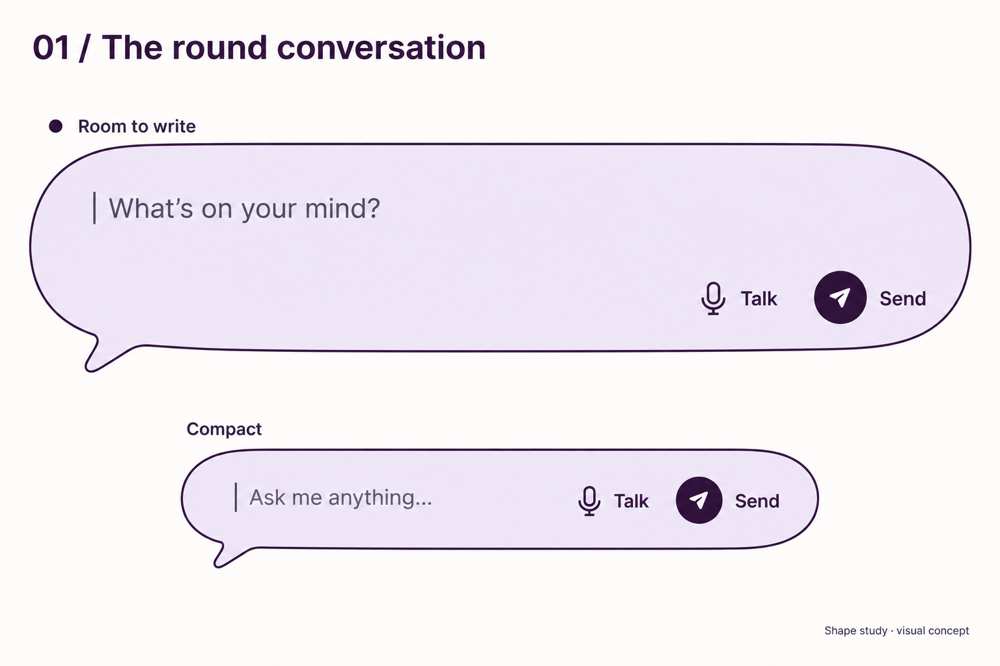

# Brand and visual identity

## Current selected design system — Harbour Blue

**Simon selected Harbour Blue on 2026-09-19 as the design system for now.** Use the [FINAL board and complete written transcription](mockups/2026-09-19-style-boards/final-harbour-blue/README.md) as the current visual reference. That companion note owns the selected board's detailed color, type, shape, content and state transcription; the semantic design-system document continues to own interaction behavior.

The selected source is iteration 5 / 04, Linen / Harbour Blue. The final image is an unchanged copy, not a new generation. This selection supersedes the prior Soft Plum accent direction, open action/outline choice and assistant recommendation of Plum + Cobalt. Linen, white surfaces, dark ink, Harbour Blue accent/outline/Send and the displayed focus/Stop treatment are now the working visual system.

**Acceptance boundary:** Simon has chosen the visual system; do not keep treating the main-board choice as open. Exact font-file validation, production dimensions, unshown states, implementation and device/human evidence remain separate. No product behavior or gate was accepted by filing this reference. Earlier exploration sections below retain their historical values and recommendations.

**Selected Home application:** use the [Explicit Scroll Row reference](mockups/2026-09-19-harbour-blue-home/selected-explicit-scroll-row/README.md)
for future Home design/development. It applies Harbour Blue to the accepted
compact continuation, open room portraits, written browsing and Round composer;
earlier Home compositions remain exploration history.

Granny is a **temporary codename**, not the final wordmark or assistant persona. [Naming exploration](naming-exploration.md) owns candidates/screening. This document owns brand promise, the accepted composer shape below and proposed identity territories. The territory palettes/typefaces remain unaccepted and not user-validated.

## Accepted shape direction — Round conversation

**Simon selected Round conversation on 2026-09-17 as the direction to use moving forward.** His instruction: “lets stick with the round conversation i really like it and i think its perfect in both comapct normal and would even work in flavicon”. This is explicit shape approval, not merely a recommendation from the image-generation session.

Use this exact **round-5 / 01 — Round conversation** reference: a full, smoothly rounded speech balloon with a short lower-left tail and an obvious writing area. Carry its recognizable silhouette through compact, normal and expanded composer sizes. The image shows compact and expanded studies; intermediate proportions remain to be specified. Keep the shape easy to find, playful and modern, without school stationery, coding-terminal styling or decorative clutter. Preserve room for readable text and labeled controls as the body grows or shrinks.

The same silhouette is the selected direction to explore for a **favicon**. Derive a simplified standalone mark from it; this approval does not claim that a favicon, final logo or Android adaptive icon has been produced or tested at small sizes.

This supersedes the earlier open composer-shape exploration. The original conversation bubble led here; soft ticket was a liked alternative but is not selected. Ribbon and soft terminal were rejected. Margin was too school-like and insufficiently discoverable; correspondence was too basic. Round conversation, rather than the later cushion or tucked-tail alternatives, is the chosen reference.

**Approval boundary:** shape direction and its compact/normal/expanded use are accepted. Mockup lilac/plum colors, typography, exact geometry, animation and copy remain provisional. No input behavior, confirmation rule, Home contract or product gate changes. The PNG is a generated visual reference, not implemented UI, editable vector source, accessibility evidence or participant research. [Component contracts](design-system.md#cmp-007) continue to govern implementation.

## Selected foundation — Linen

**Historical selection checkpoint:** Linen is retained in the final Harbour Blue system above; the Send/accent/outline shortlist below has now been resolved by Simon's choice of Harbour Blue.

**Simon selected Linen on 2026-09-19:** use canvas #FBF6EE, retain white surface #FFFFFF and dark ink #2E2D32. These are selected visual foundation values for ongoing mockups, not an implemented or accessibility-validated production token export. This supersedes the open Pearl/Linen/Defined canvas choice and the earlier grey canvas.

Soft Plum #65425F remains the liked baseline accent and prior selected direction. Simon explicitly requests variants of the Send color and accent, including blue, before choosing the main board. His current instruction permits this bounded comparison despite older objections to earlier blue/medical-looking palettes. Do not reopen the selected canvas, surfaces, ink or composer shape.

### Iteration 5 — final action-color shortlist

[Four boards](mockups/2026-09-19-style-boards/iteration-5/README.md) compare the prior blue-violet Send, a more clearly blue Send, and two blue-led accent alternatives on identical content/layout. Typography stays the existing proposed Bricolage Grotesque / DM Sans pairing. Final Send/accent/outline selection remains open for Simon.

| Candidate | Proposed Send | Proposed accent | Proposed default outline | White / Send icon | White / accent text | Outline / white | Outline / Linen |
|---|---|---|---|---|---|---|---|
| Plum + Iris | #6943AC | #65425F | #896A8B | 7.00:1 | 8.41:1 | 4.67:1 | 4.34:1 |
| Plum + Cobalt | #2458B8 | #65425F | #896A8B | 6.64:1 | 8.41:1 | 4.67:1 | 4.34:1 |
| Periwinkle + Cobalt | #2458B8 | #445685 | #697BAC | 6.64:1 | 7.20:1 | 4.18:1 | 3.88:1 |
| Harbour Blue | #165D9C | #2C5981 | #597DA0 | 6.82:1 | 7.36:1 | 4.32:1 | 4.01:1 |

These are sRGB calculations for specified values, not sampled image evidence. Send text stays dark on white (13.66:1), outside the colored icon circle; do not infer a 7:1 essential-white-text pass for all Send fills (Iris also rounds to 7.00:1). White draft-action text exceeds the internal 7:1 target; boundaries exceed 3:1 against both neighbors. Essential ink on Linen remains 12.69:1.

Ordinary borders are thin single outlines; focus adds an outer #4930A1 ring, approximately twice the ordinary stroke width and separated by a white gap. Its geometry, not hue alone, distinguishes focus when ordinary outlines or actions are blue. #962F43 remains the available Stop control/treatment with square symbol and label. Proposed focus/Stop colors and semantics stay consistent across the shortlist; the generated brighter hues and spacing are illustrative. No universal “blue means Send” claim or participant finding is implied. Send submits a request to Granny; external consequences retain their separate preview/confirmation contract.

**Assistant recommendation: Plum + Cobalt (02); challenger: Periwinkle + Cobalt (03).** The former retains Soft Plum character and a contrasting Send cue; the latter offers a more unified blue family but less separation between ordinary accent and Send. Simon's desire to finish this round does not authorize the assistant to mark its recommendation selected. After his choice, consolidate one main board rather than restart palette exploration.

## Selected visual direction — Soft Plum

**Historical selection, superseded for current accents:** continue from Harbour Blue above, not Soft Plum.

The later Linen foundation and explicitly authorized accent/Send comparison above refine this selection; historical canvas proposals below remain preserved.

**Simon selected iteration 3 Soft Plum on 2026-09-19 as the design to move forward with.** Carry forward its white writing surfaces, plum action emphasis and rounded conversation composition. The historical source was iteration 3 / 02 Soft Plum; that intermediate raster is not retained in this checkout. This supersedes the earlier open comparison of the four presets and the historical Open Day/Bright Signal recommendation as the next visual direction.

His same instruction rejects the grey/boring canvas and requests a subtly warmer off-white—not strongly yellow or warm—and more positive, noticeable outlines without a loud new hue. Those values remain open; do not freeze the selected source's grey canvas/outline. Exact font files, production tokens, other theme presets and accessibility/participant evidence are not approved by the direction selection. No product behavior or release gate changes.

### Iteration 4 — canvas and outline refinements

[Three narrow refinements](mockups/2026-09-19-style-boards/iteration-4/README.md) keep the existing proposed #65425F plum action, #FFFFFF surfaces, #2E2D32 essential ink and common Bricolage Grotesque / DM Sans type treatment. Only canvas and ordinary component outlines vary. Blue #4930A1 focus and red #962F43 Stop retain separate meanings; text/icon cues remain mandatory.

| Refinement | Proposed canvas | Proposed outline | Outline / white | Outline / canvas | Ink / canvas |
|---|---|---|---|---|---|
| Pearl | #FAF7F2 | #896A8B | 4.67:1 | 4.37:1 | 12.78:1 |
| Linen | #FBF6EE | #896A8B | 4.67:1 | 4.34:1 | 12.69:1 |
| Defined | #FAF7F2 | #795C83 | 5.72:1 | 5.35:1 | 12.78:1 |

Pearl is the assistant's recommended starting point, not Simon's selected new shade. Linen isolates a little more warmth; Defined isolates stronger outline definition. These are same-family refinements, not three new identities. Ordinary outlines apply to composer, context panel and secondary outline control; text and button fills do not inherit the lighter border color.

Ratios are calculated sRGB values, not sampled image pixels. All listed boundaries exceed 3:1; essential ink exceeds the internal 7:1 target. White on the unchanged action remains 8.41:1; ink on white remains 13.66:1. Focus against Pearl/Defined canvas is 8.85:1 and against Linen is 8.79:1; actual separated ring geometry still needs implementation checks. Do not use outline colors for essential text. Generated hues, typography and residual fill variation remain illustrative; eventual surfaces should be flat. No Android, TalkBack, scale or participant pass claimed.

## Style-board iteration 3 — neutral foundation

**Iteration 4 live-feedback addition:** Simon's notebook now requests clearer, more vibrant Send emphasis. Clear Send holds Pearl's canvas/outline and proposes #6943AC for Send only, retaining #65425F Open draft and unchanged focus/Stop semantics. White icon / Send contrast is approximately 7.00:1 by sRGB calculation (rounded; no essential white text is introduced). The dark explicit label stays; no universal color association or usability pass is inferred. This additional action shade remains unselected.

**Subsequent review:** Soft Plum was selected as the direction; its grey canvas and outlines require the refinement above. The following records the comparison's original proposed values.

Simon's 2026-09-19 chat feedback rejects iteration 2's clashing, overly colored composer/background pairings. A stable canvas is still promising; he suggests multiple user-selectable presets. Historical iteration 3 therefore held the foundation constant and varied only small action accents; its intermediate folder is not retained in this checkout. These are proposed visual studies, not accepted tokens, a selected default or an implemented theme/persistence contract.

| Shared role | Proposed value |
|---|---|
| Stable warm-grey canvas (not yellow/cream) | #F4F3F0 |
| Composer and context-panel surface | #FFFFFF |
| Essential text and persistent labels | #2E2D32 |
| Neutral component outline | #68656F |
| Focus indicator | #4930A1 |
| Available Stop control / outline | #962F43 |

| Preset | Primary action accent | White / accent contrast |
|---|---|---|
| Graphite | #45414D | 9.92:1 |
| Soft Plum | #65425F | 8.41:1 |
| Dusky Violet | #584276 | 8.55:1 |
| Clay | #713F30 | 8.55:1 |

Color stays on primary actions rather than tinting the writing surface or outlining every component. Blue focus and red Stop remain semantically consistent between presets, with text/icon cues. The Stop specimen is an available action, not proof of a stopped outcome. Normal/compact rounded composer and one optional fictional draft panel stay comparable.

Common proposed typography: Bricolage Grotesque 600 display, DM Sans 400 body / 600 controls (family references below). Holding type constant isolates surface/accent judgment; this does not accept the font pairing.

Calculated sRGB contrast of specified values, **not image pixels**: essential ink is 13.66:1 on white and 12.31:1 on canvas. Neutral outline is 5.71:1 on white and 5.14:1 on canvas. Focus is 9.46:1 on white and 8.52:1 on canvas. White on Stop is 7.54:1; Stop outline against canvas is 6.80:1. Use essential ink, not outline grey, for essential labels. The near-white canvas/surface distinction is deliberately subtle, so the visible neutral outline carries component boundaries. Focus still requires suitable separation and geometry in implementation.

The generated boards approximate fonts, text colors and state hues; small rendering drift is not a new token decision. Exact font rendering, target size, scaling, Android/TalkBack and participant evidence remain unrun. The earlier palettes below are historical proposals, not current recommendations.

## Style-board iteration 2 — feedback-led studies

**Subsequent review:** Simon rejected these color combinations in chat on 2026-09-19. Preserved as iteration history; use the neutral-foundation round above for current review.

Simon's [iteration 1 feedback](<mockups/2026-09-19-style-boards/Notes - style boards.md>) directed the second four-board round. That intermediate iteration-2 folder is not retained in this checkout. Read that living note before subsequent rounds and preserve his wording. He dislikes medical associations in the earlier green/blue/yellow treatments and wants warmer backgrounds with more personality and more distinctive type. Everyday Spark was the closest, but not selected. Retain the rounded composer and colored states, Living Pages' blue focus treatment and Bright Signal's panel structure. These preferences do not accept final colors, fonts or interaction behavior; prior recommendations remain historical.

These four studies are **proposed local mockup values**, separate from the original IDT territories. Display styles vary; body/control text remains sans-serif.

| Study | Canvas | Surface | Primary ink | Primary action / outline | Composer tint | Decorative accent |
|---|---|---|---|---|---|---|
| Apricot & Ink | #FFF8EF | #FFFFFF | #302128 | #593247 | #FFE4D2 | #F28A65 |
| Lilac & Vermilion | #FFF9F2 | #FFFFFF | #30243C | #4F2F66 | #E8DDF8 | #F16D51 |
| Cocoa & Rose | #FBF5ED | #FFFFFF | #302624 | #51382F | #F4DCE1 | #CC748E |
| Ink & Tangerine | #FFFAF3 | #FFFFFF | #29262D | #3D3142 | #FFE3CC | #ED7A3D |

| Study | Display | Body / labels | Light-to-dark color study |
|---|---|---|---|
| Apricot & Ink | Fraunces 600 | DM Sans 400 / 600 | #FFF1E6 → #FFE4D2 → #F5BA98 → #C77757 → #593247 |
| Lilac & Vermilion | Bricolage Grotesque 650 | DM Sans 400 / 600 | #F5EEFC → #E8DDF8 → #C3A6E0 → #8C64B6 → #4F2F66 |
| Cocoa & Rose | Lora 600 | Nunito Sans 400 / 600 | #FCF0F2 → #F4DCE1 → #E5BAC8 → #B87089 → #51382F |
| Ink & Tangerine | Sora 650 | Nunito Sans 400 / 600 | #FFF2E5 → #FFE3CC → #F8BE8B → #DB915C → #3D3142 |

Warm color strips end at the dark action color; these are exploratory tonal sequences, not uniform monochromatic token ramps. Shared focus proposal: #4930A1 with a separated visible ring. Stopped-treatment study: #FCEBEC surface and #962F43 outline, with text/icon. Color alone never conveys state. Small accent-circle icons should use primary ink, not the generated white icon in Cocoa & Rose.

Calculated sRGB contrast of **specified values**, not generated pixels:

| Study | Ink / composer | White / action | Outline / composer | Focus / canvas |
|---|---|---|---|---|
| Apricot & Ink | 12.58:1 | 10.65:1 | 8.76:1 | 8.97:1 |
| Lilac & Vermilion | 11.18:1 | 10.88:1 | 8.35:1 | 9.04:1 |
| Cocoa & Rose | 11.32:1 | 10.73:1 | 8.26:1 | 8.73:1 |
| Ink & Tangerine | 12.14:1 | 12.23:1 | 9.97:1 | 9.11:1 |

All listed essential ink/action pairs exceed the internal 7:1 target; outline/focus pairs exceed 3:1. Other shade combinations are not admitted by this arithmetic. Generated fills, letterforms and weights remain approximate; exact font files, glyph coverage, scaling and device evidence remain unverified.

Family references checked on Google Fonts on 2026-09-19: [Fraunces](https://fonts.google.com/specimen/Fraunces), [Bricolage Grotesque](https://fonts.google.com/specimen/Bricolage+Grotesque), [Lora](https://fonts.google.com/specimen/Lora), [Sora](https://fonts.google.com/specimen/Sora), [DM Sans](https://fonts.google.com/specimen/DM+Sans), [Nunito Sans](https://fonts.google.com/specimen/Nunito+Sans). These pages identify families; this task did not download, install, license-audit or implement fonts.

## Style-board shade studies — 2026-09-19

[Four generated iteration 1 style tiles](mockups/2026-09-19-style-boards/iteration-1/README.md) compare these existing territories on the selected Round conversation composer and a fictional draft context panel. [The mockup gallery](mockups/README.md) files both these boards and all 15 earlier chat-entry concepts. The six main palette roles and family proposals remain those in the territory definitions below; no new identity selection follows from generation.

The additional shades below are **proposed exploration values**, ordered light to dark, not a production token scale. The lightest shade is the requested composer tint; the darkest is the existing primary. Middle shades are swatch studies only, not approved text or control colors.

| Territory | Light composer tint | Pale shade | Mid shade | Strong shade | Existing primary |
|---|---|---|---|---|---|
| Open Day | #E8F2EE | #C8DDD4 | #86B3A2 | #275D54 | #123B36 |
| Bright Signal | #E8EEFF | #C8D6F7 | #8CA7DF | #3B5DA6 | #15367A |
| Living Pages | #F7E9EF | #E6C5D2 | #BF89A0 | #914C68 | #67263F |
| Everyday Spark | #F0E9FA | #D9C9EF | #B49BD6 | #7655A4 | #3D246B |

Calculated sRGB ratios for the exact text values, **not sampled generated pixels or device evidence**:

| Territory | Primary ink / composer tint | Secondary ink / tint | Primary outline / tint | White / primary action | Focus / canvas |
|---|---|---|---|---|---|
| Open Day | 13.92:1 | 7.18:1 | 10.77:1 | 12.32:1 | 8.16:1 |
| Bright Signal | 13.70:1 | 6.89:1 | 9.84:1 | 11.41:1 | 7.65:1 |
| Living Pages | 12.81:1 | 6.43:1 | 9.27:1 | 10.90:1 | 8.96:1 |
| Everyday Spark | 13.60:1 | 6.76:1 | 10.67:1 | 12.63:1 | 6.65:1 |

Use primary ink for essential composer text and persistent labels: three secondary-ink/tint pairs fall below the internal 7:1 essential-text target. Secondary ink is suitable only for supporting text at its separate target. Do not infer a contrast pass for any other shade pairing. Focus must also be offset and visible against its actual neighbors, not merely recolored. Existing Living Pages copper remains decorative.

The generated specimens approximate letterforms, some microcopy, weights and shape geometry; exact font-file specimens and component implementation remain future work. The text definitions here and the [semantic component contracts](design-system.md) override image artifacts. Shape, palette and type selections remain separate.

## Foundation

**Purpose:** return practical agency to people who want the outcome of computing without its interface burden.
**Promise:** ask for something useful; understand what happens; stay in charge.
**Central idea:** capability made approachable. The computer takes on the navigation work while the adult remains the author of the task.

Primary audience: independent older adults with differing access needs/preferences; secondary buyer/helper: someone they choose. Buyer communications must respect the adult's primacy. Before a task the intended feeling is “I can start here”; during, “I know what it is doing and can change it”; after, “I know what happened and can get on with my day.” These are emotional goals to test, not findings.

| Personality | Observable product behavior | Anti-trait |
|---|---|---|
| Capable | Verified outcome or precise limitation | Omniscient, overpromising |
| Respectful | Adult language, user choice, no unsolicited oversight | Patronizing, controlling |
| Clear | Named actions, exact previews, readable status | Minimalist ambiguity, technical jargon |
| Warm | Patient pacing and useful recovery | Childish, faux intimacy, artificial affection |
| Steady | Stable layout, predictable stop and errors | Restless, engagement-driven |
| Candid | Distinguishes prepared/sent/unknown | Hiding uncertainty, clinical authority |

Relationship posture: capable companion and respectful tool, never child, nurse, guardian, surveillance service or robot mascot. Do not gender the assistant by default or cast its user as a patient. Reasons to believe must come from the implemented preview/Stop/verification/privacy experience; they cannot be claimed as proven now.

## Positioning and expression

| Alternative category (hypothesis, not tested competitor claim) | Granny's proposed position | Evidence required |
|---|---|---|
| Generic assistant | Bounded everyday tablet outcomes with explicit verification/recovery | Paired task baseline |
| Simplified launcher | Natural intent and guided takeover beyond a simpler grid | Observed interface burden |
| Accessibility tool | Accessible adult experience with chosen input/output; no automatic policy qualification claim | Profile tests and distribution review |
| Caregiver monitoring | User-owned assistance and narrow optional helper proposals | Privacy/consent comprehension |
| Clinical technology | Ordinary life and agency; no diagnosis/medical promise | Tone/imagery review and user interpretation |

App-store/communications working line: “The tablet app you can ask.” Supporting copy must name supported tasks and limitations rather than “controls everything.” Show a real proposed workflow, an exact confirmation and Stop. No fabricated testimonials, success rates, family relief claims or logo usage suggesting approval.

## Emotional and sensory language

First five seconds: a clear place to ask, readable choices, no sign that the user must pass a test. Calm means useful state changes with bounded waits; it does not mean a blank screen. Warmth comes from patient wording, light and spacing; avoid baby-like shapes/voices. Simplicity keeps the goal and escape visible; do not remove meaning-bearing controls. Trust comes from specific behavior, not hospital blue, locks everywhere or sterile branding.

Rhythm: strong heading, short prompt, generous action region, secondary details lower down. Private task content stays visually central without decoration competing. Images depict adults choosing, making, meeting and enjoying things; request image rights and avoid stereotypes about loneliness, frailty or technological incompetence. No imposed nostalgia. Flat illustration may explain permission/control, never provide fake clinical reassurance.

Listening: mic icon + Listening; planning: task verb; acting: named step; success: evidenced outcome + check; uncertainty: question/status + explanation; warning: triangle + consequence; privacy off/on: mic slash/capture text and actual state. Colors reinforce these labels; they are not the only code. Sound/haptic cues are optional and brief; every cue has a static visual equivalent. No confetti, streaks, rewards, neon AI gradient or omnipresent animated orb.

## Four reproducible territories

Explore these on identical SCR-003 Home and SCR-007 confirmation structure so preference is not confounded by layout. The [local review board](identity-review.html) contains authored HTML/SVG rough concepts with fallback fonts; it is not a Figma file or final assets.

### IDT-01 — Open Day

**Story:** An open doorway into useful everyday computing.
**Mood:** capable, clear, hospitable, grounded. **Avoid:** spa, botanical wellness, passive.
**Emotional/audience hypothesis:** A deep green anchor with warm yellow punctuation welcomes action without implying clinical care. Fits agency-oriented adults and family buyers without age coding.

| Role | Proposed hex |
|---|---|
| Primary/action | #123B36 |
| Secondary | #275D54 |
| Accent/decorative | #F4B942 |
| Background | #F5FAF7 |
| Surface/raised surface | #FFFFFF |
| Primary text | #152522 |
| Secondary text / border on white | #44524C |
| Success | #285C40 |
| Warning | #684500 |
| High-consequence deletion/danger | #982D35 |
| Focus | #5C32A3 |
| On-primary/on-danger | #FFFFFF |

**Typeface proposal:** display Atkinson Hyperlegible Next 600–700; body Atkinson Hyperlegible Next 400–450 and controls 600. Body/controls use design-system sizes and scaling. Font fallback: Android system sans then locale-appropriate Noto; Living Pages heading fallback Georgia/serif in web exploration, system sans if unavailable in Android. Bundle reviewed licensed files for production to avoid a network font dependency; confirm script coverage, font metrics and glyph differentiation on device. Family availability/license sources below; no claim a font alone guarantees accessibility.

**Logo concept families:** Humanist wordmark with open counters, moderately wide letterspacing and a distinctive opening in one letter; no customized letter until name chosen. Symbol families: two offset doorway strokes; a horizon notch; an open rectangular frame. App icon: one large open-frame mark, not a tiny word. Horizontal mark+name; stacked name below; monochrome retains open gap.
**Layout/shape/icons/imagery/motion/sound:** 16dp containers, 12dp controls; broad horizontal bands and generous vertical rhythm. Icons 2–2.5dp stroke, recognizable forms, labels always. Photography shows adults doing self-chosen things with varied ages/abilities and explicit rights; no stock caregiver handholding. Motion settles directly; optional dry two-note low-volume acknowledgment, no victory jingle.
**Home and confirmation direction:** Home: off-white field, dark green Talk block and clear grid of labeled shortcuts, small yellow edge near entry. Confirmation: white full-page card, dark recipient/body, green exact action and outlined Cancel; no decorative illustration beside private message.
**Strengths/risks/test:** Best balance of authority and warmth; risk of eco/financial association. Test whether green looks like health care or finance, whether wordmark feels adult, and whether the open-frame mark implies an app launcher.

| Foreground / background | Role | Calculated contrast |
|---|---|---|
| #152522 / #F5FAF7 | body/background | 15.08:1 |
| #152522 / #FFFFFF | body/surface | 15.91:1 |
| #FFFFFF / #123B36 | action | 12.32:1 |
| #44524C / #FFFFFF | supporting | 8.21:1 |
| #285C40 / #FFFFFF | success | 7.79:1 |
| #684500 / #FFFFFF | warning | 8.61:1 |
| #FFFFFF / #982D35 | danger | 7.60:1 |
| #5C32A3 / #FFFFFF | focus | 8.61:1 |
| #152522 / #F4B942 | text/accent | 8.99:1 |

### IDT-02 — Bright Signal

**Story:** Technology that makes the next step unmistakable.
**Mood:** direct, optimistic, crisp, modern. **Avoid:** hospital, corporate dashboard, neon.
**Emotional/audience hypothesis:** Cobalt and saturated yellow make legibility and intent feel confident. Suits users who prefer visible energy over muted aesthetics; no age preference assumed.

| Role | Proposed hex |
|---|---|
| Primary/action | #15367A |
| Secondary | #56328A |
| Accent/decorative | #FFD43B |
| Background | #F2F5FF |
| Surface/raised surface | #FFFFFF |
| Primary text | #15223A |
| Secondary text / border on white | #43516B |
| Success | #255A37 |
| Warning | #674900 |
| High-consequence deletion/danger | #9E2636 |
| Focus | #7025A8 |
| On-primary/on-danger | #FFFFFF |

**Typeface proposal:** display Manrope 600–700; body Source Sans 3 400–450 and controls 600. Body/controls use design-system sizes and scaling. Font fallback: Android system sans then locale-appropriate Noto; Living Pages heading fallback Georgia/serif in web exploration, system sans if unavailable in Android. Bundle reviewed licensed files for production to avoid a network font dependency; confirm script coverage, font metrics and glyph differentiation on device. Family availability/license sources below; no claim a font alone guarantees accessibility.

**Logo concept families:** Strong geometric wordmark with open apertures; symbol families: offset corner brackets; a single broad directional cut; two aligned bars forming a clear route. Icon silhouette must remain recognizable in one color. Horizontal name beside mark; stacked compact wordmark; avoid chevrons resembling navigation commands.
**Layout/shape/icons/imagery/motion/sound:** 8dp containers/control radius, precise grid, bold section dividers. Straight-ended labeled icons. Abstract geometric illustrations explain flows; documentary photography only in communications. 120–180ms transitions; optional clear short percussive onset cue with soft decay.
**Home and confirmation direction:** Home: pale blue-white canvas, cobalt Talk control, yellow optional decorative panel with dark ink. Confirmation: nearly all white with cobalt heading/primary action, no yellow warning-like decorative block around Send.
**Strengths/risks/test:** Strong visibility/scalability; risk of banking/enterprise tone or overstimulation. Test whether it feels inviting, whether yellow is confused with warnings, and whether stronger contrast improves task reading without fatigue.

| Foreground / background | Role | Calculated contrast |
|---|---|---|
| #15223A / #F2F5FF | body/background | 14.59:1 |
| #15223A / #FFFFFF | body/surface | 15.89:1 |
| #FFFFFF / #15367A | action | 11.41:1 |
| #43516B / #FFFFFF | supporting | 7.99:1 |
| #255A37 / #FFFFFF | success | 8.09:1 |
| #674900 / #FFFFFF | warning | 8.30:1 |
| #FFFFFF / #9E2636 | danger | 7.54:1 |
| #7025A8 / #FFFFFF | focus | 8.34:1 |
| #15223A / #FFD43B | text/accent | 11.15:1 |

### IDT-03 — Living Pages

**Story:** A useful computer with the composure of a well-edited page.
**Mood:** thoughtful, tactile, personal, literate. **Avoid:** nostalgic, ornate, sepia, luxury.
**Emotional/audience hypothesis:** Plum, ink and paper make personal content feel cared for. Editorial pacing supports stories as future context but must not force a memory-product position on MVP.

| Role | Proposed hex |
|---|---|
| Primary/action | #67263F |
| Secondary | #3D5141 |
| Accent/decorative | #D78342 |
| Background | #FFF8ED |
| Surface/raised surface | #FFFFFF |
| Primary text | #2E2424 |
| Secondary text / border on white | #63504A |
| Success | #34563A |
| Warning | #704400 |
| High-consequence deletion/danger | #9B242E |
| Focus | #4930A1 |
| On-primary/on-danger | #FFFFFF |

**Typeface proposal:** display Source Serif 4 600–700; body Source Sans 3 400–450 and controls 600. Body/controls use design-system sizes and scaling. Font fallback: Android system sans then locale-appropriate Noto; Living Pages heading fallback Georgia/serif in web exploration, system sans if unavailable in Android. Bundle reviewed licensed files for production to avoid a network font dependency; confirm script coverage, font metrics and glyph differentiation on device. Family availability/license sources below; no claim a font alone guarantees accessibility.

**Logo concept families:** Adaptable serif wordmark with sturdy strokes; symbol families: a folded page revealing an opening; two page edges forming a window; a single bracket-book form. Monochrome uses no fine hairlines; small app icon uses broad page fold without letters. Horizontal lockup for store/communications, stacked mark/name for onboarding.
**Layout/shape/icons/imagery/motion/sound:** 4dp cards and 8dp buttons; typography carries hierarchy, subtle rules instead of many cards. Simple two-tone editorial line illustrations; no fake paper texture behind text, no imposed old-photo nostalgia. Quiet page-reveal transition, reduced motion instant. Optional warm single plucked cue.
**Home and confirmation direction:** Home: paper background, generous ink heading, plum Talk button, clearly separated white action rows. Confirmation: plain white with source-style metadata and exact body; action remains a large sans button. Copper is decorative only because internal essential-text target fails on its accent pairing.
**Strengths/risks/test:** Distinctive warmth and adult credibility; risk of literary/English bias, font reading burden or nostalgic interpretation. Test serif headings against sans, avoid making product feel only for stories, measure reading speed and comfort.

| Foreground / background | Role | Calculated contrast |
|---|---|---|
| #2E2424 / #FFF8ED | body/background | 14.28:1 |
| #2E2424 / #FFFFFF | body/surface | 15.06:1 |
| #FFFFFF / #67263F | action | 10.90:1 |
| #63504A / #FFFFFF | supporting | 7.56:1 |
| #34563A / #FFFFFF | success | 8.27:1 |
| #704400 / #FFFFFF | warning | 8.35:1 |
| #FFFFFF / #9B242E | danger | 7.82:1 |
| #4930A1 / #FFFFFF | focus | 9.46:1 |
| #2E2424 / #D78342 | text/accent | 5.18:1 |

### IDT-04 — Everyday Spark

**Story:** A little more possibility in everyday tasks.
**Mood:** lively, personable, assured, contemporary. **Avoid:** toy, confetti, mascot, childish.
**Emotional/audience hypothesis:** Violet, teal and coral offer expressive warmth without a robot persona. Tests whether visual pleasure can coexist with precise control.

| Role | Proposed hex |
|---|---|
| Primary/action | #3D246B |
| Secondary | #146064 |
| Accent/decorative | #F18F9C |
| Background | #FAF5FF |
| Surface/raised surface | #FFFFFF |
| Primary text | #261D32 |
| Secondary text / border on white | #594B66 |
| Success | #295C44 |
| Warning | #674500 |
| High-consequence deletion/danger | #962F43 |
| Focus | #006267 |
| On-primary/on-danger | #FFFFFF |

**Typeface proposal:** display Nunito Sans 600–700; body Atkinson Hyperlegible Next 400–450 and controls 600. Body/controls use design-system sizes and scaling. Font fallback: Android system sans then locale-appropriate Noto; Living Pages heading fallback Georgia/serif in web exploration, system sans if unavailable in Android. Bundle reviewed licensed files for production to avoid a network font dependency; confirm script coverage, font metrics and glyph differentiation on device. Family availability/license sources below; no claim a font alone guarantees accessibility.

**Logo concept families:** Rounded but not bubble-letter wordmark; symbol families: one offset rounded loop with a deliberate opening; two joined arches; an asymmetric tile pair. Icon uses broad distinctive opening, not a generic sparkle/star/AI orb. Monochrome preserves asymmetry; no gradient dependence. Wordmark widths adapt to all finalists.
**Layout/shape/icons/imagery/motion/sound:** 24dp containers and 16dp controls; rounded forms with disciplined spacing, no floating random blobs. Friendly labeled geometric icons; editorial color-block illustration, diverse adults portrayed as agents. Small 180ms ease-out transition; static equivalent. Optional warm two-tone cue, no celebratory animation.
**Home and confirmation direction:** Home: very pale violet canvas, dark violet Talk, teal secondary outlines and small coral shape away from task labels. Confirmation: plain white preview, violet action, persistent Cancel/Change; coral never substitutes for danger or privacy state.
**Strengths/risks/test:** Most expressive, scalable beyond age framing; risk of child/wellness associations and excess ornament. Test dignity and comprehension before preference, compare fatigue over repeated tasks.

| Foreground / background | Role | Calculated contrast |
|---|---|---|
| #261D32 / #FAF5FF | body/background | 15.00:1 |
| #261D32 / #FFFFFF | body/surface | 16.10:1 |
| #FFFFFF / #3D246B | action | 12.63:1 |
| #594B66 / #FFFFFF | supporting | 8.01:1 |
| #295C44 / #FFFFFF | success | 7.75:1 |
| #674500 / #FFFFFF | warning | 8.65:1 |
| #FFFFFF / #962F43 | danger | 7.54:1 |
| #006267 / #FFFFFF | focus | 7.14:1 |
| #261D32 / #F18F9C | text/accent | 7.02:1 |

## Contrast method and limitations

Calculated 2026-09-13 using sRGB relative luminance: normalize channel to 0–1, linearize at 0.04045, weight 0.2126/0.7152/0.0722, then (Llighter+0.05)/(Ldarker+0.05). Values rounded to 2 decimals for display; threshold comparisons use unrounded values. These are arithmetic measurements of opaque color pairs, not a device/user accessibility test.

All listed essential text/primary/danger/status-on-white pairs exceed proposed 7:1; focus exceeds 3:1. Living Pages copper accent/body is 5.18:1 and **must not carry essential text** under Granny's 7:1 target; use it decoratively only. Borders/focus need validation against both adjacent colors; focus uses white separation around dark buttons. Disabled color overlays, photos, opacity, dark themes and actual component composites require separate measurements. Dark/high-contrast production palettes are not derived by inversion; they are part of GATE-05 production work.

## Typeface evidence

Accessed 2026-09-13: [Atkinson Hyperlegible Next source/license](https://github.com/googlefonts/atkinson-hyperlegible-next), [Source Sans](https://github.com/adobe-fonts/source-sans), [Source Serif](https://github.com/adobe-fonts/source-serif), [Manrope distribution](https://github.com/google/fonts/tree/main/ofl/manrope), [Nunito source family](https://github.com/googlefonts/nunito). Atkinson's publisher describes differentiated characters for low-vision readability; this supports candidate selection, not Granny test results. Repositories include font license information; capture exact downloaded version/license at handoff. Nunito Sans requires its own exact family distribution/license check before bundling. Do not assume family names or browser fallbacks equal installed fonts.

## Decision brief for Simon

Recommend **Open Day**, with its disciplined layout and high-contrast humanist text, as the first direction to prototype. It expresses everyday capability without assuming an age/medical identity and works for long repeated tasks. Keep Bright Signal as a serious alternative if users find it clearer or more confident. Do not mix all four palettes into one indecisive UI.

Scores below are creative judgment 1–5, not research. Risk column: 5 means lower anticipated risk.

| Territory | Brand fit | Distinctive | Accessible potential | Warmth | Clarity | Extension | Technical practicality | Low risk |
|---|---|---|---|---|---|---|---|---|
| Open Day | 5 | 4 | 5 | 5 | 5 | 5 | 5 | 4 |
| Bright Signal | 4 | 4 | 5 | 3 | 5 | 5 | 5 | 4 |
| Living Pages | 4 | 5 | 4 | 5 | 4 | 4 | 4 | 3 |
| Everyday Spark | 4 | 5 | 4 | 4 | 4 | 5 | 4 | 3 |

Simon chooses a direction to develop, reactions to names separately, and qualities to keep/remove. Confidence is high in visible state, large text and independent Stop as brand behavior; actual palette/typeface/symbol appeal remains taste and research. Test older adults and helpers separately for comprehension, dignity, recognition and preference on matched screens. Change recommendation if Open Day reads as medical/finance, has lower comprehension, or feels dull/untrustworthy to intended users.

Naming finalists **Daykind, Handspan, Clearfold** are independent strategic choices with screening limits. Daykind pairs with Open Day/Everyday Spark; Handspan with Open Day/Bright Signal; Clearfold with Bright Signal/Living Pages. Name choice never follows automatically from palette approval.

## Logo and identity production package

After feedback, develop three concept families for selected name/direction: adaptable wordmark, standalone symbol and app icon. Produce horizontal/stacked lockups, monochrome/reversed versions, Android adaptive-icon foreground/background and small monochrome icon. Proposed tests: symbol readable at 24/48dp; wordmark at 120px/30mm; clear space at least one symbol-stroke-module; test against competing app icons and accessibility symbols. These are trial dimensions, not approved final standards.

Use editable Figma/vector source with named layers, outlined SVG exports plus original live-type source, PDF overview and PNG 1×/2×/3× previews. Record name/territory/concept/status in filename, e.g. IDT-01-concept-a-wordmark-proposed.svg. Git stores reviewed exports, licenses, token values and source/Figma version references; Simon owns approval, designer owns source preparation. Do not convert exploratory HTML rough symbols into final marks by renaming them.

Application sheet: SCR-001 onboarding, SCR-003 Home, SCR-004 voice state, SCR-007 confirmation, SCR-008 uncertain result, app-store icon and one plain marketing panel. Include light, dark and high-contrast studies, large text, grayscale and reduced-motion equivalents. Reject generic robot/star/orb, medical cross, grandmother caricature, gendered default persona, fine-line inaccessible mark or strong confusion with existing identity.

Final name/mark adoption requires professional trademark and linguistic review in chosen markets; domains/handles and font/image licenses must be confirmed separately. No clearance/availability is claimed. [Figma](figma.md) and [design system](design-system.md) define return of approved semantic tokens to Git and Android.
