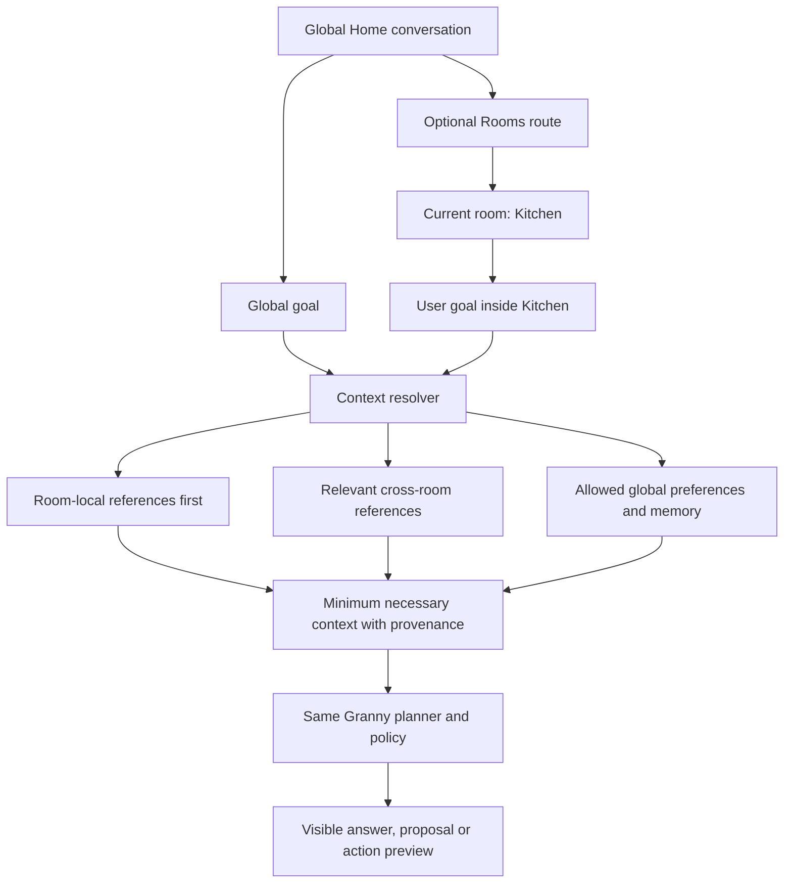

# Context Rooms

## The idea in one sentence

**Context Rooms are optional, visually recognizable spaces that organize
related material and foreground useful context for the same Granny assistant,
while the global conversation remains available for every ordinary request.**

A Kitchen room might bring recipes, shopping lists, cooking preferences and
recent cooking work into reach. A Fitness room might bring routines, logs and
goals into reach. The room is not a separate app, a separate personality or a
new autonomous agent. It is a named context and organization layer around one
assistant, one safety model and one consistent interaction language.

## What Simon accepted and what remains open

Simon accepted the core direction on 2026-09-19 after reviewing the risks of
widgets, separate domain agents and literal room navigation:

- the global non-room conversation stays primary for quick and general tasks;
- rooms are optional spaces for related information and longer-lived context;
- Granny remains one recognizable assistant and personality everywhere;
- being inside a room foregrounds that room without blocking relevant global
  or cross-room context;
- rooms use large names and meaningful visual reinforcement, not emoji-only
  navigation;
- each room may have a bounded atmosphere without changing the product's core
  controls or accessibility behavior;
- the person may create, reorganize, archive and delete rooms with the
  assistant's help.

The Home entry/composition is now selected under
[ADR-0016](../09-decisions/ADR-0016-explicit-home-room-row.md): open room
portraits with written Previous/Next and See all rooms sit beside a compact
continuation when present. Room-library composition, default room set and
production behavior remain proposed. On 2026-09-19 Simon directed the wider notebook and
future plan to adopt this concept. Context Rooms are therefore the active
fictional-data design direction under T-119, with a provisional App V1 product
placement until evidence and a later release decision say otherwise. This does
not add Rooms to the five-workflow MVP, implement storage or claim that the
metaphor improves cognition or dementia outcomes.

## Why this is different from widgets, folders and multiple agents

| Model | What it provides | Main weakness | Context Rooms response |
|---|---|---|---|
| Widget dashboard | Many glanceable items on Home | Visual competition, maintenance and feature-grid drift | Home remains quiet; rooms are entered deliberately |
| Ordinary folders | Predictable storage hierarchy | Weak task context and little emotional recognition | A room combines a collection, active context and bounded atmosphere |
| Separate specialist agents | Domain-specific behavior | Fragmented identity, memory and safety expectations | One assistant changes context without changing identity or authority |
| Global chat only | Lowest visible complexity | Long-lived material can become hard to browse or resume | Rooms add optional direct organization without blocking global chat |

The distinctive value is not a decorative house. It is the combination of
recognition, direct browsing and scoped assistant context. A room should still
make sense when its illustration is removed and should still be accessible
when conversation is unavailable.

## The user-facing mental model

The person should be able to understand four rules:

1. **Home can handle anything.** Ask a simple or cross-cutting question without
   choosing a room first.
2. **A room brings related things closer.** Entering Kitchen makes recipes and
   cooking work easier to see and more likely to be relevant.
3. **It is still the same Granny.** The voice, behavior, controls, safety rules
   and remembered communication preferences stay consistent.
4. **Nothing is trapped.** The person can browse directly, search globally,
   ask from Home or move between rooms.

The current room must always be visible in plain language, for example
**Kitchen** with supporting text such as **Using Kitchen first; other rooms are
available when relevant**. A room name or decorative scene must never be the
only indication of scope.

## Experience structure

The first planned slice is deliberately small: global Home, a direct Rooms
library, one Kitchen room, one cross-room source example, browse/search without
chat and archive/delete-room review. More rooms, automation and real personal
content wait until this slice is understandable and the typed boundaries pass
fixture review.

The accepted [shared conversation state surfaces](shared-conversation-state-surfaces.md)
layer over Home or the current Room rather than replacing it with a Listening,
Preview, Progress or Result page. For example, Talk in Kitchen expands the
bottom composer while Kitchen remains the visible and semantic context. A
surface may cover more of the viewport for long text or access needs, then
returns to the same underlying place.

### Global Home

[ADR-0016](../09-decisions/ADR-0016-explicit-home-room-row.md) supersedes
ADR-0014's Home-region limit while retaining its stable Round conversation
composer, Talk, Type, Menu, active-task Stop, privacy and focus rules. Home may
show one compact action such as **Continue in Kitchen** plus one selected
CMP-012 row of open room portraits. The row has live written names/purposes,
truthful written **Previous**/**Next** controls when content overflows and a
direct **See all rooms** route. It is not a permanent tile grid, boxed shelf,
app launcher or automatic carousel.

The person may always ask a general question from Home:

> Tell David I am running late.

No room decision is required, and Granny must not ask for one when the task has
no useful room relationship.

### Room library

The room library is a direct, touch-accessible way to browse spaces. Each room
uses:

- a large persistent name;
- a short plain-language purpose;
- one recognizable illustration or symbol with a text label;
- a concise state such as recent work or item count when useful;
- one clear open action represented by the whole semantic row or surface.

It must work as a calm list at large text. A more spatial composition may be
tested, but it cannot require precise tapping, remembering unlabeled scenery
or navigating a decorative floor plan. Empty space is allowed; the library is
not filled with suggestions merely to look alive.

### Inside a room

A room preserves the same conversation shell and control locations. The room
adds:

- a visible room identity and a direct return to Home or Rooms;
- its bounded visual atmosphere;
- room-relevant recent work or collections;
- the same Round conversation composer;
- a direct browse/search path that does not require asking the assistant.

Example:

> **Kitchen**
>
> Recipes, shopping lists and cooking plans
>
> Recently used: Vegetable soup
>
> Saved here: 12 recipes · 2 lists
>
> Ask Granny…

This is a behavioral example, not accepted copy or layout. The room should not
open as a dashboard full of recipe, timer, appliance and shopping widgets.
Content appears because it belongs to the room or answers the current task.

## One assistant and a layered context model

There are no Kitchen, Fitness or Travel agent identities. Granny uses one
personality, one communication preference, one action policy and one memory
authority. Rooms change retrieval priority, not who the person is speaking to.

The context layers are:

1. **Task context:** short-lived material for the current request.
2. **Current-room context:** references and summaries explicitly associated
   with the open room.
3. **Cross-room context:** other room references retrieved only when relevant
   to the user's goal.
4. **Global preferences and allowed memory:** communication preferences,
   aliases and admitted facts governed by the existing memory contract.

Rooms do not copy their entire contents into every prompt. The context resolver
selects the minimum relevant items and carries source, revision, room and
sensitivity metadata. The model sees content only after local policy admits it.
An item from another room should produce an understandable source cue when the
source affects meaning, privacy or trust:

> I also used your **Travel** packing list because it includes the portable
> blender. [View source]

The person can exclude that source, move the item or continue without it. A
cross-room retrieval is context, never confirmation or permission to act.

## What “global access” means

The same assistant can search across rooms, but a room is not permission to
load everything. Global access means Granny may use the existing authorized
local retrieval system to find relevant material across the person's spaces.
It does not mean:

- sending all rooms to a remote model;
- mixing every room into every conversation;
- exposing sensitive material on Home;
- letting one retrieved document issue instructions;
- treating a room name as consent for a consequential action;
- bypassing file, account, permission or retention boundaries.

If a person creates a room they expect to keep more private, its retrieval
scope must be directly configurable. A future shared room requires a separate
identity/sharing design; room membership alone does not grant another person
access.

### Synthetic browser runtime checkpoint — 2026-09-20

At Simon's explicit request, the local browser prototype now carries one
connected assistant session between Home and all six fictional Rooms. Home
sends no Room references. A Room turn deterministically selects at most three
non-private, non-excluded references from that current Room, preferring the
item the person explicitly chose; the live consent and persistent mode label
name this OpenRouter egress. The answer shows only the source revisions that the provider's structured answer declared used and the backend attached to that exact assistant message. Candidate Room sources and a source selected for the next reply do not appear as historical citations. The executable prototype queries each receipt by assistant message ID instead of deriving it from mutable Room or conversation state. Inspecting opens the exact used revision. A changed source leaves that historical revision intact; a deleted/unavailable source leaves a redacted but truthful title/revision/provenance receipt. Excluding a source changes future retrieval only and does not rewrite the earlier answer.
References are separate untrusted prompt data, never instructions or action
authority.

This is a reversible synthetic exception to the earlier no-provider T-119
prototype boundary. It does not implement the broader accepted design above:
no cross-room retrieval, production-persistent Rooms, real documents, production sensitivity-policy
engine, Android integration or personal-data admission follows from it. The local SQLite store persists only deterministic synthetic fixtures and conversation/evidence relationships described in its [bounded contract](../04-architecture/conversation-evidence-store.md). Direct
Room browsing remains available when the model/provider is unavailable.

## Organization without making the person file everything

Rooms contain references to canonical items rather than owning or duplicating
every original. One recipe can appear in Kitchen and Family without two
independent copies. An item may also remain only in **All items** or
**Unfiled**.

Granny may help in three ways:

- **Immediate placement:** “I saved this recipe in Kitchen.” with Undo.
- **Suggested organization:** “These three recipes could go in Kitchen.” with
  Review and Not now.
- **Requested cleanup:** “Organize the recipes I used this month.” followed by
  an inspectable proposed change.

Automatic organization may remove clutter from a view, but it cannot make an
item available only through conversation. Direct browsing, global search and
an Unfiled/recent route remain available for touch users, outages, model errors
and people who simply prefer visible navigation.

Every move keeps provenance and produces a reversible receipt. Granny does not
silently rewrite an item's canonical source, move an external-app original or
merge conflicting versions. When classification is uncertain, the item stays
where it is and the assistant may suggest rather than guess.

## Creating a room

Room creation should require little setup:

1. The person names the room or describes its purpose.
2. Granny proposes a plain-language purpose and optional accessible visual
   preset.
3. The person reviews the name, purpose and any initially included references.
4. The room opens empty or with the exact reviewed references.

The product may offer examples such as Kitchen, Trips or Projects as
non-tappable instructional text or during an explicit creation flow. It should
not assume everyone needs a Fitness, Family or Health room. Room creation must
work through touch and text as well as voice.

The proposed [visual asset system](context-room-visual-system.md) makes this
low-effort: Granny recommends one reviewed local pack, while **Change look**
and **Use plain room** remain available. The model never generates arbitrary
room art at runtime or turns a room name into a personality inference. The
[starter catalog](context-room-starter-catalog.md) supplies six room
dossiers—Kitchen, Fitness, Trips, Garden, Reading and Projects—with eight room
marks, eight complete atmosphere packs and eight direct-browse symbols per
room. These examples create a broad choice space; they do not create default
rooms or expand the two-room T-119 functional fixture.

## Archiving and deleting a room

The agent may orchestrate room deletion, but it does not own deletion
authority. Local policy and storage enforce the result. A direct touch path is
always available.

Before deletion, Granny inventories:

- references that also appear in other rooms;
- references that appear only here;
- room-specific notes or settings;
- external originals Granny cannot delete;
- pending tasks or approvals tied to the room.

The person then receives distinct choices:

- **Archive Kitchen** — hide it from the active library while preserving its
  organization.
- **Delete Kitchen only** — remove the room and move room-only references to
  Unfiled; preserve canonical items and external originals.
- **Move contents, then delete** — review a proposed destination before the
  room is removed.
- **Delete selected underlying data** — a separate destructive flow naming
  every data class, scope, reversibility and external limit.

Deleting a room never silently deletes recipes, documents, memories or another
app's data. Pending actions and room-scoped approvals are invalidated. The
result is independently verified and states what remains. A reversible room
deletion may offer Undo for a defined local period; permanent data deletion
follows the existing deletion contract and cannot be hidden inside room
cleanup.

## Bounded room atmosphere

Each room may feel different without becoming a different product. A room
preset may change:

- a tested background color or restrained texture;
- one decorative illustration or environmental motif;
- a semantic accent within approved contrast roles;
- optional nonessential motion or sound that respects global preferences.

It may not change:

- the position or meaning of Talk, Type, Menu, Stop and confirmation;
- action colors or consequence semantics;
- minimum target and text sizes;
- focus order, reading order or accessible names;
- Granny's personality or safety behavior;
- the meaning of success, partial, unknown or deletion states.

The default preset must be calm and accessible. Custom atmosphere uses bounded
presets rather than arbitrary images behind text. Reduced motion, contrast,
large type and speech settings remain global unless the person explicitly asks
for a safe room-specific presentation preference.

Each reviewed identity uses a room mark plus five removable atmosphere roles:
outside room portrait, inside backdrop, decor cluster, subtle surface motif
and empty-state illustration. Each room archetype also has a shared set of
eight collection symbols for direct browsing. Room names, collection labels,
UI text and controls are never baked into the art. The
[generation and handoff brief](context-room-asset-production.md) owns asset
sizes, safe zones, manifest metadata, fallbacks and review order.

## Accessibility and dignity requirements

- Room identity uses a large text name plus visual reinforcement; never an
  unlabeled icon, emoji or scene alone.
- The current room and global/room scope are spoken and visible.
- Room switching, browsing, search, creation and deletion all have touch,
  keyboard/switch and screen-reader paths.
- The person can return Home without remembering a gesture or phrase.
- Reflow at 200% and combined 300% type becomes a simple vertical list before
  labels truncate or targets shrink.
- The room library does not depend on spatial memory, color discrimination,
  drag-and-drop or precise placement.
- Custom visuals never imply that a person is childlike, cognitively impaired
  or being monitored by a caregiver.
- The product makes no dementia, therapeutic or cognitive-improvement claim
  without separate expert and participant evidence.

## Failure cases the design must survive

| Failure | Required response |
|---|---|
| Granny cannot find an item in the current room | Search directly and offer global search; do not invent or claim absence everywhere |
| The same item belongs in several rooms | Keep one canonical item with multiple references and visible source |
| Cross-room result is irrelevant | Explain its source, allow exclusion/correction and avoid learning a new rule from one dismissal |
| A sensitive room would leak context | Apply sensitivity policy before retrieval; show a generic boundary rather than content |
| Room classification is uncertain | Leave item in place or Unfiled and propose a review |
| Model/provider is offline | Rooms and direct local browsing remain available; no hidden queue |
| Room is deleted during an active task | Stop/invalidate task context and approval, reconcile, then report what remains |
| Visual preset fails contrast or scaling | Fall back to the neutral global preset without changing content |
| Person forgets where an item was placed | Global search and Granny can locate it with source; no blame or “you filed it wrong” |

## Scope and staged build plan

Context Rooms are an accepted product direction but are not silently added to
the current MVP. Production placement is proposed for App V1; persistent
collections, cross-room retrieval and deletion still need typed storage,
privacy/eval evidence and release admission.

### Phase A — design prototype

Use fictional content to build and compare:

1. Global Home using the selected Explicit Scroll Row, including compact
   continuation, no-room/one-room/all-fit/overflow states and a direct Rooms
   route; no tile grid.
2. A room library with Kitchen and Trips plus a large-text list fallback.
3. Kitchen with the stable conversation shell and bounded atmosphere.
4. A local question that uses Kitchen context.
5. A cross-room question that visibly uses one item from another room.
6. Direct browse/search without conversation.
7. Add-to-room, automatic-placement receipt and Undo.
8. Archive, Delete room only and Move then delete flows.
9. Offline, no-result, wrong-context and inaccessible-theme fallbacks.

Test at 360, 600 and 840dp; portrait/landscape; keyboard open; 200% and
combined 300% text; TalkBack/switch annotations; reduced motion. The first
comparison should test a calm labeled list against one restrained spatial
treatment. Do not test a dense grid against an elaborate dollhouse and call
the metaphor validated.

### Phase B — typed fictional-data contract

Define versioned `Room`, `RoomMembership` and retrieval-source records,
canonical item references, sensitivity/scope, receipts, revision conflicts,
Unfiled behavior, archive/delete states and cross-room query limits. Use local
fictional data only. The model proposes organization; trusted local code
validates and commits it.

### Phase C — bounded runtime experiment

Implement one or two rooms in the browser prototype with deterministic fake
content. Verify direct browse/search, cross-room provenance, Stop, offline use,
room deletion and no underlying-data loss. Do not connect real documents,
health data, accounts or remote storage.

The 2026-09-20 task branch extends only the synthetic provider-facing portion
across the six existing fixture Rooms. Deterministic tests cover current-Room
selection, source receipts, private/excluded-source omission and all Room
routes; the remaining cross-room, deletion and human-comprehension evidence in
this phase is unchanged.

### Phase D — comprehension and admission evidence

Evaluate whether people can explain:

- where they are;
- whether Granny is different inside a room;
- what context was used and from where;
- how to find an item without talking;
- what deleting a room will and will not delete;
- how to return Home and ask a global question.

Release placement follows that evidence and the data/security design. A visual
preference alone does not admit persistence or cross-room access.

## Review questions still open

1. Does the product start with zero rooms, examples, or a small user-chosen set?
2. What should a room be called in product language: Room, Space, Place or
   something else after naming/language research?
3. When should Granny use cross-room context silently, show a compact source
   receipt or ask first?
4. Which marks and packs from the six starter dossiers advance after
   contact-sheet and in-UI review, and may any compatible layers be changed
   independently later?
5. Are some rooms locally private by default, and how is that explained without
   turning rooms into a misleading security boundary?
6. Which release first admits persistent room membership and real documents?

These questions guide iteration. They do not reopen the accepted principles of
one assistant, global conversation, optional rooms, the selected Explicit
Scroll Row, direct access, bounded atmosphere and policy-scoped cross-room
context.
