# Chat entry explorations

All 15 images from the five 2026-09-17 rounds are embedded here. These are generated visual concepts with fictional content. [Round conversation is the selected shape](../../brand-and-visual-identity.md#accepted-shape-direction--round-conversation); the other images preserve exploration history, not current implementation instructions. Colors, fonts and copy in these images were not accepted by selecting a shape.

[New font and color style boards](../2026-09-19-style-boards/README.md) · [All mockups](../README.md)

## Selected reference — Round conversation

## Round 1 — Early landing compositions

### The pebble

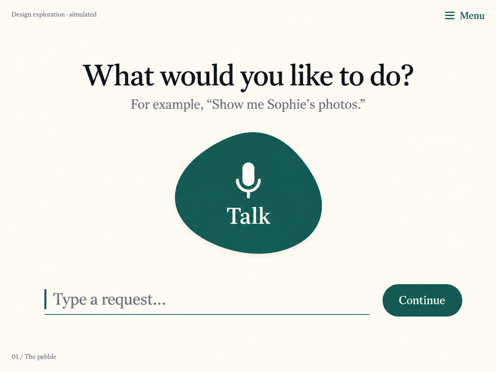

### The open page

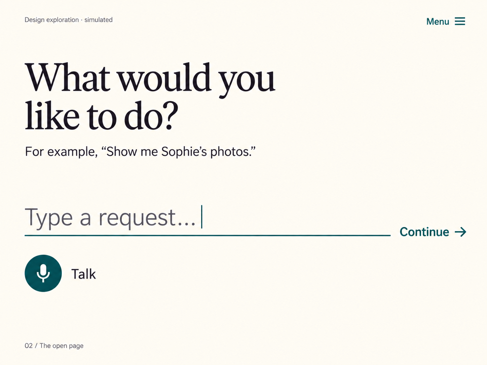

### The shoreline

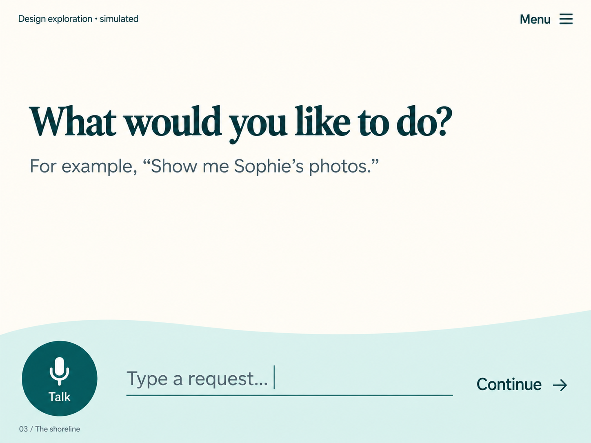

## Round 2 — Conversation and draft layouts

### One clear next step

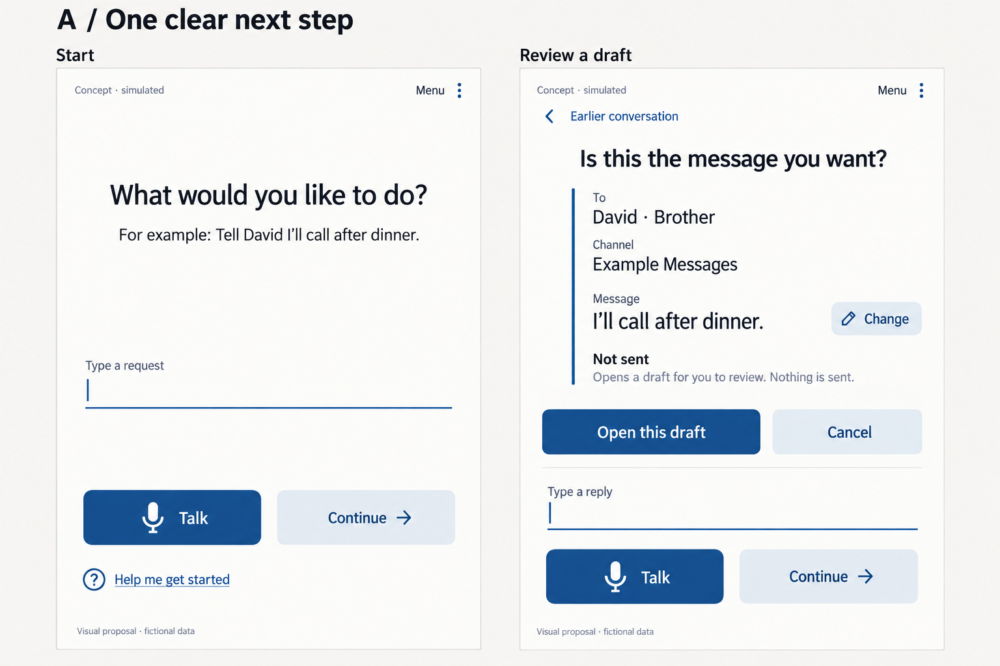

### The shared table

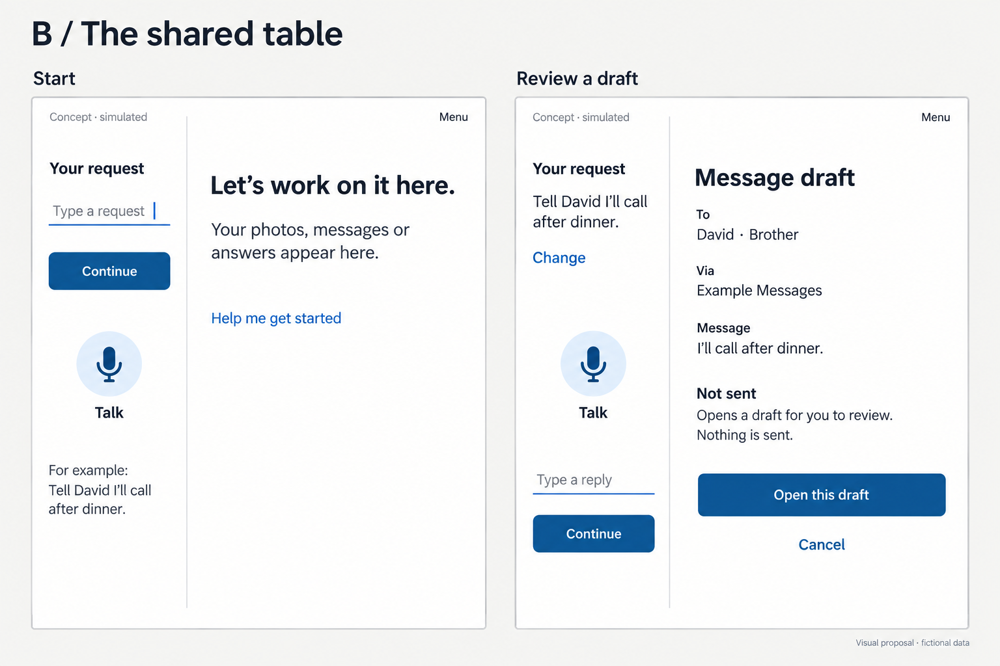

### Conversation working page

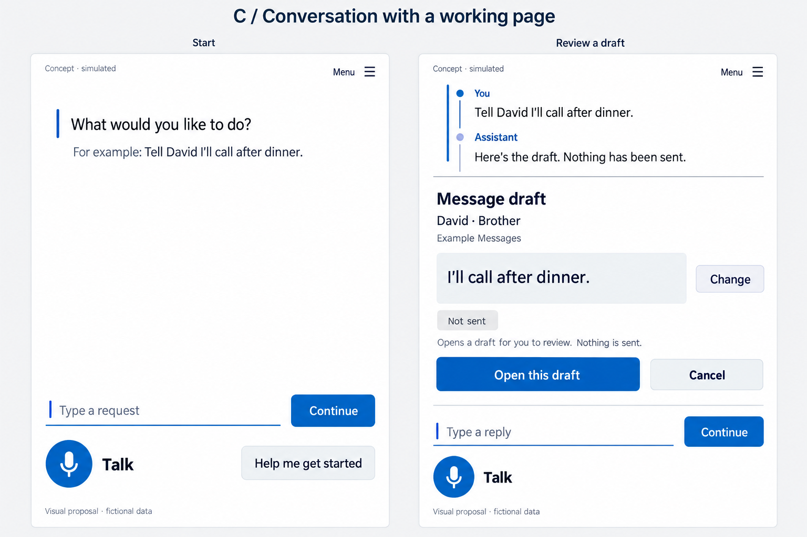

## Round 3 — Writing-surface studies

### Correspondence

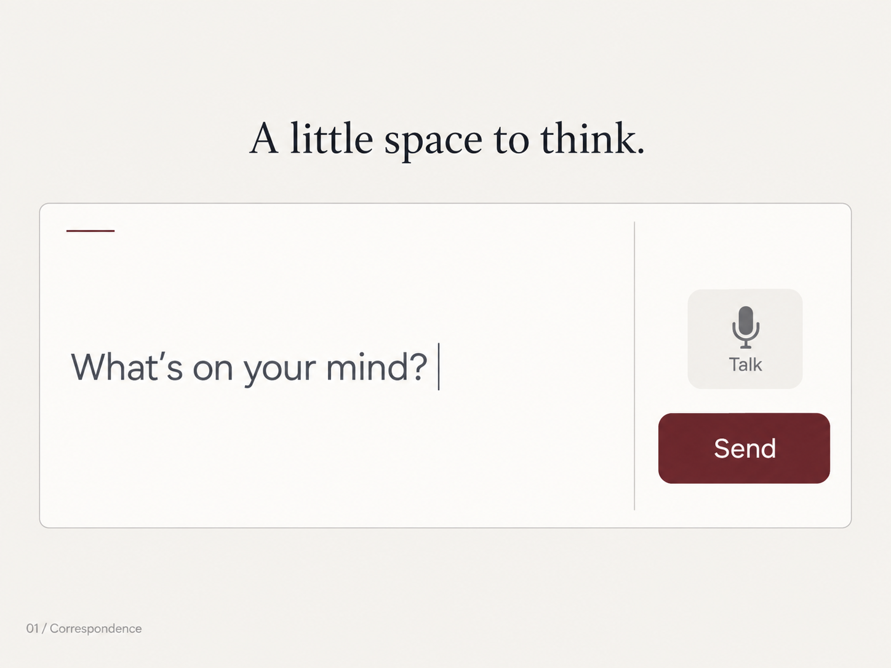

### Margin

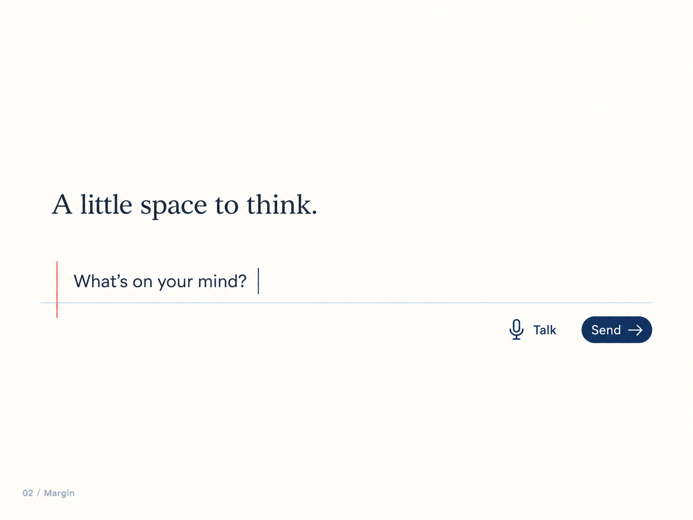

### Soft terminal

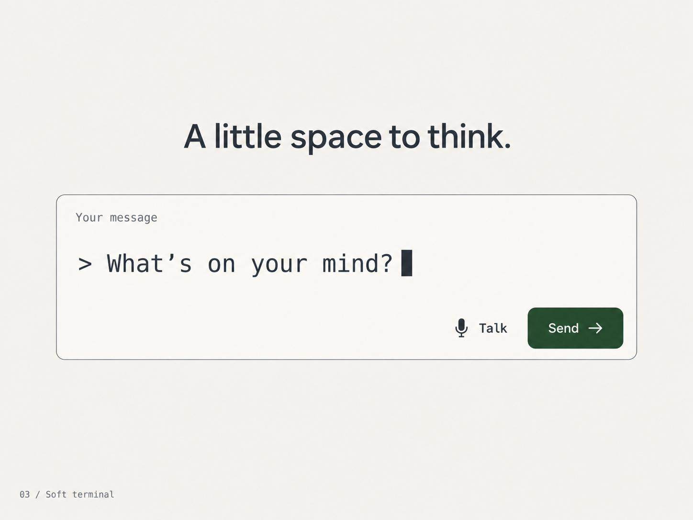

## Round 4 — Bubble, ticket and ribbon

### Conversation bubble

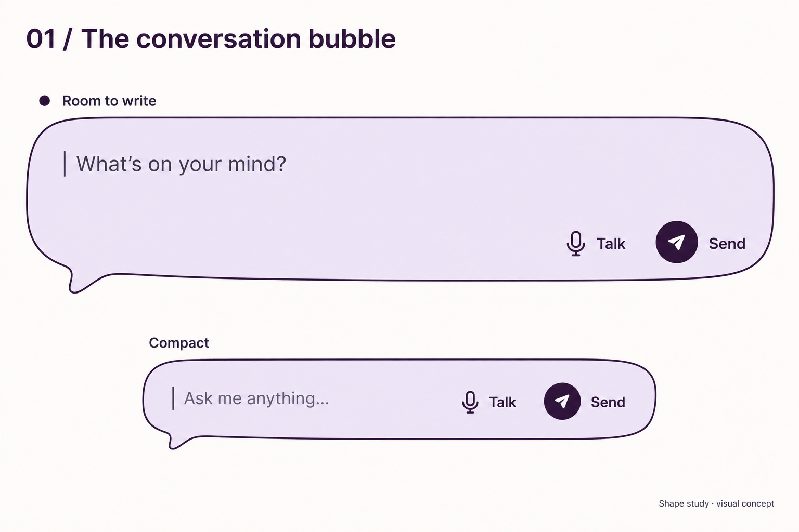

### Soft ticket

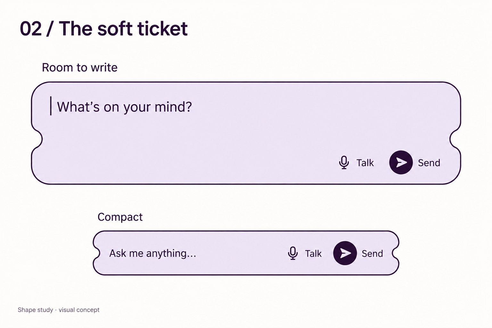

### Folded ribbon

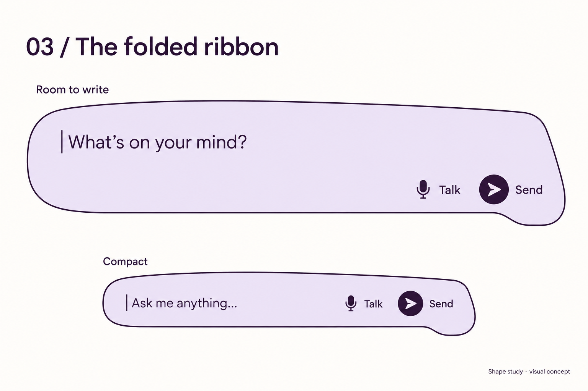

## Round 5 — Alternative bubble shapes

### Tucked tail

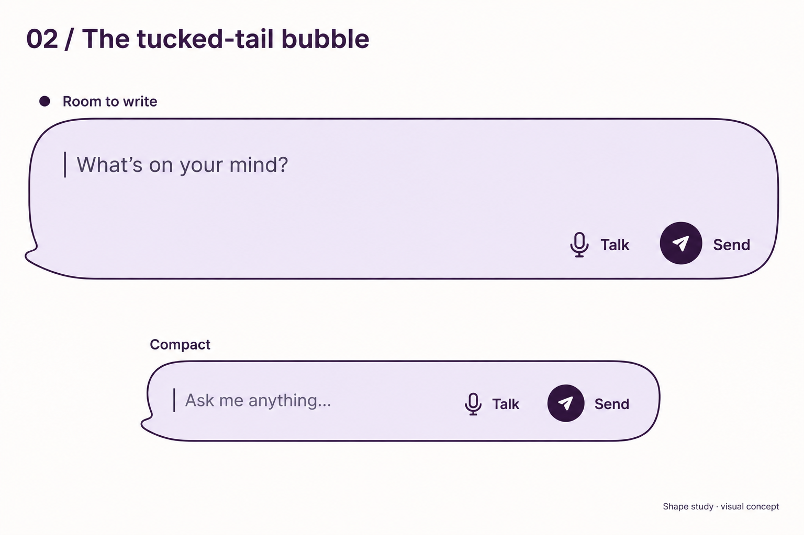

### Cushion bubble

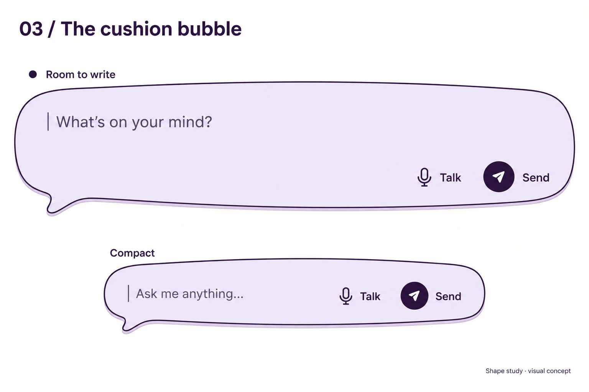

Lets do some more variations on correspondence