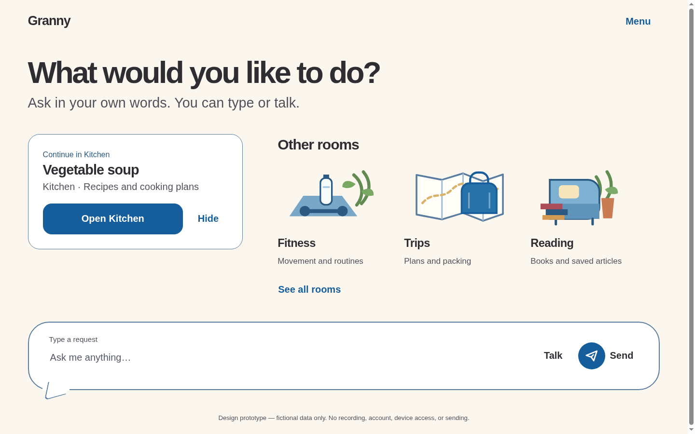
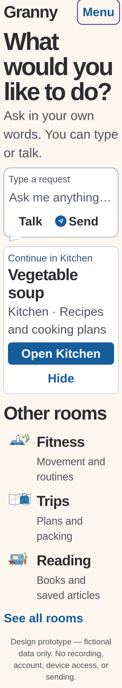

# Frontend checkpoint 1 — Explicit Scroll Row Home

These screenshots record the dependency-free browser implementation of the
selected Home at implementation commit `e5d5790`. They are review evidence for
the bounded Home checkpoint, not new composition authority and not Android,
assistive-technology or participant evidence.

## Expanded participant Home



Fixture: participant mode at 1440×900 CSS pixels, default continuation and the
three fictional Fitness/Trips/Reading rooms. All rooms fit the measured row, so
Previous/Next are truthfully absent. Stop is absent because no task is active.

## Narrow large-text Home



Fixture: 600 CSS pixels wide, 150% app text combined with the isolated 200%
review scale, for 300% total. The screenshot is full-page because no single
1000-pixel viewport can contain this intentionally enlarged state. Reviewer
controls were hidden for capture; the rendered participant Home was unchanged.
The composer precedes continuation and a direct vertical Rooms list, with zero
page-level horizontal overflow.

## Comparison with the selected source

- The implementation preserves the Linen canvas, Harbour Blue outline/actions,
  dark ink, quiet written Menu, large invitation, one compact continuation,
  open room portraits and broad Round composer with written Talk/Send.
- It preserves the selected hierarchy without copying raster geometry. At
  expanded landscape the composer remains near the bottom; at narrow or large
  text its document order moves it before continuation/Rooms.
- Unlike the source raster, Previous/Next appear only when the rendered row
  truly overflows. At an end, the unavailable control remains focusable with
  `aria-disabled`, a visible reason and a described position; one range update
  is announced per movement.
- The source's polished room/continuation illustrations were not available as
  reviewed local assets. The implementation intentionally omits continuation
  artwork and uses simpler unframed room placeholders. It does not claim exact
  artwork fidelity.
- The Round outline and short lower-left tail are CSS, not raster artwork. No
  gradients, glow, shadow, glass, generated imagery or remote asset is used.

## Placeholder inventory

- `Granny` is a written codename/placeholder marker, not a final logo or public
  name.
- Fitness, Trips and Reading use three hand-authored local SVG atmosphere
  placeholders. Essential room name, purpose and target remain live text; the
  image-failure fixture removes the decoration and retains all behavior.
- Kitchen, each room target and `See all rooms` open plainly labelled fictional
  placeholder surfaces. They include working return actions and explicitly do
  not claim a room interior, saved soup, personal history or persistence.
- No image-generation tool, remote image URL, tracking request or personal data
  was used.

## Checks run for this checkpoint

All commands used the repository's existing Node 26.8.1, Python and Chromium
151 installation; no dependencies were installed.

```text
node prototypes/stage-1/model.test.mjs                  67 passed
node prototypes/stage-1/scheduler.test.mjs               7 passed
node prototypes/stage-1/cloud.test.mjs                  27 passed
node prototypes/stage-1/serve.test.mjs                   1 passed
node prototypes/stage-1/home-browser-check.mjs         156 passed, 0 browser errors
node prototypes/stage-1/browser-check.mjs              132 passed, 0 browser errors
node prototypes/stage-1/runtime-browser-check.mjs       37 passed, 0 browser errors
python3 scripts/validate-docs.py                          PASS, 0 errors
git diff --check                                         PASS
```

The Home browser check covers exact idle copy/no Stop, empty validation,
physical keyboard text/Tab/Enter submission, continuation hide/fresh-session
restore, Kitchen/room/list routes and focus return, measured all-fit/overflow
movement, first/middle/last state, changed scroll/range, once-only live
announcements, no/one/image-failure fixtures, reduced motion, 360/600/840/1440
and constrained-height layouts, combined 300% text, control reachability,
capture interception from document initialization, static-only loopback
requests, and absence of cookies/browser storage. The existing browser suite
continues to exercise all five scripted workflows and active Stop. The runtime
suite uses wire fixtures, not a real backend/MCP.

Final cockpit, Python documentation-unit and handoff checks are recorded in the
linked session note because they include this evidence folder and completed
session record.

## Known limits

- No reviewed Bricolage Grotesque or DM Sans files exist locally. The browser
  uses the documented system-sans fallback; exact font fidelity is unproven.
- CSS pixels do not establish Android dp/sp or physical target size. TalkBack,
  switch access, native Android reflow/IME, device navigation/Stop, physical
  target measurements and older-adult comprehension remain unrun.
- The browser intercepts and counts microphone/speech capture attempts and the
  server disables microphone/camera through Permissions Policy; this is not a
  native Android permission test.
- The complete SCR-016 library, Kitchen/Fitness interiors, search, creation,
  management, cross-room retrieval, persistence and real personal data are out
  of scope. Connected-demo compatibility is regression-tested with frontend
  wire fixtures; no provider or external network was used.
- Screenshot review cannot prove final brand, logo, typography, room artwork or
  comprehension acceptance. The selected source and canonical SCR/CMP/access
  documents retain authority.
