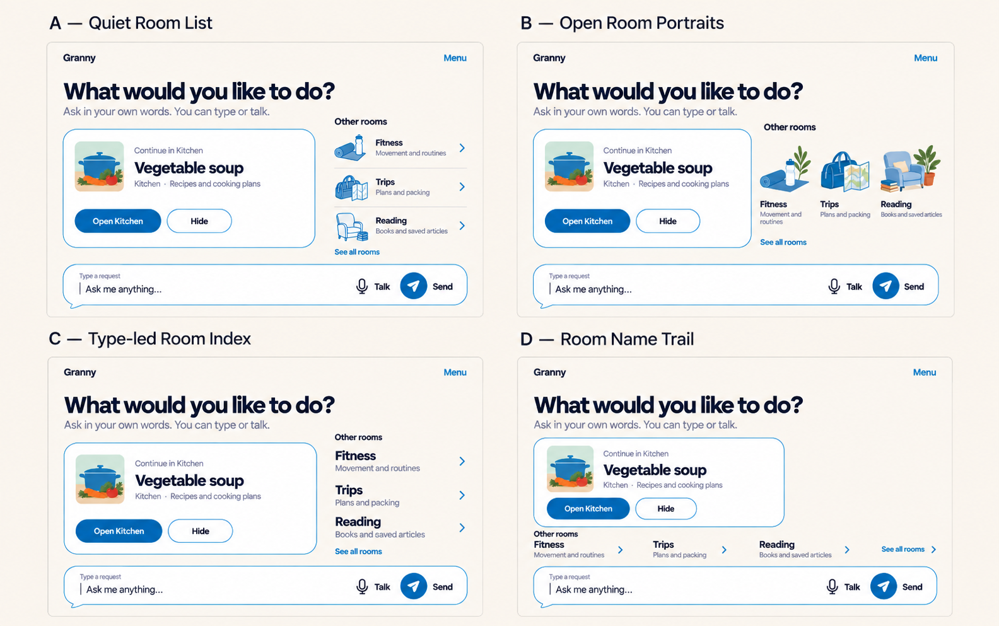
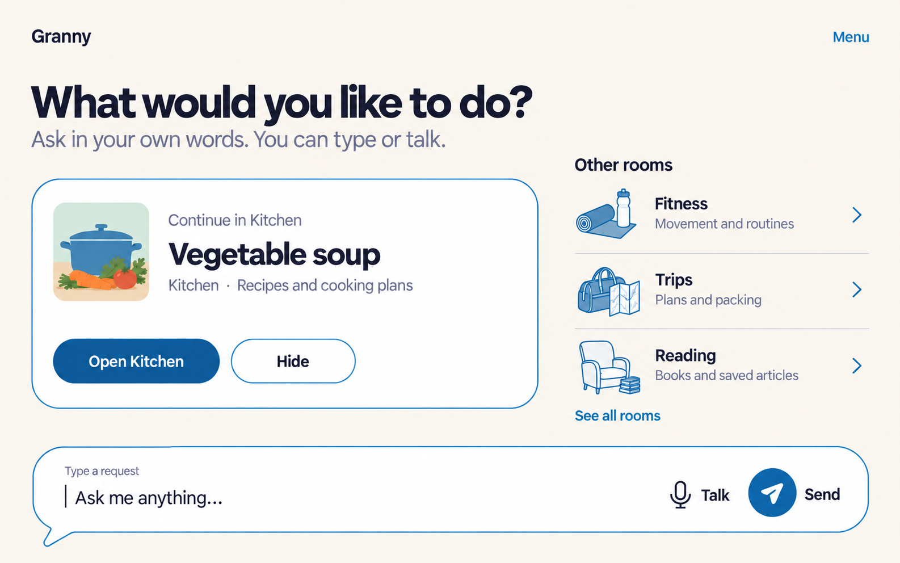
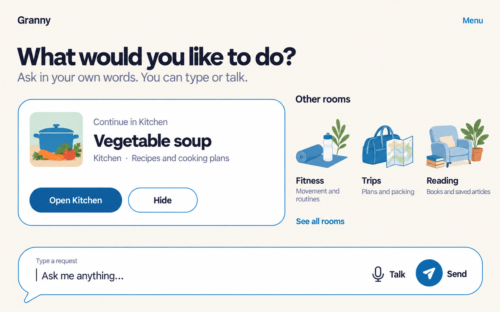
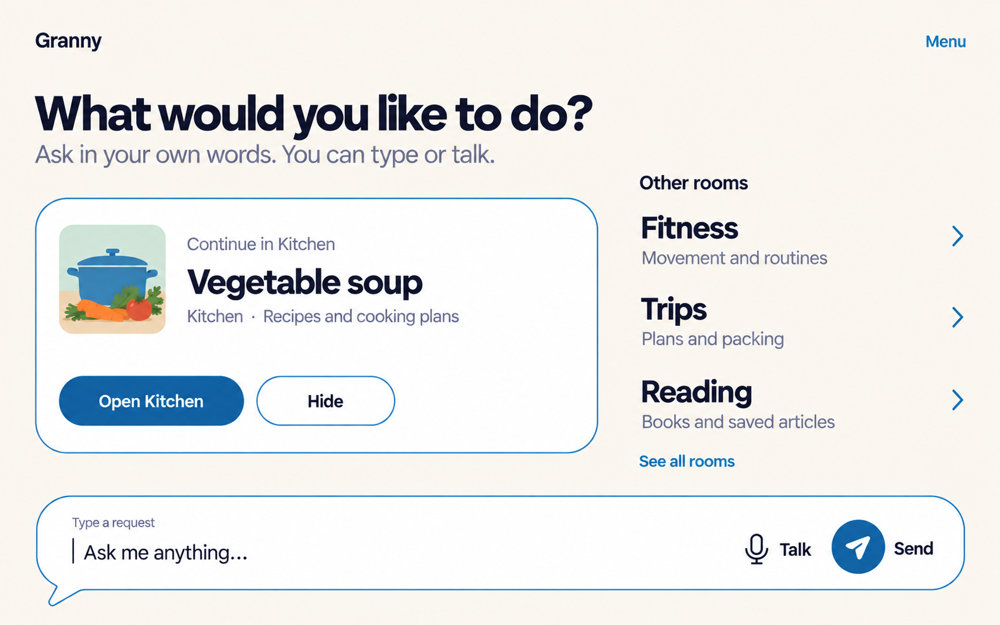
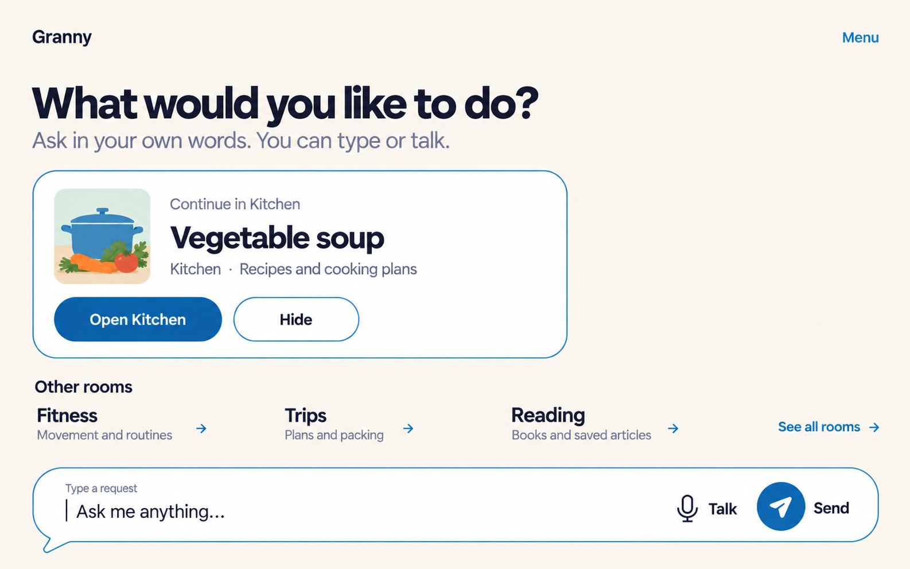

# Harbour Blue Home composition — round 3

> [!note] Selected base for the next refinement
> Simon identified B — Open Room Portraits as the strongest current direction
> and asked for smaller continuation and alternate browsing treatments. Continue
> with [round 4](../round-4/README.md). This folder remains preserved in full.

Simon selected round 2's continuation-led idea as the strongest basis, in
particular its large “Continue in Kitchen” language, but rejected the strongly
separated room tiles. This round holds the rectangular continuation panel and
bottom conversation composer constant while comparing four ways for other
Rooms to flow directly through the Linen canvas.

These are Home-load compositions only. They do not create tabs, a Rooms
library, room interiors, frontend code, Android UI or Figma frames. The
selected [Harbour Blue system](../../2026-09-19-style-boards/final-harbour-blue/README.md)
remains fixed. Kitchen, Fitness, Trips, Reading and Vegetable soup are
fictional fixtures; “Granny” remains a codename.

## Comparison



The comparison is a generated review sheet and may resample fine pixels. The
four individual images below are the authoritative raster references.

## A — Quiet Room List



**Structural thesis:** thin separators, small Harbour Blue line illustrations
and generous row spacing make the entire written row feel tappable without
turning each Room into a card.

**Main sacrifice:** the dividers still introduce visible structure, so this is
the least radical departure from the tiled treatment.

## B — Open Room Portraits



**Structural thesis:** recognizable removable portraits can sit directly on
the page with their names and purposes, making Rooms feel like places rather
than boxed features.

**Main sacrifice:** without persistent boundaries, the illustrations may read
as decoration unless the whole label-and-portrait area has strong interaction
feedback.

## C — Type-led Room Index



**Structural thesis:** large room names, plain-language purposes and quiet
directional cues provide the calmest, clearest browsing treatment with no card
containers or decorative dependency.

**Main sacrifice:** removing room art weakens visual and spatial recognition
for people who benefit from a pictured place.

## D — Room Name Trail



**Structural thesis:** one flowing horizontal line of names uses the widest
tablet canvas and leaves the most open Linen space while keeping all Rooms in
the same visual sentence.

**Main sacrifice:** the horizontal relationship is most vulnerable to narrow
windows and large text, where it must become one vertical sequence rather than
scrolling or shrinking.

## Review table

| Direction | Other-room treatment | How it avoids tiles | Main review risk |
|---|---|---|---|
| A — Quiet Room List | Illustrated vertical rows | No outer cards; only short dividers | Still feels list-like and visibly structured |
| B — Open Room Portraits | Unframed portraits with live labels | Art and text rest directly on Linen | May appear decorative rather than actionable |
| C — Type-led Room Index | Large written links and purposes | No containers, illustrations or dividers | Loses pictorial room reinforcement |
| D — Room Name Trail | One horizontal written sequence | No region boundary or individual surfaces | Must reflow vertically at narrow width/large text |

## Shared fixture and invariants

- “Continue in Kitchen” remains the single white rectangular context panel in
  every direction; “Vegetable soup” is explicitly fictional recent work.
- The other Rooms are visually borderless at rest, but each name, purpose and
  reinforcement represents one broad semantic target in implementation.
- Borderless does not mean invisible interaction: keyboard, switch and remote
  focus must reveal a separated `#4930A1` focus ring without shifting layout.
- Home remains usable without choosing a Room. The invitation and Round
  composer retain Type, Talk and Send near the bottom in stable locations.
- Room meaning is present in live written names and purposes, never only in
  color or generated artwork. Decorative art can be removed.
- Idle Home has no Stop. There are no tabs, rails, app grids, prompts, weather,
  clock, news, scores, streaks, alerts, notification counts or fake memories.
- Narrow screens and large text must stack invitation, continuation, other
  Rooms and composer into one simple vertical reading sequence.

## Source reference and fidelity

All generations referenced the unchanged selected source:

`docs/02-design/mockups/2026-09-19-style-boards/final-harbour-blue/harbour-blue-final.png`

The intended roles are Canvas `#FBF6EE`, Surface `#FFFFFF`, Ink `#2E2D32`,
Accent `#2C5981`, Outline `#597DA0`, Send `#165D9C`, Focus ring `#4930A1`,
Stop/danger `#962F43` and On-colour `#FFFFFF`. No idle Stop is shown. Natural
fictional room art contains restrained illustrative color; UI actions and
boundaries retain Harbour Blue roles.

Typography intent is Bricolage Grotesque 600 for display and DM Sans 400/600
for body and controls. The image generator does not expose or certify the font
files, exact hex pixels, Android dp/sp, vectors or responsive layout, so those
remain approximations. Each source image is 1586 × 992 pixels. They are design
references, not accepted Android geometry.

Full-size inspection found all expected copy legible and correctly spelled,
the continuation rectangle intact, other Rooms visually integrated with the
Linen canvas and the composer present in every direction. B's portraits carry
the most decorative weight; D's horizontal purposes are the smallest text in
the set. The comparison sheet is not pixel-identical to its source images.

Contrast, 56/64dp target sizes, 200% reflow, combined 300% scaling, TalkBack,
keyboard/switch order, focus-ring geometry, IME behavior and older-adult
comprehension remain unrun. A raster image cannot prove them.

## Exact generation prompts

The built-in image-generation tool created one source per direction using the
selected Harbour Blue board as its visual-system reference. No CLI or API-key
path was used.

### A — Quiet Room List

```text
Use case: ui-mockup
Asset type: full-screen landscape tablet Home UI, Harbour Blue Home round 3, Direction A — Quiet Room List
Input image: the selected Harbour Blue visual-system reference. Preserve its Linen canvas, white surfaces, dark ink, Harbour Blue outline/actions and Round conversation composer; do not copy its board layout.
Create a spacious 16:10 Granny Home-load screen. Keep small “Granny” upper left, written “Menu” upper right, “What would you like to do?” and “Ask in your own words. You can type or talk.”. Keep one large white rectangular outlined continuation panel on the left with a restrained fictional soup image and exact live text “Continue in Kitchen”, “Vegetable soup”, “Kitchen · Recipes and cooking plans”, filled “Open Kitchen” and outlined “Hide”. This continuation panel is intentionally the only strong rectangle.
On the right, place “Other rooms” and a calm vertical list for Fitness / “Movement and routines”, Trips / “Plans and packing”, and Reading / “Books and saved articles”. The rows must blend directly into the Linen background: no cards, pills, rounded boxes, filled containers or tinted tiles. Give each row a small removable Harbour Blue line illustration, a broad implied touch area, generous vertical space, a quiet right chevron and only a thin short divider between rows. Add “See all rooms” below.
Keep the large white Round speech-balloon composer near the bottom across the width with a short lower-left tail and #597DA0 outline. Show “Type a request”, a visible caret, “Ask me anything…”, outlined microphone and “Talk”, circular #165D9C paper plane and “Send”.
Use Canvas #FBF6EE, Surface #FFFFFF, Ink #2E2D32, Accent #2C5981, Outline #597DA0, Send #165D9C and white on colour. Reserve #4930A1 for focus only; no Stop on idle Home. Approximate Bricolage Grotesque 600 and DM Sans 400/600. Flat fills, no shadow. Preserve generous free space, written meaning and simple vertical reflow. Add no other words.
Avoid: room cards, tiles, badges, tabs, bottom navigation, app grid, prompt chips, clocks, weather, metrics, gradients, glow, glass, shadows, AI imagery, watermark, device frame, status bar, people or private data.
```

### B — Open Room Portraits

```text
Use case: ui-mockup
Asset type: full-screen landscape tablet Home UI, Harbour Blue Home round 3, Direction B — Open Room Portraits
Input image: the selected Harbour Blue visual-system reference. Preserve its Linen, white, Ink and Harbour Blue system and Round composer; do not recreate its board layout.
Create a spacious 16:10 Granny Home-load screen with small “Granny”, written “Menu”, “What would you like to do?” and “Ask in your own words. You can type or talk.”. On the left keep one large white rectangular outlined continuation panel with fictional soup artwork and exact text “Continue in Kitchen”, “Vegetable soup”, “Kitchen · Recipes and cooking plans”, “Open Kitchen” and “Hide”. It is the only strong container.
On the right place “Other rooms”, then three restrained open portraits sitting directly on Linen with no background shapes or boundaries: a movement mat and bottle for Fitness / “Movement and routines”; travel bag and map for Trips / “Plans and packing”; chair and books for Reading / “Books and saved articles”. Place each written name and purpose immediately below its portrait. Treat portrait plus label as one broad implied target. Do not use cards, arches, circles, pills, dividers, tinted patches, icon squares or button outlines. Add “See all rooms” below.
Keep the full-width Round conversation composer near the bottom with white surface, short lower-left tail, #597DA0 outline, “Type a request”, caret, “Ask me anything…”, outlined mic plus “Talk”, #165D9C circular plane plus “Send”.
Use Canvas #FBF6EE, Surface #FFFFFF, Ink #2E2D32, Accent #2C5981, Outline #597DA0, Send #165D9C, white on colour; focus #4930A1 only when active and no idle Stop. Approximate Bricolage Grotesque 600 and DM Sans 400/600. Flat, spacious and adult. Add no other words.
Avoid: room tiles/cards, floating bubbles, badges, tabs, bottom navigation, dashboard content, prompts, gradients, glow, glass, shadows, watermark, device frame, people or private data.
```

### C — Type-led Room Index

```text
Use case: ui-mockup
Asset type: full-screen landscape tablet Home UI, Harbour Blue Home round 3, Direction C — Type-led Room Index
Input image: the selected Harbour Blue visual-system reference. Preserve its Linen canvas, white surfaces, dark Ink, Harbour Blue actions and Round composer; do not copy the board composition.
Create a spacious 16:10 Granny Home-load screen. Show small “Granny” upper left, written “Menu” upper right, “What would you like to do?” and “Ask in your own words. You can type or talk.”. Keep one large white rectangular outlined continuation panel on the left containing restrained fictional soup art and exact text “Continue in Kitchen”, “Vegetable soup”, “Kitchen · Recipes and cooking plans”, filled “Open Kitchen” and outlined “Hide”. Keep this as the only strong rectangle.
On the right place “Other rooms” followed by a purely typographic, borderless room index directly on Linen: large “Fitness” with “Movement and routines”; large “Trips” with “Plans and packing”; large “Reading” with “Books and saved articles”. Give each entry a quiet right chevron and generous blank space as its implied full-width target. No art, icons, dividers, backgrounds, boxes, pills, circles or tinted surfaces. Add “See all rooms” below.
Place the large white Round speech-balloon composer near the bottom across most width, with lower-left tail and #597DA0 outline. Include “Type a request”, visible caret, “Ask me anything…”, outlined microphone with “Talk”, #165D9C circular paper plane with “Send”.
Use Canvas #FBF6EE, Surface #FFFFFF, Ink #2E2D32, Accent #2C5981, Outline #597DA0, Send #165D9C and white on colour. Reserve #4930A1 for focus; no idle Stop. Approximate Bricolage Grotesque 600 and DM Sans 400/600. Use large legible text, generous free space and a reading order that stacks vertically. Add no other words.
Avoid: room cards, tiles, artwork, icon badges, tabs, bottom navigation, app grid, dashboard content, prompts, gradients, glow, glass, shadows, watermark, device frame, people or private data.
```

### D — Room Name Trail

```text
Use case: ui-mockup
Asset type: full-screen landscape tablet Home UI, Harbour Blue Home round 3, Direction D — Room Name Trail
Input image: the selected Harbour Blue visual-system reference. Preserve its Linen, white, Ink and Harbour Blue roles and Round composer; do not copy its board layout.
Create a spacious 16:10 Granny Home-load screen with small “Granny”, written “Menu”, “What would you like to do?” and “Ask in your own words. You can type or talk.”. Keep a moderately wide white rectangular outlined continuation panel below the invitation with fictional soup artwork and exact text “Continue in Kitchen”, “Vegetable soup”, “Kitchen · Recipes and cooking plans”, “Open Kitchen” and “Hide”. This is the only strong rectangle and must not fill the whole width.
Below it, place “Other rooms” and one calm horizontal name trail directly across the Linen canvas: “Fitness” / “Movement and routines”, “Trips” / “Plans and packing”, “Reading” / “Books and saved articles”, followed by “See all rooms”. Use only written text and small directional arrows with generous spacing. No card, tile, background panel, divider, illustration, arch, pill or tinted area around any room. Make the visual sequence clearly capable of stacking vertically at narrow widths rather than shrinking.
Keep the large white Round conversation composer near the bottom with generous separation, a short lower-left tail and #597DA0 outline. Include “Type a request”, visible caret, “Ask me anything…”, outlined microphone plus “Talk”, #165D9C circular paper plane plus “Send”.
Use Canvas #FBF6EE, Surface #FFFFFF, Ink #2E2D32, Accent #2C5981, Outline #597DA0, Send #165D9C and white on colour. #4930A1 is focus-only; no idle Stop. Approximate Bricolage Grotesque 600 and DM Sans 400/600. Flat fills and abundant open Linen space. Add no other words.
Avoid: cards, tiles, boxes, room art, tabs, bottom navigation, dashboard content, prompt chips, gradients, glow, glass, shadows, watermark, device frame, people or private data.
```

### Comparison sheet

```text
Create one clean 2×2 comparison sheet for a product-design review using the four supplied Granny landscape tablet Home mockups exactly as references. Preserve each screenshot without redesigning, recolouring, cropping its controls, changing its text, or inserting content inside it. Place the screenshots at equal readable size on a neutral Linen #FBF6EE review canvas with generous outer margins and even gutters. Put labels OUTSIDE and above each screenshot only: “A — Quiet Room List”, “B — Open Room Portraits”, “C — Type-led Room Index”, “D — Room Name Trail”. Use dark Ink #2E2D32 for labels. No title, commentary, logos, arrows, decorations, shadows, device frames, watermarks, or extra UI. The result is a review sheet, not a fifth design.
```

## Stop point

No winner is selected. This round stops at Home composition and does not extend
into a full Rooms library, room interiors, implementation or Figma authoring.

**Review question:** Which borderless room treatment should be refined—A's
quiet list, B's open portraits, C's type-led index or D's room-name trail—or
which restrained parts should be combined without creating a busier fifth
design?
