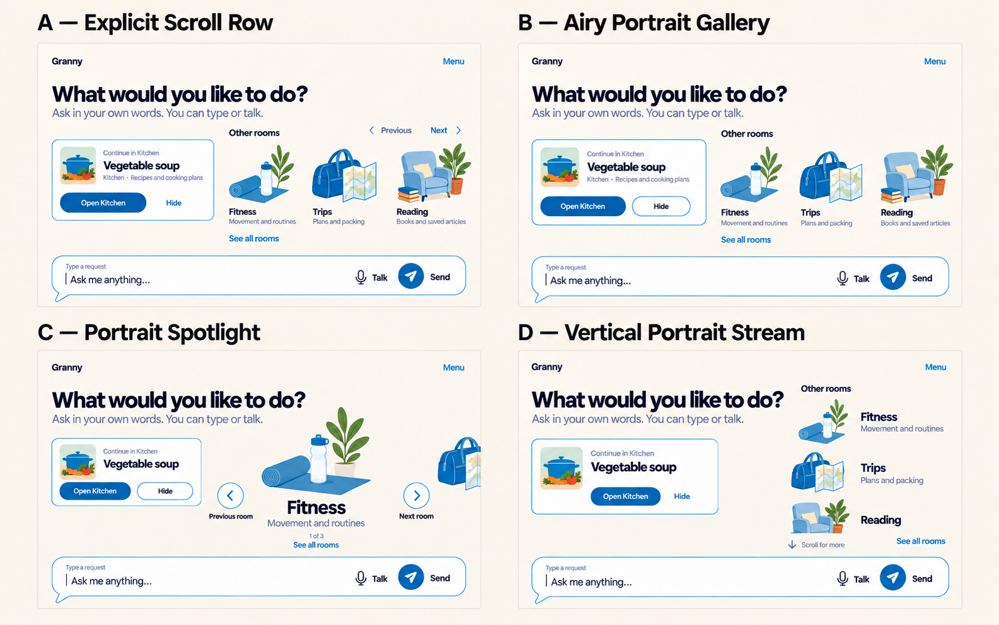
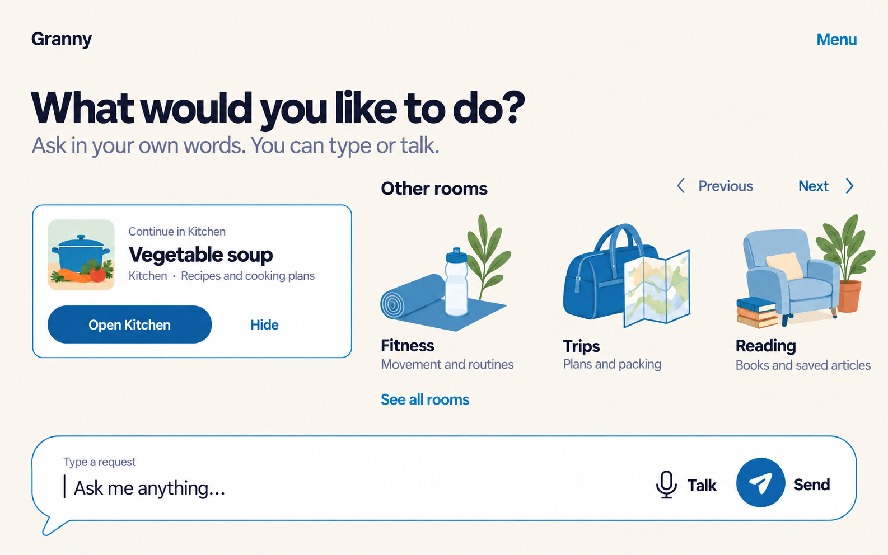
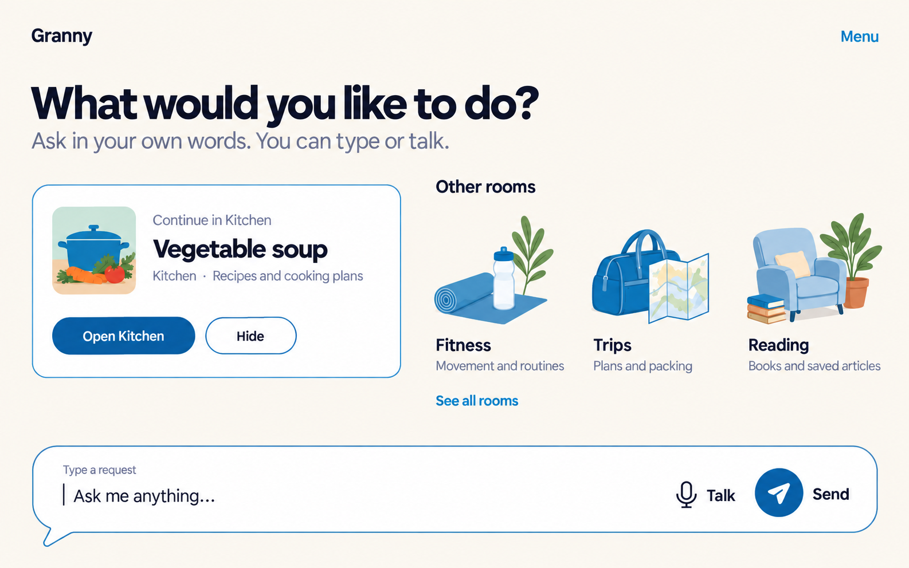
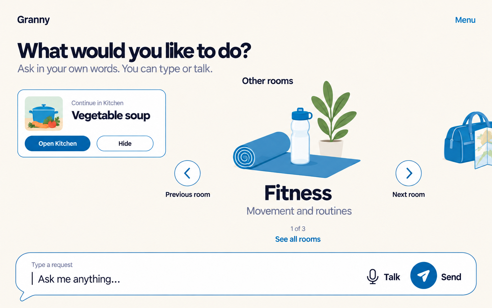
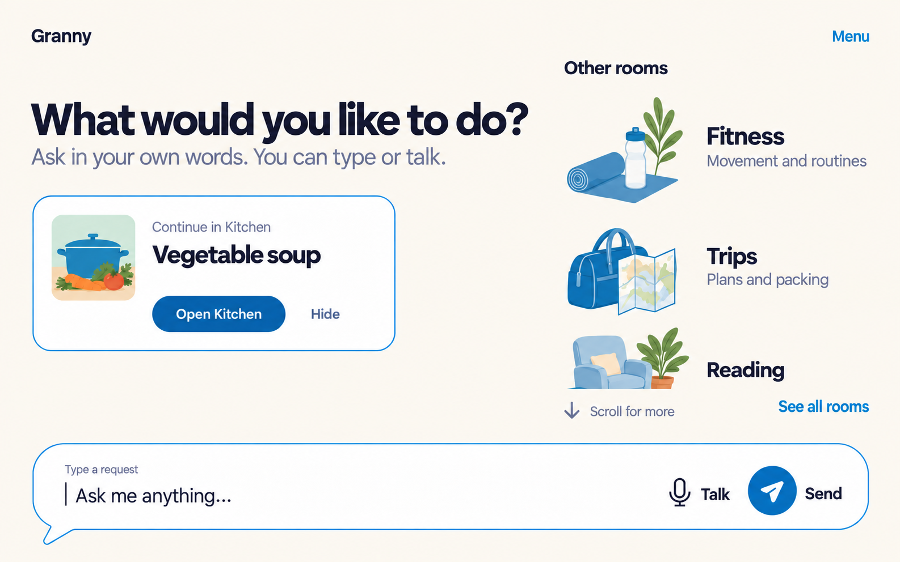

# Harbour Blue Home composition — round 4

> [!success] Direction selected
> Simon selected **A — Explicit Scroll Row** on 2026-09-19 as the Home
> composition to use and develop in future sessions. Use the stable
> [selected reference](../selected-explicit-scroll-row/README.md). The remaining
> directions and prompts stay here as comparison history.

Simon identified [round 3 option B — Open Room Portraits](../round-3/README.md#b--open-room-portraits)
as the strongest current direction. This refinement round preserves its
unframed portraits flowing directly through the Linen canvas while reducing
the visual weight of “Continue in Kitchen” and testing different ways to
browse the Rooms.

These remain full-screen Home-load mockups, not tabs, a Rooms library, room
interiors, frontend code, Android UI or Figma frames. The selected
[Harbour Blue system](../../2026-09-19-style-boards/final-harbour-blue/README.md),
bottom Round composer and one-assistant model remain fixed. All room and recent
work content is fictional; “Granny” remains a codename.

## Comparison



The comparison is a generated review sheet and may resample fine pixels. Use
the individual source images below for authoritative raster detail.

## A — Explicit Scroll Row



**Structural thesis:** written Previous and Next controls make a horizontal
portrait row explicitly browsable without depending on an invisible swipe
gesture, while the compact continuation remains available at the side.

**Main sacrifice:** navigation controls add visual machinery, and the generated
screen shows all three fixtures rather than the requested clipped next portrait,
so the need to scroll is less obvious than intended.

## B — Airy Portrait Gallery



**Structural thesis:** the smallest change to Simon's preferred direction
reduces continuation weight, increases free Linen space and keeps all three
Rooms immediately visible without scroll controls.

**Main sacrifice:** it works best with a small room set; additional Rooms must
move behind “See all rooms” or introduce a later browsing rule.

## C — Portrait Spotlight



**Structural thesis:** one large open portrait at a time gives each Room a
memorable sense of place and makes the continuation clearly secondary, while
written Previous room, Next room and position text explain the pager.

**Main sacrifice:** only one complete Room is visible, increasing navigation
steps and hiding the overall set from immediate view.

## D — Vertical Portrait Stream



**Structural thesis:** a vertical stream uses the expanded tablet edge like a
calm window into Rooms and reveals a partial next portrait as a natural scroll
cue, with “See all rooms” as a direct alternative.

**Main sacrifice:** the room area has its own vertical movement beside the
composer, which may complicate focus order, scrolling ownership and large-text
reflow.

## Review table

| Direction | Room browsing model | Continuation treatment | Main review risk |
|---|---|---|---|
| A — Explicit Scroll Row | Horizontal row with written Previous/Next | Compact side rectangle | Extra controls without a strong clipped-scroll cue |
| B — Airy Portrait Gallery | All three visible at once | Smaller version of selected B | Does not show how a larger room set behaves |
| C — Portrait Spotlight | One room at a time with written pager controls | Smallest, simplified rectangle | Hides other Rooms and requires more navigation |
| D — Vertical Portrait Stream | Two full portraits plus a partial next item | Compact left-side rectangle | Nested vertical-scroll and reflow complexity |

## Shared fixture and invariants

- Every direction remains Home and can handle an ordinary request without
  choosing a Room. The large Round composer stays near the bottom.
- “Continue in Kitchen” remains a white rectangular context surface but is
  smaller than the selected round-3 source. “Vegetable soup” is fictional.
- Room portraits remain unframed, removable reinforcement on Linen. Live room
  names and purposes carry meaning; art never contains essential text.
- Scroll or paging is never gesture-only: A and C expose written controls, D
  provides a written scroll cue plus “See all rooms”, and B exposes all fixtures.
- Each portrait-and-label group represents one broad semantic target even
  though it has no persistent card boundary. Focus must use a separated
  `#4930A1` ring without clipping or shifting the layout.
- Narrow screens and large text must stack into one vertical reading order.
  The composer must remain available rather than being pushed behind room art.
- Idle Home has no Stop. There are no tabs, bottom navigation, feature grids,
  prompt chips, weather, clock, metrics, alerts, badges or fake memories.

## Source reference and fidelity

Every source used two references:

1. `docs/02-design/mockups/2026-09-19-harbour-blue-home/round-3/02-open-room-portraits.png`
2. `docs/02-design/mockups/2026-09-19-style-boards/final-harbour-blue/harbour-blue-final.png`

The intended roles remain Canvas `#FBF6EE`, Surface `#FFFFFF`, Ink `#2E2D32`,
Accent `#2C5981`, Outline `#597DA0`, Send `#165D9C`, Focus ring `#4930A1`,
Stop/danger `#962F43` and On-colour `#FFFFFF`. Natural fictional room art uses
restrained illustration color. No idle Stop is shown.

Typography intent remains Bricolage Grotesque 600 for display and DM Sans
400/600 for body and controls. The image generator does not certify font files,
exact hex pixels, vectors, Android dp/sp or adaptive behavior. Each source is
1586 × 992 pixels and the comparison is 1585 × 992; these are design references,
not accepted Android geometry.

Full-size review found the required Home identity, invitation, continuation,
room labels and bottom composer legible in all sources. A did not produce the
requested partial Reading crop and therefore communicates scrolling mainly
through Previous/Next. C deliberately removes the continuation purpose line to
test a smaller summary. D intentionally shows Reading only partially. The
comparison sheet is not pixel-identical to the source images.

Contrast, touch-target dp, 200% text reflow, combined 300% scaling, TalkBack,
keyboard/switch order, focus-ring geometry, scroll semantics, IME behavior and
older-adult comprehension remain unrun. Raster images cannot prove them.

## Exact generation prompts

The built-in image-generation tool generated each direction from the selected
round-3 B source and the unchanged Harbour Blue board. No CLI or API-key path
was used.

### A — Compact Continue + Open Scroll Row

```text
Use case: ui-mockup
Asset type: full-screen landscape tablet Home UI, Harbour Blue Home round 4, Direction A — Compact Continue + Open Scroll Row
Input images: Image 1 is the selected Round 3 B composition base; Image 2 is the selected Harbour Blue visual-system reference. Preserve the warm Linen/Harbour Blue character, open unframed room portraits, adult typography, and Round conversation composer. Generate a new composition rather than putting the source screenshot in a frame.
Primary request: Refine Round 3 B into a spacious 16:10 Granny Home-load screen. Make the continuation substantially smaller so Rooms receive more space. Keep Home conversation-first and calm.
Composition: small “Granny” upper left and written “Menu” upper right. Use a moderately sized “What would you like to do?” with “Ask in your own words. You can type or talk.”. Beneath, place a compact white rectangular continuation strip no more than about one third of the content height. It shows a small soup-pot thumbnail, “Continue in Kitchen”, bold “Vegetable soup”, “Kitchen · Recipes and cooking plans”, a compact filled “Open Kitchen” action and quieter written “Hide”. It remains a clear rectangle but must not dominate.
Below or alongside it, give the larger share of the canvas to “Other rooms” as a horizontal open portrait row directly on Linen. Show Fitness and Trips fully and Reading partly clipped at the right edge to communicate horizontal scrolling. Portraits are unframed and have no cards, circles, tiles, arches, background patches or shadows. Under each portrait place live UI name and purpose: “Fitness” / “Movement and routines”, “Trips” / “Plans and packing”, “Reading” / “Books and saved articles”. Provide quiet written “Previous” and “Next” navigation near the row plus “See all rooms”, so browsing never depends on gesture alone. Keep broad implied targets and generous gaps.
Composer: keep the large white Round conversation speech balloon near the bottom across most width, with short lower-left tail and #597DA0 outline. Show “Type a request”, visible caret, “Ask me anything…”, outlined microphone with “Talk”, circular #165D9C paper plane and separate “Send”.
Visual system: Canvas #FBF6EE, Surface #FFFFFF, Ink #2E2D32, Accent #2C5981, Outline #597DA0, Send #165D9C, white on colour. #4930A1 focus-only; no Stop on idle Home. Approximate Bricolage Grotesque 600 and DM Sans 400/600. Flat fills; abundant Linen space.
Exact visible text: “Granny”, “Menu”, “What would you like to do?”, “Ask in your own words. You can type or talk.”, “Continue in Kitchen”, “Vegetable soup”, “Kitchen · Recipes and cooking plans”, “Open Kitchen”, “Hide”, “Other rooms”, “Previous”, “Next”, “See all rooms”, “Fitness”, “Movement and routines”, “Trips”, “Plans and packing”, “Reading”, “Books and saved articles”, “Type a request”, “Ask me anything…”, “Talk”, “Send”. Add no other words.
Avoid: room cards or tiles, dot-only pagination, gesture-only navigation, bottom tabs, app grid, extra widgets, prompt chips, weather, clock, gradients, glow, glass, shadows, AI imagery, watermark, device frame, status bar, people or private data.
```

### B — Small Continue + Airy Portrait Gallery

```text
Use case: ui-mockup
Asset type: full-screen landscape tablet Home UI, Harbour Blue Home round 4, Direction B — Small Continue + Airy Portrait Gallery
Input images: Image 1 is the selected Round 3 B composition base; Image 2 is the selected Harbour Blue visual-system reference. Preserve the open unframed portrait idea, Linen canvas, Harbour Blue roles, writing affordance and adult warmth.
Primary request: Create the most conservative refinement of selected option B as a spacious 16:10 Granny Home-load screen. Keep all three room portraits visible at once, but reduce the continuation panel by about 40 percent and increase the Linen breathing room.
Composition: small “Granny” upper left and written “Menu” upper right. Place “What would you like to do?” and “Ask in your own words. You can type or talk.” high on the page at a moderate, not oversized, scale. Make a compact white rectangular continuation panel at upper left or center-left with small soup artwork and exact text “Continue in Kitchen”, bold “Vegetable soup”, “Kitchen · Recipes and cooking plans”, a compact filled “Open Kitchen” and quiet written “Hide”. It is important but subordinate to the whole Home.
Use the remaining broad region for “Other rooms”: three open, evenly spaced portrait-and-label targets resting directly on Linen—Fitness with a movement mat and bottle, Trips with a travel bag and map, Reading with a chair and books. No outer container and no individual cards, circles, tinted backgrounds or shadows. Write each name and purpose below: “Fitness” / “Movement and routines”, “Trips” / “Plans and packing”, “Reading” / “Books and saved articles”. Add quiet “See all rooms”. Use composition and whitespace, not boxes, to communicate grouping.
Composer: large white Round speech-balloon composer near the bottom across most width, with lower-left tail and #597DA0 outline. Show “Type a request”, visible caret, “Ask me anything…”, outlined microphone plus “Talk”, circular #165D9C paper plane plus “Send”.
Visual system: Canvas #FBF6EE, Surface #FFFFFF, Ink #2E2D32, Accent #2C5981, Outline #597DA0, Send #165D9C, white on colour. Reserve #4930A1 for focus; no idle Stop. Approximate Bricolage Grotesque 600 and DM Sans 400/600. Flat, uncramped and quiet.
Exact visible text: “Granny”, “Menu”, “What would you like to do?”, “Ask in your own words. You can type or talk.”, “Continue in Kitchen”, “Vegetable soup”, “Kitchen · Recipes and cooking plans”, “Open Kitchen”, “Hide”, “Other rooms”, “Fitness”, “Movement and routines”, “Trips”, “Plans and packing”, “Reading”, “Books and saved articles”, “See all rooms”, “Type a request”, “Ask me anything…”, “Talk”, “Send”. Add no other words.
Avoid: room cards, tiles, carousel indicators, tabs, app grid, prompt chips, extra widgets, gradients, glow, glass, shadows, AI imagery, watermark, device frame, status bar, people or private data.
```

### C — Portrait Spotlight Pager

```text
Use case: ui-mockup
Asset type: full-screen landscape tablet Home UI, Harbour Blue Home round 4, Direction C — Portrait Spotlight Pager
Input images: Image 1 is the selected Round 3 B composition base; Image 2 is the selected Harbour Blue visual-system reference. Preserve the Linen canvas, open room-portrait language, Harbour Blue controls, adult warmth and Round composer. Generate a new layout rather than framing the input.
Primary request: Create a spacious 16:10 Granny Home-load variation based on open room portraits, but test a calm one-room-at-a-time pager. Make continuation much smaller than in the source.
Composition: small “Granny” upper left and written “Menu” upper right. Place a moderate “What would you like to do?” and “Ask in your own words. You can type or talk.” at upper left. Directly beneath, use a thin compact white outlined rectangle for fictional continuation: a tiny soup pot thumbnail, “Continue in Kitchen”, bold “Vegetable soup”, and one compact “Open Kitchen” action with quiet written “Hide”. Omit the longer room-purpose line inside this compact version to reduce weight.
Give most central space to “Other rooms”. Feature one large unframed Fitness portrait—a movement mat, bottle and restrained plant—resting directly on Linen, with large live text “Fitness” and “Movement and routines”. Show a small partial peek of the Trips portrait at the right edge to suggest the next room. Add clearly written “Previous room” and “Next room” controls with simple arrows, plus “1 of 3” as secondary position text and “See all rooms”. Do not use pagination dots. The entire featured portrait-and-label area is one broad implied target with no card, panel, arch, circle, backdrop or shadow.
Composer: large white Round conversation speech balloon near the bottom across most width, short lower-left tail and #597DA0 outline. Show “Type a request”, visible caret, “Ask me anything…”, outlined microphone with “Talk”, circular #165D9C paper plane and separate “Send”.
Visual system: Canvas #FBF6EE, Surface #FFFFFF, Ink #2E2D32, Accent #2C5981, Outline #597DA0, Send #165D9C, white on colour. #4930A1 focus-only; no idle Stop. Approximate Bricolage Grotesque 600 and DM Sans 400/600. Flat and uncramped.
Exact visible text: “Granny”, “Menu”, “What would you like to do?”, “Ask in your own words. You can type or talk.”, “Continue in Kitchen”, “Vegetable soup”, “Open Kitchen”, “Hide”, “Other rooms”, “Fitness”, “Movement and routines”, “Previous room”, “Next room”, “1 of 3”, “See all rooms”, “Type a request”, “Ask me anything…”, “Talk”, “Send”. Add no other words.
Avoid: large continuation card, room cards or tiles, dots, gesture-only navigation, tabs, app grid, extra widgets, gradients, glow, glass, shadows, watermark, device frame, status bar, people or private data.
```

### D — Vertical Open Portrait Stream

```text
Use case: ui-mockup
Asset type: full-screen landscape tablet Home UI, Harbour Blue Home round 4, Direction D — Vertical Open Portrait Stream
Input images: Image 1 is the selected Round 3 B composition base; Image 2 is the selected Harbour Blue visual-system reference. Preserve its unframed room portraits, Linen canvas, Harbour Blue roles, Round composer and calm adult tone. Generate a new structural variation.
Primary request: Create a spacious 16:10 Granny Home-load screen based on open portraits, testing a vertical scroll relationship rather than a horizontal gallery. Make continuation noticeably smaller and secondary.
Composition: small “Granny” upper left and written “Menu” upper right. Use a two-zone expanded-tablet layout with ample Linen. In the left zone show moderate “What would you like to do?” and “Ask in your own words. You can type or talk.”, followed by a compact white outlined continuation rectangle with tiny soup image, “Continue in Kitchen”, bold “Vegetable soup”, a compact “Open Kitchen” action and quiet written “Hide”. It should occupy less than half the left-zone height.
In the right zone place “Other rooms” and a vertically flowing, borderless portrait stream directly on Linen. Show Fitness first as a broad unframed portrait-and-label row with “Fitness” and “Movement and routines”; show Trips beneath with “Trips” and “Plans and packing”; let the top of the Reading portrait and its written “Reading” label remain partially visible at the lower edge of this room stream to signal more vertical content. Use generous gaps, no divider lines, no cards, no shared panel, no tinted backdrops and no shadows. Add written “Scroll for more” with a down arrow and “See all rooms”, ensuring scrolling is not the only discovery route. Room art must never sit behind text.
Composer: keep the large white Round conversation composer along the bottom across most width, stable and separate from the stream, with lower-left tail and #597DA0 outline. Show “Type a request”, visible caret, “Ask me anything…”, outlined mic with “Talk”, circular #165D9C plane with “Send”.
Visual system: Canvas #FBF6EE, Surface #FFFFFF, Ink #2E2D32, Accent #2C5981, Outline #597DA0, Send #165D9C and white on colour. #4930A1 focus-only; no idle Stop. Approximate Bricolage Grotesque 600 and DM Sans 400/600. Flat, generous and readable.
Exact visible text: “Granny”, “Menu”, “What would you like to do?”, “Ask in your own words. You can type or talk.”, “Continue in Kitchen”, “Vegetable soup”, “Open Kitchen”, “Hide”, “Other rooms”, “Fitness”, “Movement and routines”, “Trips”, “Plans and packing”, “Reading”, “Scroll for more”, “See all rooms”, “Type a request”, “Ask me anything…”, “Talk”, “Send”. Add no other words.
Avoid: horizontal carousel, room cards or tiles, bordered room list, app grid, tabs, bottom navigation, extra widgets, gradients, glow, glass, shadows, watermark, device frame, status bar, people or private data.
```

### Comparison sheet

```text
Use case: ui-mockup
Asset type: labeled comparison review sheet for four existing full-screen tablet Home mockups
Input images: Image 1 is A Explicit Scroll Row; Image 2 is B Airy Portrait Gallery; Image 3 is C Portrait Spotlight; Image 4 is D Vertical Portrait Stream. Treat them as finished screenshots.
Primary request: Compose the four supplied screenshots into a clean 2-by-2 review sheet on plain Linen #FBF6EE. Keep each screenshot's full content, proportions, colors and copy unchanged as closely as possible. Scale proportionally and add only these labels outside and above the screenshots: “A — Explicit Scroll Row”, “B — Airy Portrait Gallery”, “C — Portrait Spotlight”, “D — Vertical Portrait Stream”. Use dark Ink #2E2D32, bold simple sans-serif labels and generous gutters.
Constraints: no title, winner, rating, commentary, logo, watermark, device frame or text over screenshots. Labels are review metadata, not product UI. The result is a comparison sheet, not a fifth design.
```

## Stop point

Simon selected A — Explicit Scroll Row after this comparison. This round still
stops before the full Rooms library, room interiors, room creation, frontend
implementation or Figma frames.

**Next review question:** How should the selected row behave when every Room
fits, when additional Rooms overflow and when large text requires a vertical
fallback?
