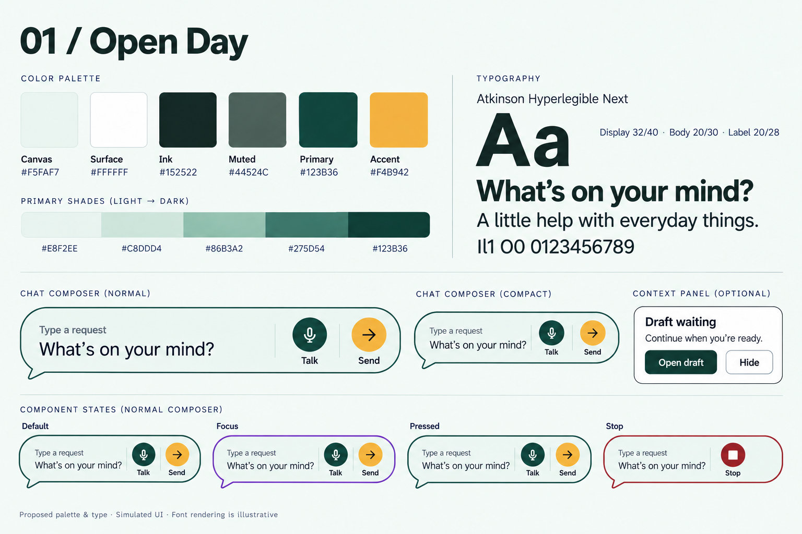
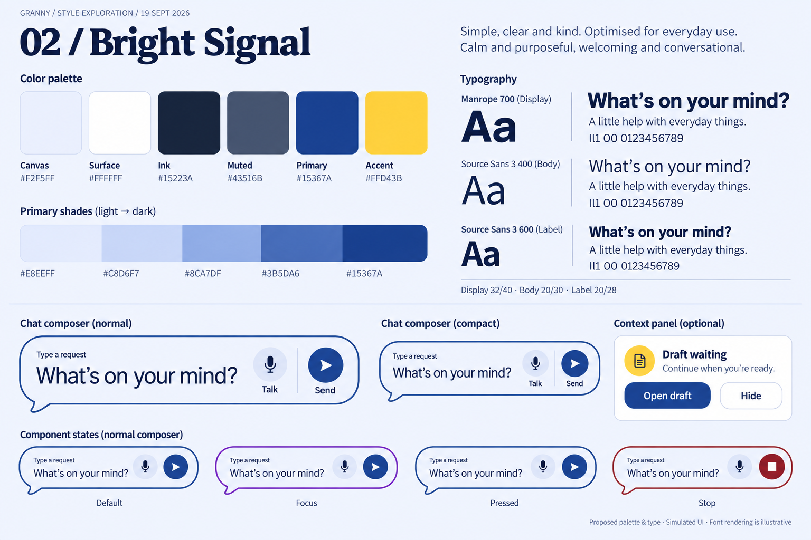
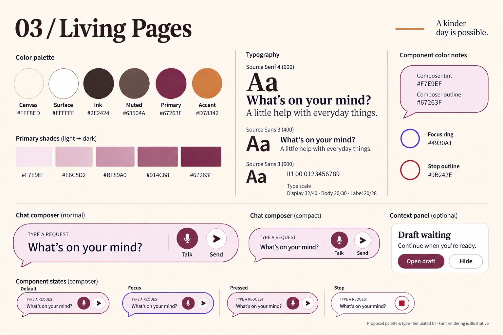
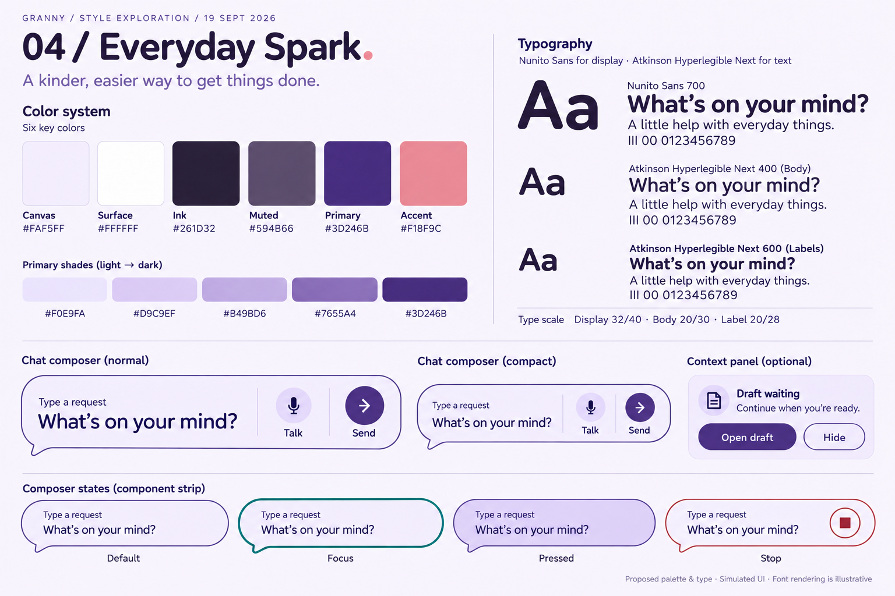

ty
# Iteration 1 — font and color style tiles

Archived first round. [Return to iterations and Simon's feedback](../README.md). His subsequent notes supersede the recommendation recorded below; no first-round palette or font was selected.

Four **style tiles** (also called foundation boards): proposed fonts, palettes, shade ramps and component specimens before the next landing/Home compositions. Generated with the built-in image model on 2026-09-19, then visually reviewed and revised for legibility. These are bitmap design artifacts, not a functioning design system.

The audience is independent older adults using a stock-Android tablet. The design goal is a clear, inviting place to speak or type, with an adult, approachable tone. The accepted Round conversation shape is the starting point. This round compares styling; later layout variation can explore the invitation, reading rhythm and single optional context panel.

[All mockups](../../README.md) · [Selected shape and previous rounds](../../2026-09-17-chat-entry/README.md) · [Exact color roles and new shade ramps](../../../brand-and-visual-identity.md#style-board-shade-studies--2026-09-19) · [Generation prompts](prompts.md)

| Direction | Display proposal | Body / control proposal |
|---|---|---|
| Open Day | Atkinson Hyperlegible Next 700 | Atkinson Hyperlegible Next 400 / 600 |
| Bright Signal | Manrope 700 | Source Sans 3 400 / 600 |
| Living Pages | Source Serif 4 600 | Source Sans 3 400 / 600 |
| Everyday Spark | Nunito Sans 700 | Atkinson Hyperlegible Next 400 / 600 |

These font names/weights are the intended proposals. Generated letterforms approximate fonts; they do not demonstrate the actual font files, metrics or glyph coverage. Use the linked canonical color tables and shade values for exact hex codes, not eyedropped pixels from the images. Existing [type scale and dimensions](../../../design-system.md#token-roles-and-provisional-dimensions) remain the source for sizes, scaling and targets.

## Open Day

Fresh green, warm white and a yellow accent. Calm and capable.

## Bright Signal

Cobalt and yellow. The clearest, most assertive option.

## Living Pages

Plum and ivory. Editorial warmth, with serif reserved for headings.

## Everyday Spark

Lilac, deep violet and coral. The most playful continuation of the selected bubble.

## Review and next iteration

My visual preference for this round is Everyday Spark for its connection to the selected rounded bubble, with Open Day as the calmer challenger. This is a design judgment, not user research or acceptance. Choose the palette and typography separately if useful; do not average every direction together.

The [design handoff and UI craft workflow](../../../../../.agents/skills/granny-ui-craft/SKILL.md) kept the same conversation-first job, labeled touch/voice controls and fictional draft fixture across the set. Individual image layouts drift slightly. Board 02's editorial board title is not the intended Manrope app heading. All letterforms and weight differences remain illustrative; the table above specifies the intended families and weights. Small status/Stop labels, focus-ring spacing, exact bubble geometry and some swatch shading still need deterministic component work. Treat the state strip as color exploration only; it cannot relocate or hide the required labeled Stop. These limitations are recorded rather than mistaken for component approval.

The component board is not a Home screen showing every specimen at once. In a Home composition, use one rounded composer, quiet Menu and zero or one eligible CMP-010 panel. “Send” within the composer submits the request to interpretation only; it is not approval to send an external message. A draft panel opens review and does not send. Product state, accessibility and action rules remain in [SCR-003](../../../product-design-spec.md#scr-003), [CMP-007](../../../design-system.md#cmp-007) and [CMP-010](../../../design-system.md#cmp-010).

Next bounded design round: three Home compositions using a preferred palette/type pairing, the selected bubble, and the same fictional draft panel. Compare a quiet invitation, a more editorial reading rhythm and a spacious tablet composition. Cover panel absent/present, normal/expanded composer and large text before implementing anything. Listening, progress/Stop, exact confirmation, error, expiry and unknown-result screens are not delivered in this foundation-board set. No Android, TalkBack or participant evidence is claimed.
