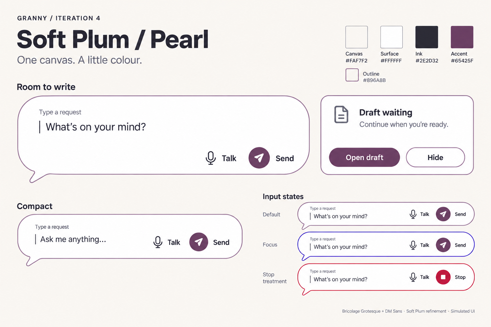
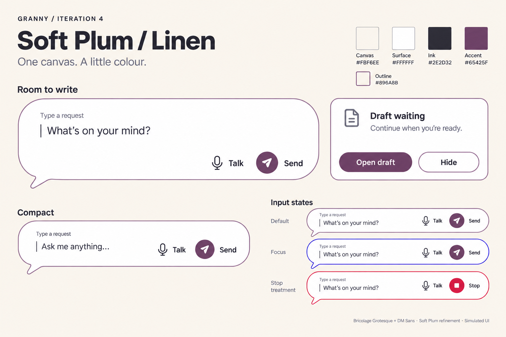
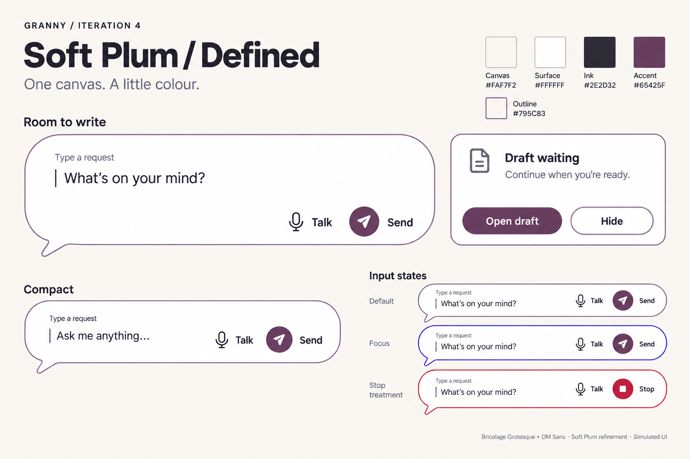
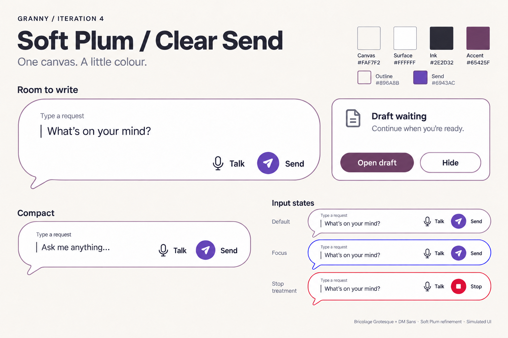

# Soft Plum refinements

**Subsequent selection:** Simon chose Linen's canvas and retained the white surface/dark ink. He liked Clear Send's blue-ish action and requested a final Send/accent shortlist, including blue alternatives. Continue with [iteration 5](../iteration-5/README.md); Pearl's recommendation below is historical.

**Soft Plum is Simon's selected direction to move forward with (2026-09-19).** This round changes the grey canvas and grey component outlines he disliked, not the selected direction. White writing surfaces, plum buttons, typography, rounded composer and single fictional draft panel remain fixed.

For older adults using the eventual stock-Android tablet app, the design aim is a welcoming, easy-to-find conversation surface without a yellow wash or loud new hue. These are local bitmap comparisons, not implemented screens.

## Compare the changes

| Variant | Canvas | Outline | What to judge |
|---|---|---|---|
| Pearl | #FAF7F2 | #896A8B | Barely warm off-white; muted plum outline |
| Linen | #FBF6EE | #896A8B | Same outline, slightly warmer canvas |
| Defined | #FAF7F2 | #795C83 | Pearl canvas, deeper plum outline |

**Recommendation: Pearl.** It removes the grey cast with the smallest warmth change. Linen tests the warmer boundary; Defined tests stronger definition without introducing another color family. The differences are deliberately close; compare at full size.

## Pearl

Recommended starting point: a barely warm off-white with a soft but clearly plum outline.

## Linen

A little warmer than Pearl, with the same outline; tests the upper limit of warmth.

## Defined

Pearl's background with a deeper plum outline; tests extra definition without a new hue.

## Preserved and still open

### Added from the live notebook — Clear Send

Simon's new iteration 3 note asks for a clearer, more vibrant Send action and a harmonious outline that stands out. This fourth study uses Pearl's canvas/outline and changes only Send to violet #6943AC; Open draft remains Soft Plum. Compare against Pearl to judge action emphasis separately from background warmth. This is a discoverability hypothesis, not proof of a universal action-color association; the Send label and symbol remain essential.

### Implementation limits

Blue focus and red Stop keep their meaning; ordinary outlines do not replace either. Talk/Send/Stop remain labeled. The Stop specimen shows an available action, not proof that an operation stopped. No behavior, widgets, theme settings, full landing-page layout or app code changed.

[Canonical selection and exact proposed values](../../../brand-and-visual-identity.md#selected-visual-direction--soft-plum) govern subsequent work. The new canvas/outline shades remain candidates; selecting Soft Plum does not certify font files, exact generated pixels or accessibility. Image generation introduces small hue/weight drift and residual fill variation; eventual implementation should use flat specified colors. Device, text-scale and human checks remain unrun.

[Feedback notebook — read before the next round](<../Notes - style boards.md>) · [All iterations](../README.md) · Historical source: iteration 3 / 02 Soft Plum (intermediate raster not retained) · [Built-in image-model prompts](prompts.md)
