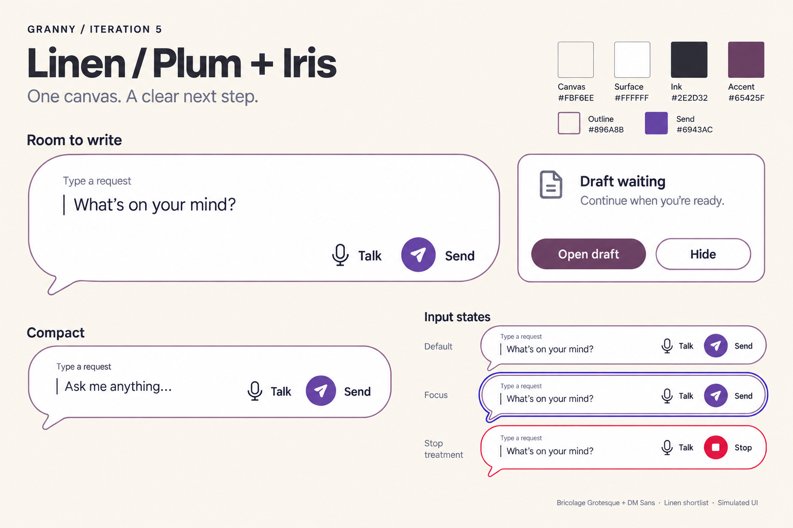
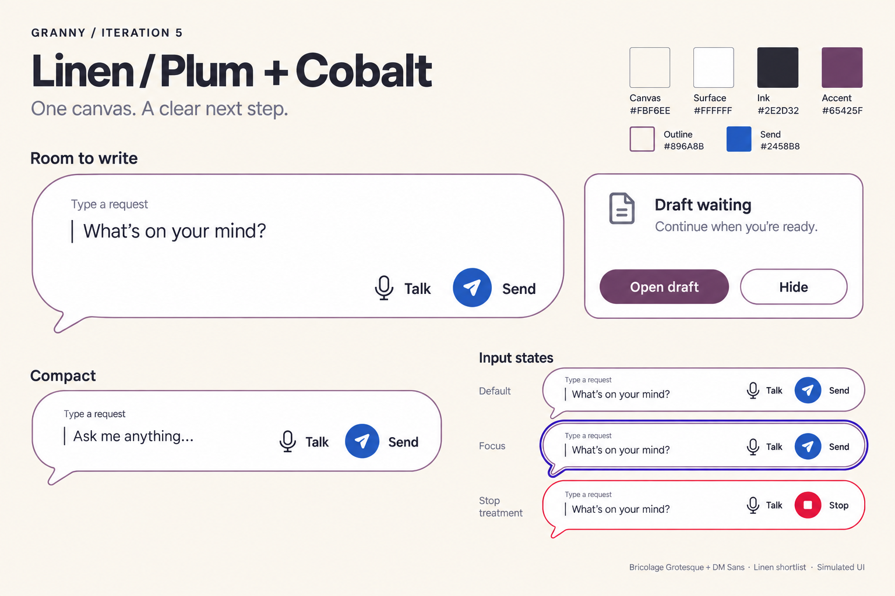
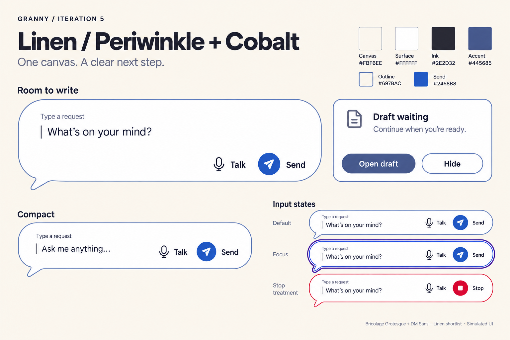
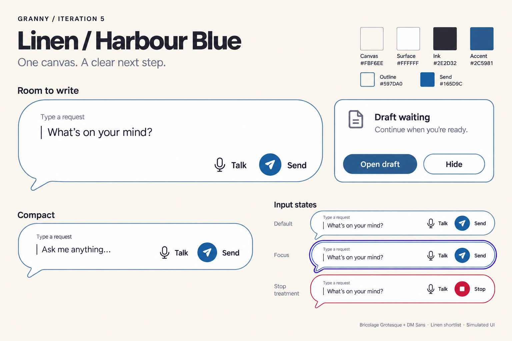

# Linen — choose the main board

**Final selection, Simon, 2026-09-19: 04 — Harbour Blue.** [Current final board and written design reference](../final-harbour-blue/README.md). This resolves the choice and supersedes the assistant recommendation below; the original shortlist is preserved as history.

**Fixed by Simon:** Linen canvas, white surface and dark ink. Soft Plum remains the baseline accent he likes; this round explicitly explores blue alternatives. The selected rounded composer and its layout stay fixed. Read his [iteration 4 feedback](<../Notes - style boards.md>) before subsequent work.

The aim is a welcoming, legible conversation surface for the eventual stock-Android tablet app: an obvious next action, a distinct ordinary boundary, and focus/Stop treatments that do not depend on hue alone. These are generated bitmap studies, not implemented screens or evidence of universal color associations.

## Shortlist

| Board | Send | Accent / draft action | Outline | Decision it isolates |
|---|---|---|---|---|
| 01 — Plum + Iris | #6943AC | #65425F | #896A8B | Keep the liked violet Send |
| 02 — Plum + Cobalt | #2458B8 | #65425F | #896A8B | Change only Send to cobalt |
| 03 — Periwinkle + Cobalt | #2458B8 | #445685 | #697BAC | Same cobalt Send; move accent/outline toward blue |
| 04 — Harbour Blue | #165D9C | #2C5981 | #597DA0 | Try a softer blue family |

**Recommendation: 02 — Plum + Cobalt.** It preserves Soft Plum's warmth and makes Send visually separate from the ordinary outline and draft action. The tradeoff is two action-color families rather than a unified blue palette. **03 — Periwinkle + Cobalt** is the direct challenger if you prefer a more blue-led system. This is an assistant recommendation; Simon still chooses the main board.

## 01 — Plum + Iris

Closest continuation: Soft Plum accents with the blue-violet Send treatment you liked.

## 02 — Plum + Cobalt

Keep Soft Plum's character, with a clearer cobalt-blue Send button. Recommended shortlist leader.

## 03 — Periwinkle + Cobalt

Blue-family alternative: muted periwinkle outlines and accents with the same cobalt Send; compare directly with 02.

## 04 — Harbour Blue

A softer, slightly teal-leaning blue family; less violet, with a more unified accent/Send relationship.

## What stays consistent

- Canvas #FBF6EE, surface #FFFFFF, essential ink #2E2D32; same proposed Bricolage Grotesque / DM Sans treatment.
- Normal, compact and default composer have one ordinary outline. Focus adds a heavier, separated blue-violet ring; it does not merely repaint the same border.
- Stop uses a red control, square symbol and explicit label. This illustrates an available Stop action, not a verified stopped outcome.
- Talk and Send remain labeled; Send here submits a request to Granny, not permission to send an external message. Consequence-based confirmation remains unchanged.
- One fictional draft context panel; no new widgets, feature tiles, Rooms navigation, settings, typography exploration or app implementation.

[Canonical selected foundation and proposed shortlist values](../../../brand-and-visual-identity.md#selected-foundation--linen) take precedence over generated pixels. Fills, fonts, stroke widths and focus-ring spacing remain approximate; final flat rendering, text scale, Android and human evidence are unrun. Pastel character is carried by the gentle overall palette, not low-contrast essential text or controls.

Choose one numbered board as the main visual reference. That next choice should consolidate the palette, not reopen Linen/surface/ink or create another unrelated round.

[All iterations](../README.md) · [Feedback notebook](<../Notes - style boards.md>) · [Built-in image-model prompts](prompts.md)
