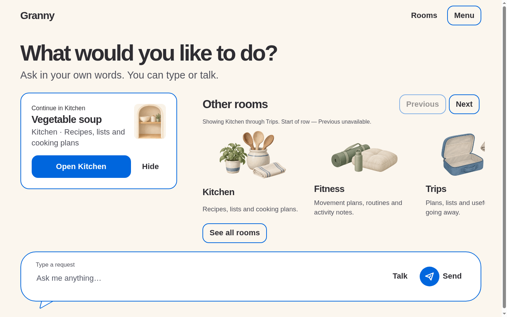
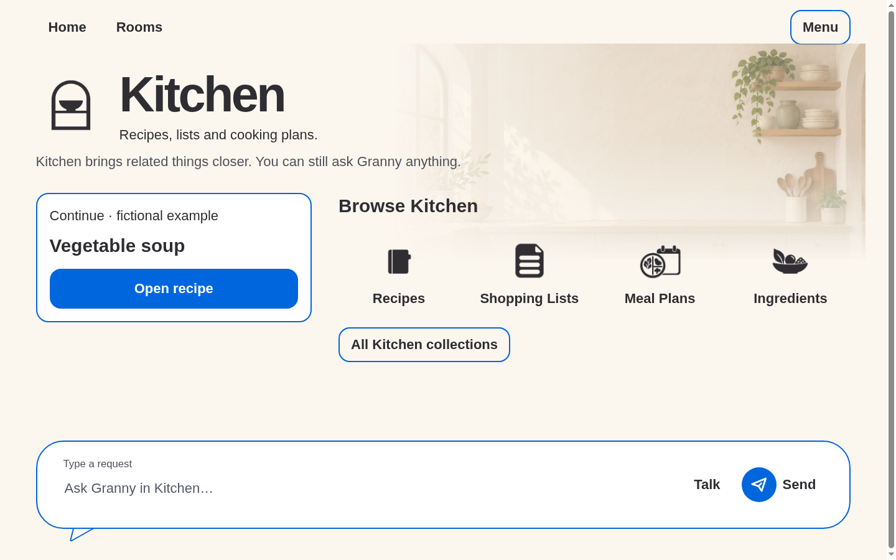
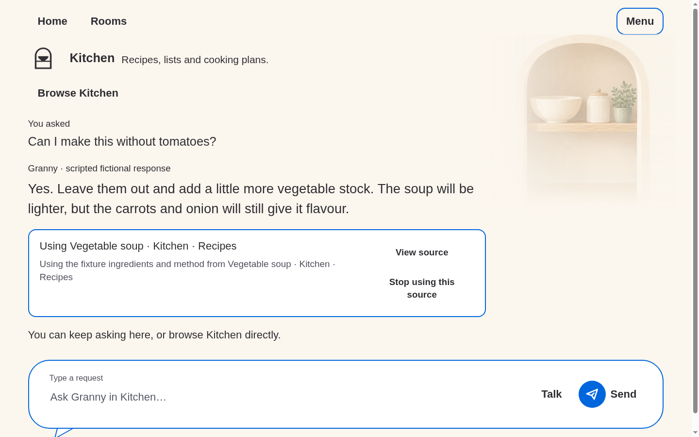
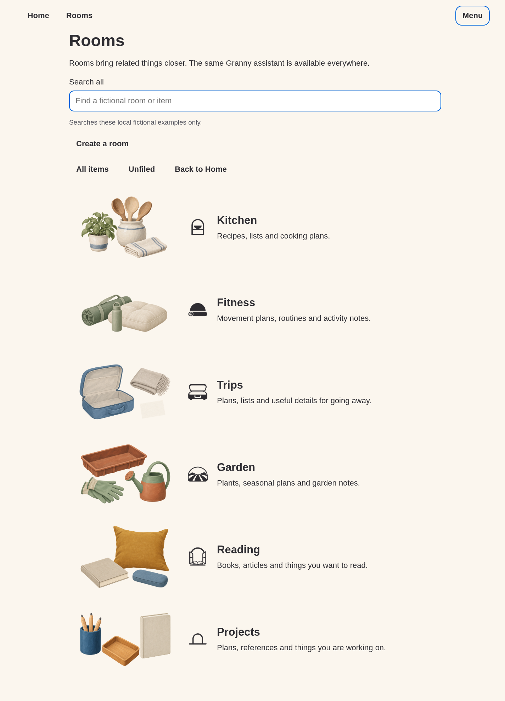
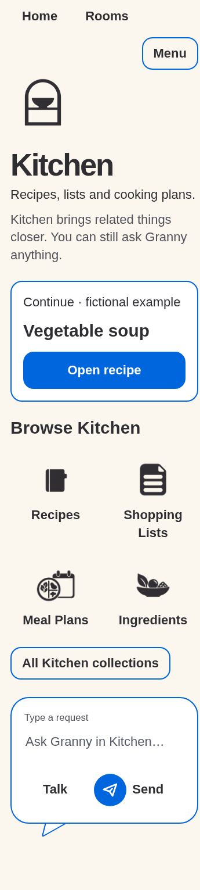
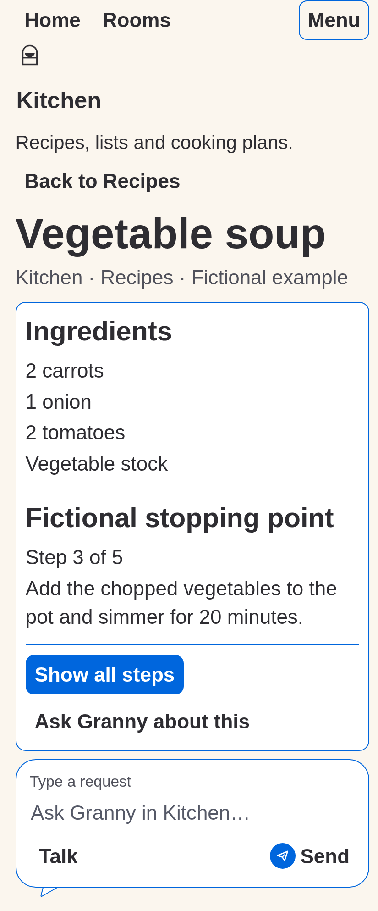
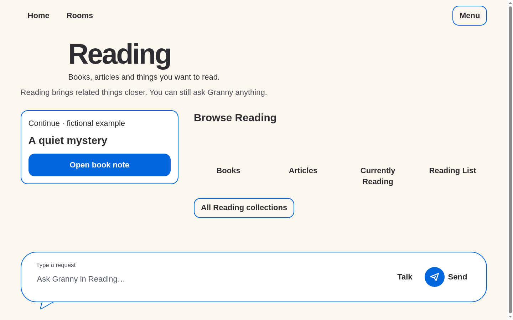

# Visual cleanup

Captured with `node prototypes/stage-1/rooms-review.mjs`, Chrome
151.0.7922.173, fictional fixtures only. Inspected base commit:
`9ff4762aeaf7b0539be4ef9f3c6676b5e94f9ecc`; captures include this cleanup's
working-tree changes. No source artwork or earlier screenshot was overwritten.

Simon's follow-up supersedes the earlier artwork placement and muted outline
blue for this browser checkpoint: transparent object/decor imagery at room
entry; portraits at Home continuation and in room chat; larger overview
backdrops, alpha-faded at the edge with no extra corner object; bigger text
and room marks, closer collection/continuation spacing. Blue `#0066DD` is an
implementation interpretation of the brighter mockup, not a sampled exact
colour or final branding decision. Most labels remain dark Ink; important
controls have stronger blue outlines. Violet focus and burgundy Stop survive.

The Round composer and its continuous tail/focus geometry are reused, not
replaced. Real Home scrolling and written controls remain; only scrollbar
chrome is hidden. Narrow/large-text modes intentionally stack, rather than
require horizontal scrolling. Artwork is removed at constrained sizes.

## Expanded: 1440 × 900

## Reflow and decoration fallback

## Checks and limits

See the [session's exact checks](../../../10-execution/sessions/2026-09-20-context-rooms-visual-cleanup.md).
Source assets remain unchanged local copies: no new generation, remote fonts,
storage, microphone or provider request. Fading is a CSS alpha mask, not
painted replacement art. Existing soft shadows/halos in some decor assets
remain visible; this pass does not retouch artwork.

System fonts remain a fidelity limit. Desktop browser reflow/focus evidence
does not establish Android dp size, TalkBack/switch access, physical tablet
quality or older-adult comprehension. Those remain unrun. Review question:
does the brighter outlined-control treatment feel clear without overpowering
the calmer room artwork?
