# Six-room frontend review

Fictional browser evidence, not accepted product design or Android evidence.
The selected Explicit Scroll Row Home and Round composer are extended, not
rebuilt. The same Granny assistant remains available inside every room.

## Inspected build

Worktree: `/home/lgtw/Work/granny-worktrees/explicit-scroll-row-home`;
branch `feature/explicit-scroll-row-home`, starting implementation `1e81dd7`.
Captures show the September 20 working-tree implementation. The
[session](../../../10-execution/sessions/2026-09-19-context-rooms-frontend.md)
owns final publication evidence. No source mockup was overwritten.

Run `node prototypes/stage-1/serve.mjs` and open `http://127.0.0.1:4173`.
Reproduce captures with `node prototypes/stage-1/rooms-review.mjs`.
Chrome 151.0.7922.173; 1440×900 / 16:10 unless noted. Library, narrow and
200% captures include the full document. Default scripted fixture: six
starter rooms, continuation visible, no connected model or personal data.

## Five Kitchen frames mapped to implementation

| Reference | Implementation | Intentional adaptation |
|---|---|---|
| 01 Home to Kitchen | Retained Home, continuation and native scroll row in `app.js` | All six rooms available with a partial next portrait; measured overflow and canonical purpose copy. |
| 02 Kitchen overview | `identity`, `overview`, `symbol` in `room-ui.js` | Four open targets, one fictional continuation, edge-only atmosphere. |
| 03 Recipes selected | `collectionView`, labelled search, text-only rows | Whole row is the target; no thumbnails/nested cards. Decoration removed here to protect navigation. |
| 04 Vegetable soup detail | `itemView`, two-section reading surface and Show all steps | Fictional stopping point, not real saved progress; columns stack at narrow/large text. |
| 05 Ask Granny about soup | `conversationView`, source cue and inspection/exclusion | Ask pre-fills an editable question and waits for Send. Explicit scripted response; exclusion affects future replies, earlier source remains labelled as history. |

All five new frames and comparison were inspected at original detail in the
primary checkout's `docs/02-design/mockups/context-rooms/kitchen-vertical-slice/iteration-1/`.
That design package remains a read-only dependency outside this branch's
integrated base. The selected Home and Harbour Blue board are integrated.
SCR-003/016/017 and CMP-007/010/011/012 govern behavior, not raster geometry.

## Six packs and all 48 collection labels

Each collection is a native labelled button; selection uses words and
`aria-pressed`. Four appear on overview; All collections exposes eight.
Selection opens locally searchable content without a model. Every room has
a populated detail/Ask example and its own empty-state art.

| Room / pack / mark | Eight collections in dossier order |
|---|---|
| Kitchen / K01 Morning Pantry / K-M01 | Recipes; Shopping Lists; Meal Plans; Favorites; Recently Used; Appliance Notes; Ingredients; Unfiled |
| Fitness / F01 Morning Stretch / F-M01 | Routines; Walking; Classes; Strength; Stretching; Cycling; Swimming; Equipment Notes |
| Trips / T01 Light Packing / T-M01 | Packing Lists; Reservations; Places; Travel Documents; Day Plans; Transport Notes; People to Visit; Past Trips |
| Garden / G01 Morning Allotment / G-M04 | Plants; Watering; Seasonal Plans; Photos; Seeds; Supplies; Things to Do; Garden Journal |
| Reading / R01 Window Seat / R-M07 | Books; Articles; Currently Reading; Reading List; Notes; Book Club; Finished; Sources |
| Projects / P01 Open Worktable / P-M01 | Plans; Reference Images; Notes; Materials; Drafts; Things to Do; Recently Used; Archive |

Fitness and Projects use canonical short identities; Movement and Hobbies
are descriptive aliases, not extra rooms. Library includes Search all,
All items, Unfiled and Create room. The retained five-step flow offers a
bounded three-template/three-mark set or blank room. Explicit Create alone
adds a room to memory. Cancel adds nothing; reload/reset restores six starters.

## Assets, placeholders and fidelity

The [runtime manifest](../../../../prototypes/stage-1/assets/context-rooms/asset-manifest.json)
records all 84 unchanged copies, source paths, roles, dimensions, alpha and
SHA-256. Lead independently verified all runtime/source hashes. A Terra
reviewer inspected all 84 selected originals individually at original detail.
Primary design originals remain untouched; no rejected variant or regenerated
artwork is used.

- Selected marks, portraits, backdrops, transparent decor, motifs, empty
  illustrations and symbols remain separate from live written labels.
- Portraits have mixed ratios and opaque Linen-like edges, unlike the Home
  reference's transparent objects. Contain sizing preserves the thresholds.
- Overview backdrops are dimmed/cropped at the outer edge, not behind content.
  Motifs are single clipped strips, not assumed seamless. Fitness/Trips
  overlays have a soft alpha halo, kept small on Linen/white. Collection,
  detail and conversation omit atmosphere to protect reading and controls.
- Reviewed local Bricolage Grotesque/DM Sans files are absent. System sans is
  an honest fallback; exact typography is not claimed.
- Granny remains a written codename. Custom-room marks are explicitly
  labelled reused placeholders, not final custom art or branding.
- Missing images retain slots and written identity. Artwork-disabled review
  hides decoration without moving essential controls.

## Screenshots

### Home and library

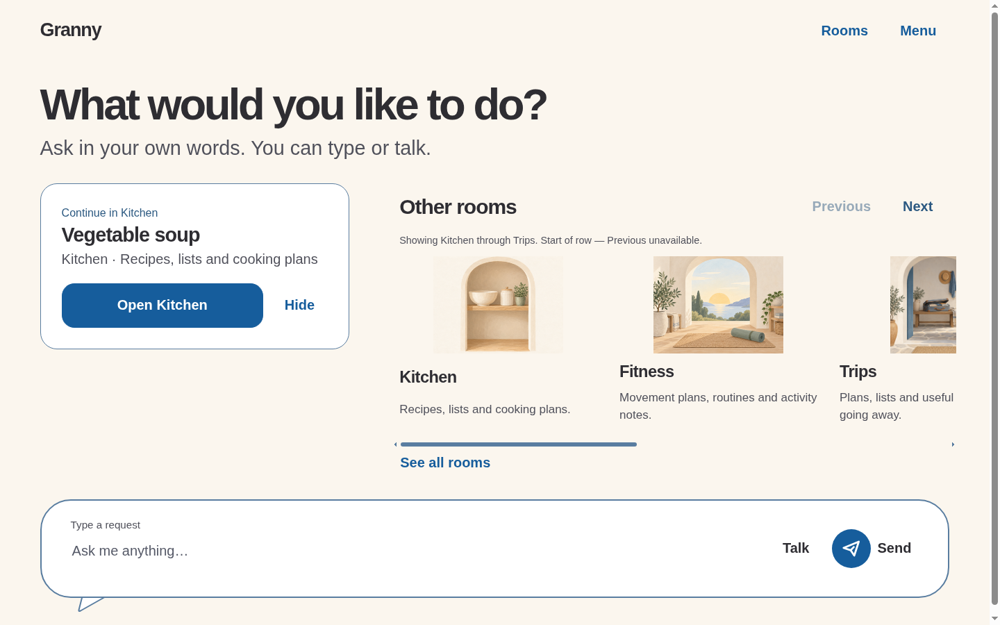

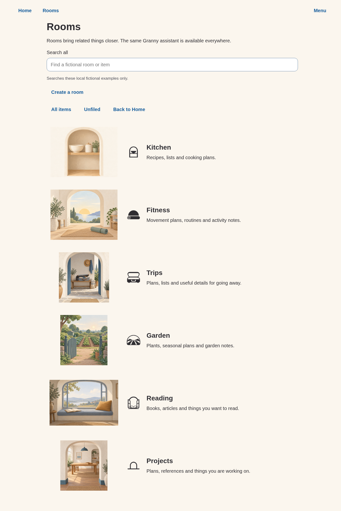

### Six overviews

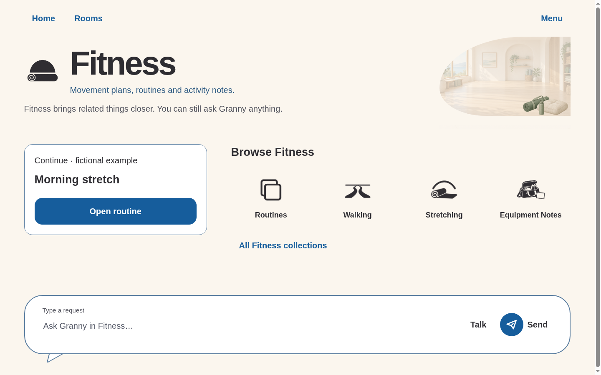

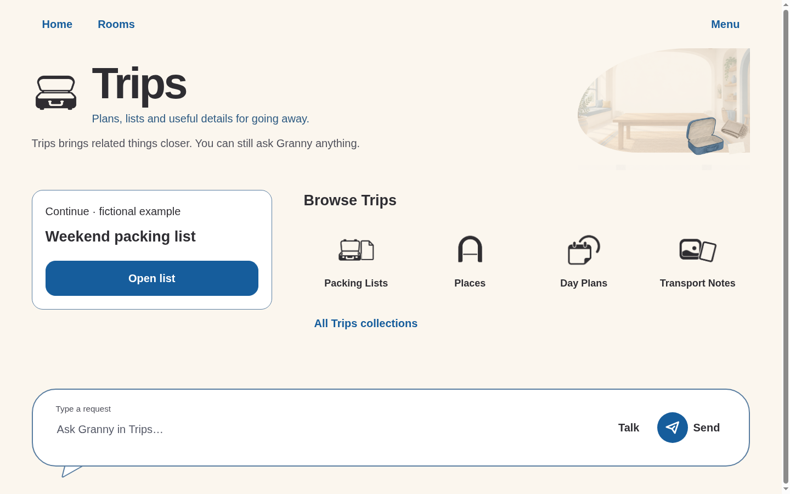

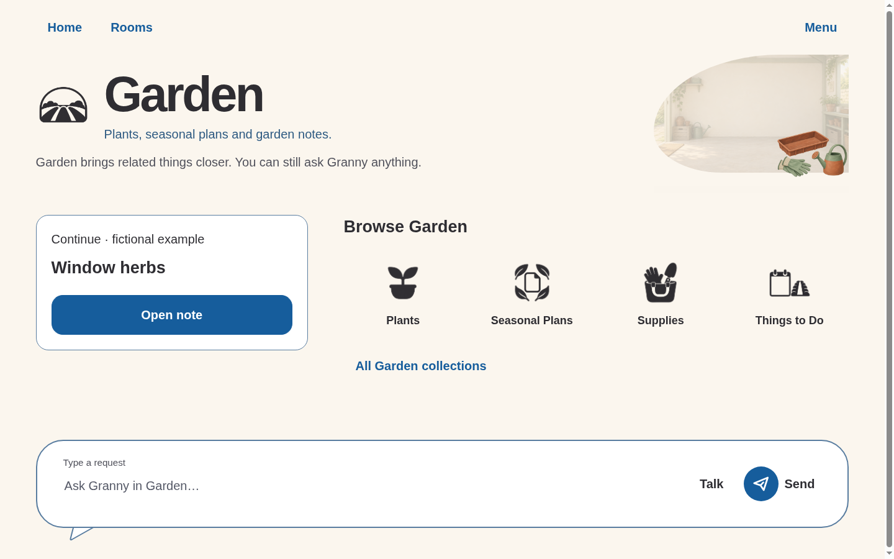

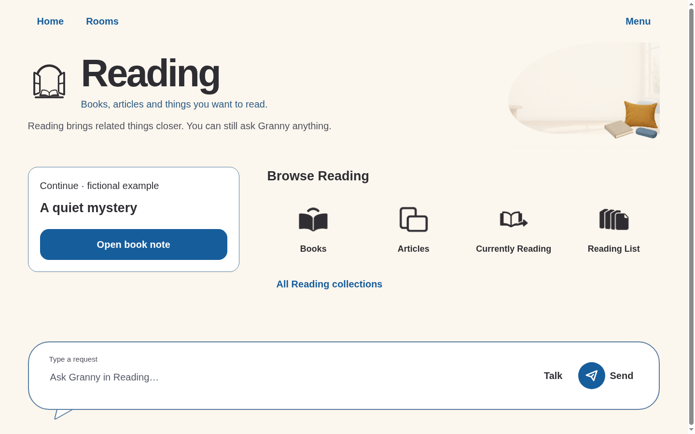

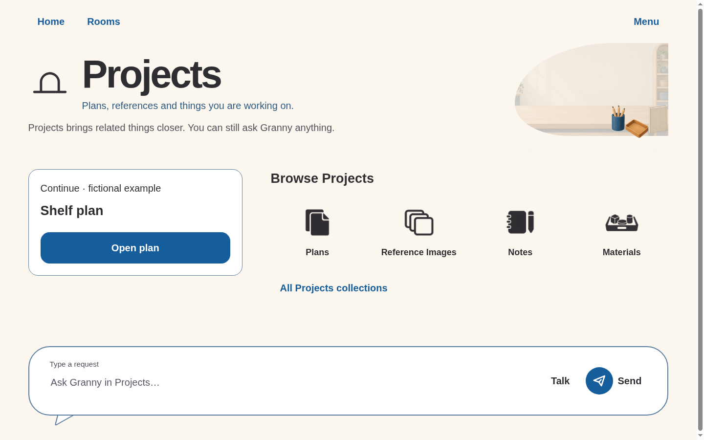

### Kitchen vertical slice

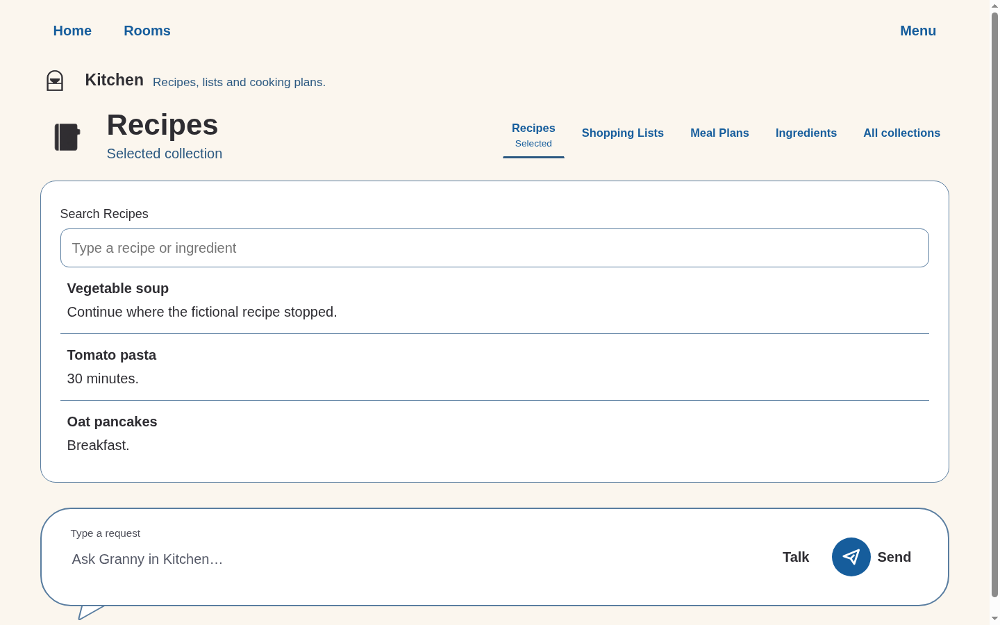

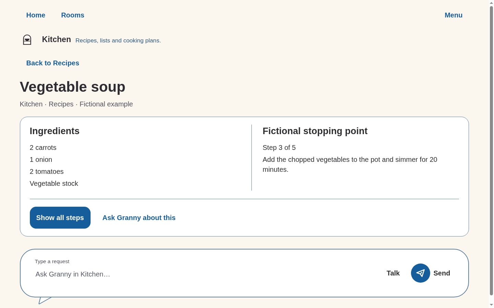

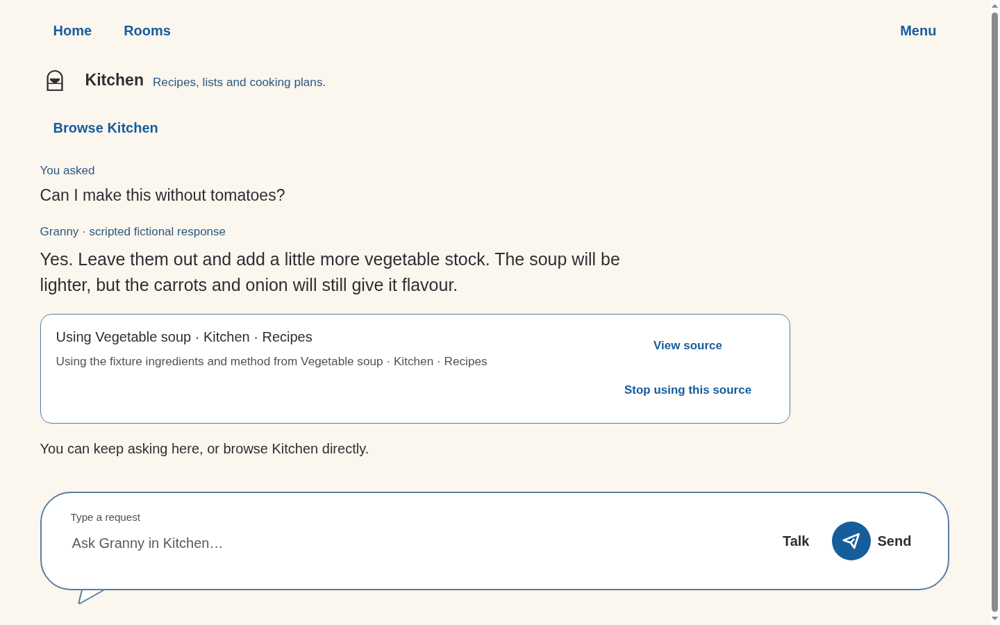

### Other states

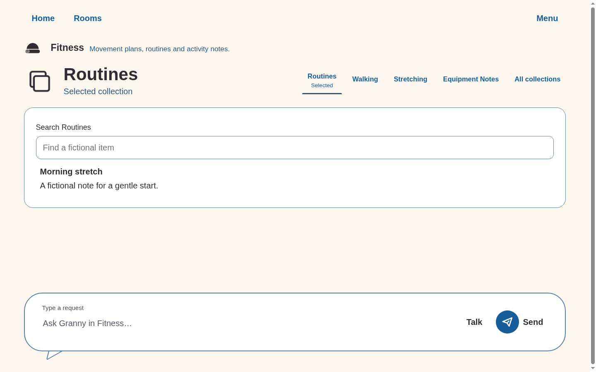

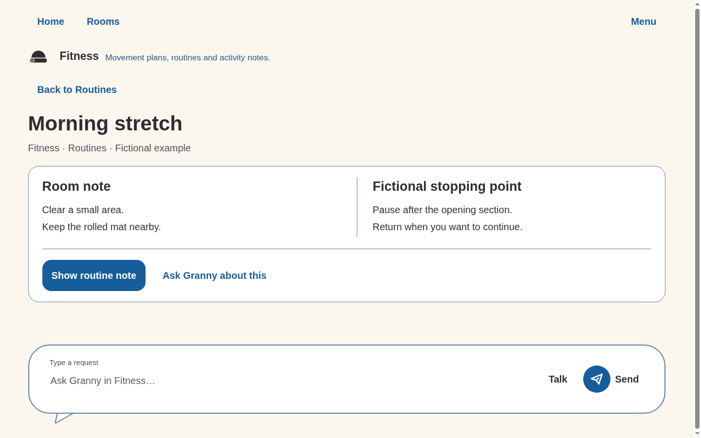

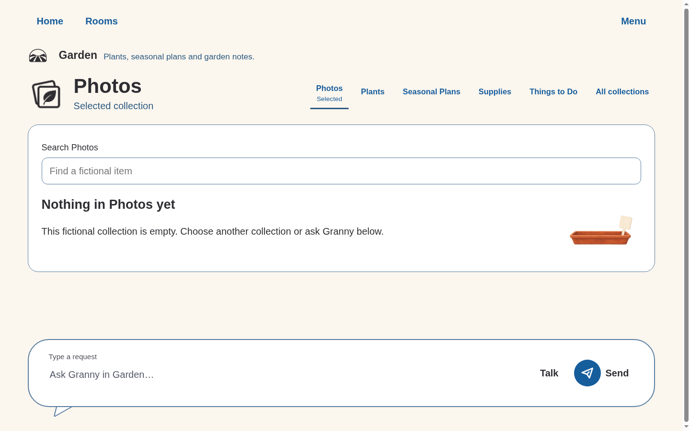

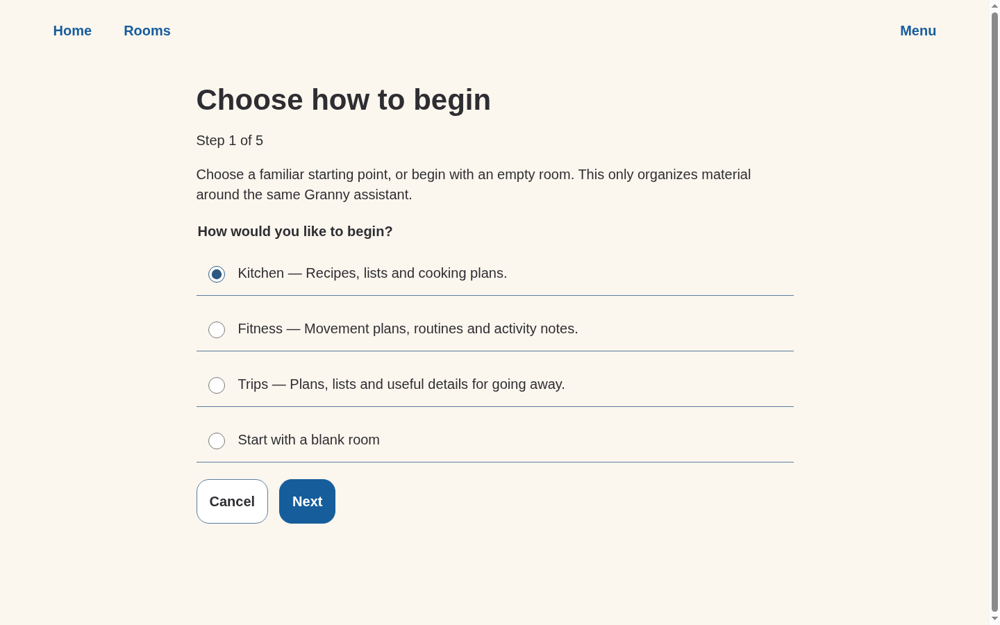

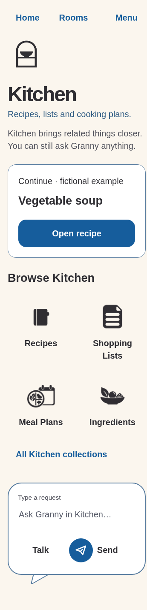

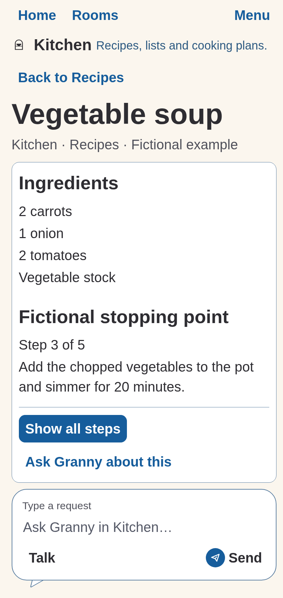

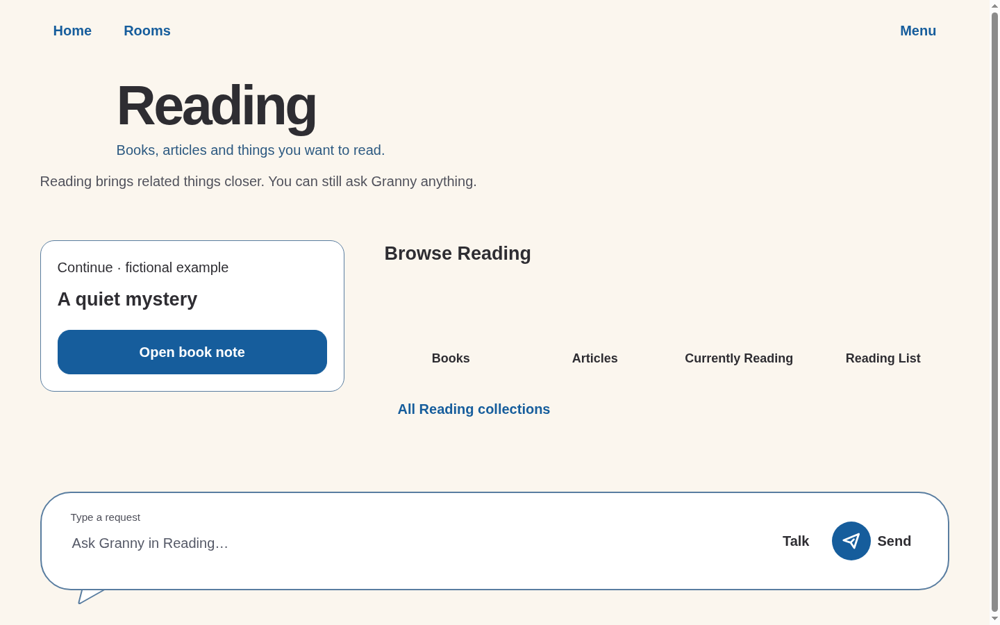

## Verification and limits

Exact commands/results are in the
[session validation](../../../10-execution/sessions/2026-09-19-context-rooms-frontend.md#validation-and-handoff).
Checks cover original workflows, real Home overflow/end states and focus,
six rooms/48 labels, sources, creation, search, missing art, 360/600/840/1440
widths, large text and no external requests or persistence. Review fixed
fragmented library names, decoration over controls, composer occlusion and
the detached tail in reflow. The violet contour surrounds the composer/tail.

Targets use 56px minimum and 64px primary/Stop intent. CSS pixels do not prove
Android dp or physical size. Native TalkBack, switch hardware, Android reflow,
participant comprehension and production model/context behavior remain unrun.
Sequential keyboard checks do not pass those gates. The selected palette is
preserved without claiming every stricter internal contrast aspiration is met.
Reduced motion requires no animation.

No backend, personal history, real reading material, booking, health guidance,
persistent room membership or production cross-room retrieval is implemented.
Source use is an explicit, reversible fictional UI demonstration.

**Simon's main review question:** does the four-symbol overview make direct
browsing discoverable while leaving the composer clearly available, especially
when a smaller window becomes one vertical sequence?

