# Core outcome modules — iteration 1

This pack explores five useful outcomes inside the selected Harbour Blue
conversation shell. Its thesis is: **ordinary conversation remains visible;
each outcome earns one contextual rectangular module, with its source, state
and next action stated plainly instead of becoming a mini-app dashboard.**

All people, apps, dates, messages, photos and appointments are fictional. The
frames are proposed visual references, not implementation, capability evidence
or production acceptance. “Granny” remains a codename.

## Comparison

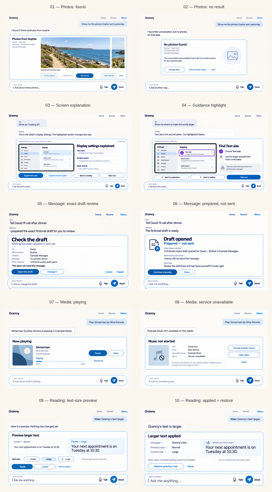

The review sheet adds labels outside the product screenshots and resamples the
images. Inspect the individual sources below for full-size detail.

## Photos

### 01 — Found photos

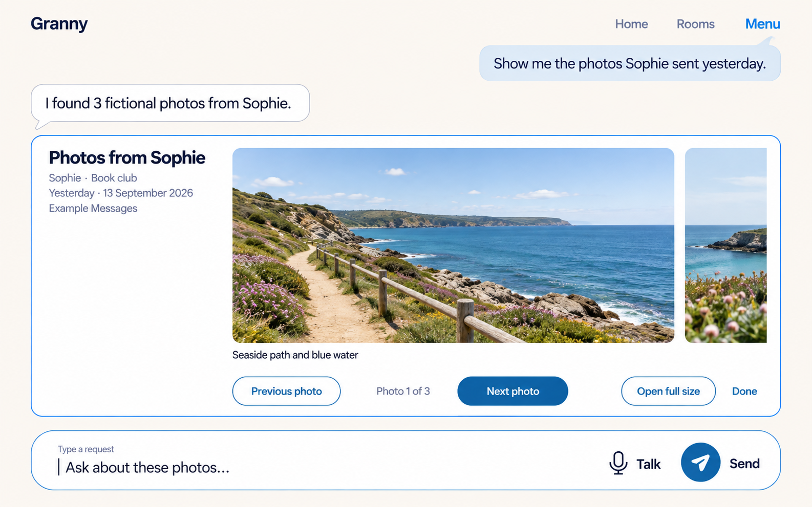

One large image owns attention while sender, relationship, date and source stay
adjacent. Written Previous/Next, position, full-size and Done controls avoid
gesture-only browsing. At narrow width or large text, metadata precedes the
image, then controls stack beneath it.

### 02 — No result

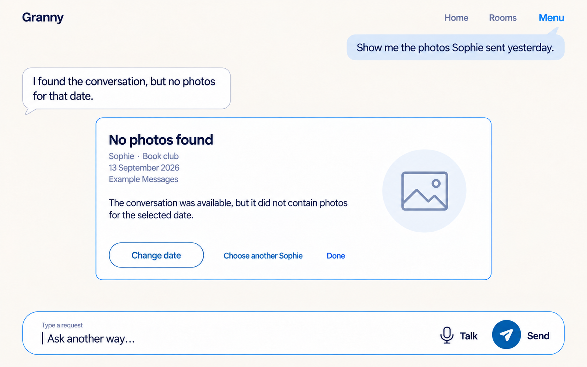

The empty result says what was searched and distinguishes “conversation found,
no photos for that date” from loading, permission denial or a missing source.
Change date and choose another person are explicit recovery paths.

## Screen explanation

### 03 — Explanation

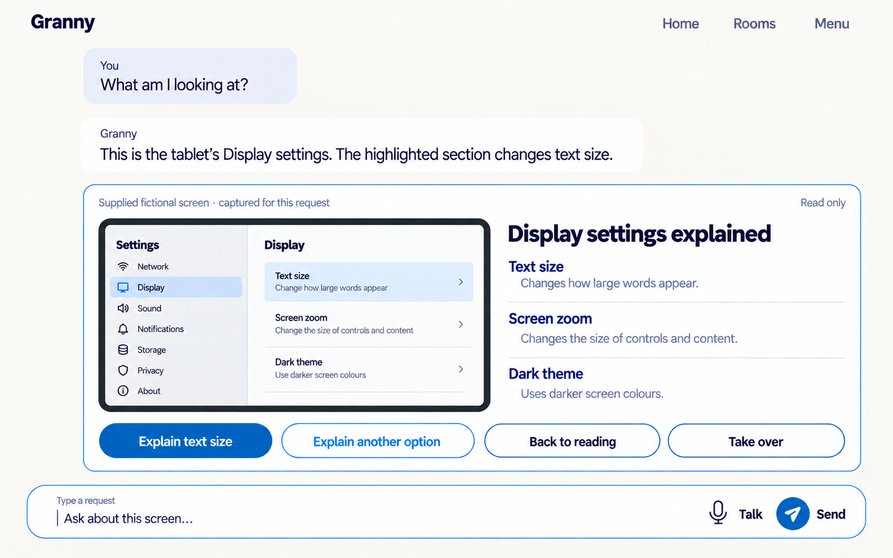

The supplied screen is visibly fictional and read only. Granny names the
highlighted region and explains the three visible options without claiming to
change them. Back to reading is a safe return; Take over hands control back.

### 04 — Guidance highlight

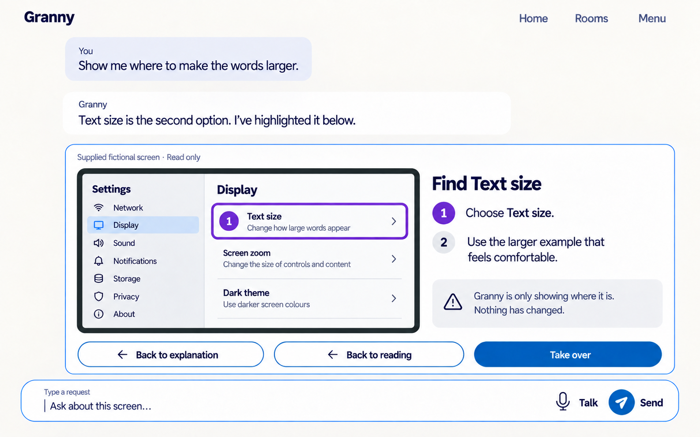

The highlight combines a separated focus-purple outline, number and written
target; color is reinforcement, not meaning. “Nothing has changed” remains
inside the module. Back to explanation and Back to reading preserve origin.

## Message drafting

### 05 — Exact draft review

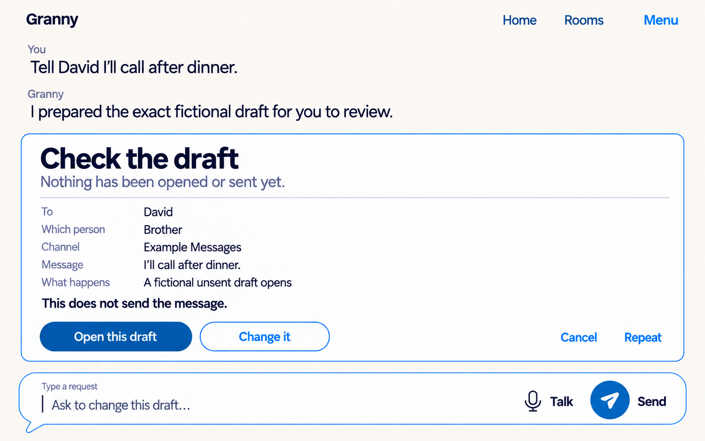

Recipient, differentiator, channel, exact body and effect precede the specific
Open this draft action. The module states that nothing has been opened or sent.
The composer can request an edit; its Send control does not approve the draft.

### 06 — Prepared, not sent

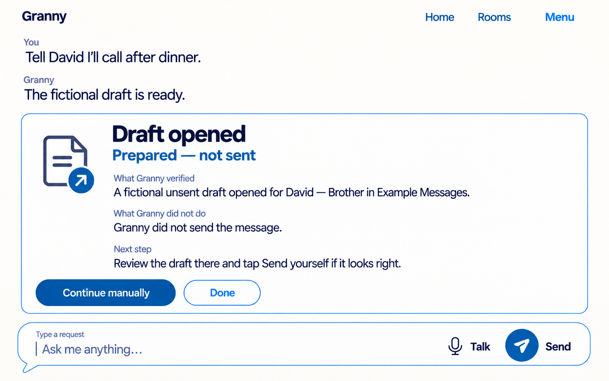

The outcome distinguishes an opened fictional draft from a sent message. It
states the verified boundary and offers a deliberate manual handoff, preserving
the result language established by CMP-006.

## Media

### 07 — Playing

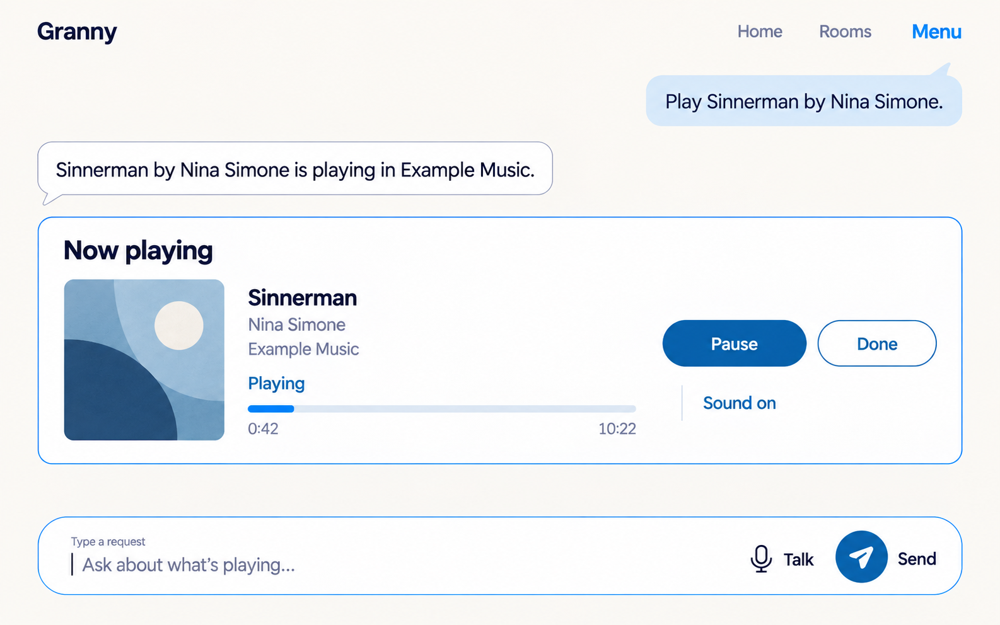

Title, artist, source and written Playing state accompany progress. Pause is
the primary media control and is never icon-only. The frame represents a result
after explicit play; it does not imply autoplay.

### 08 — Service unavailable

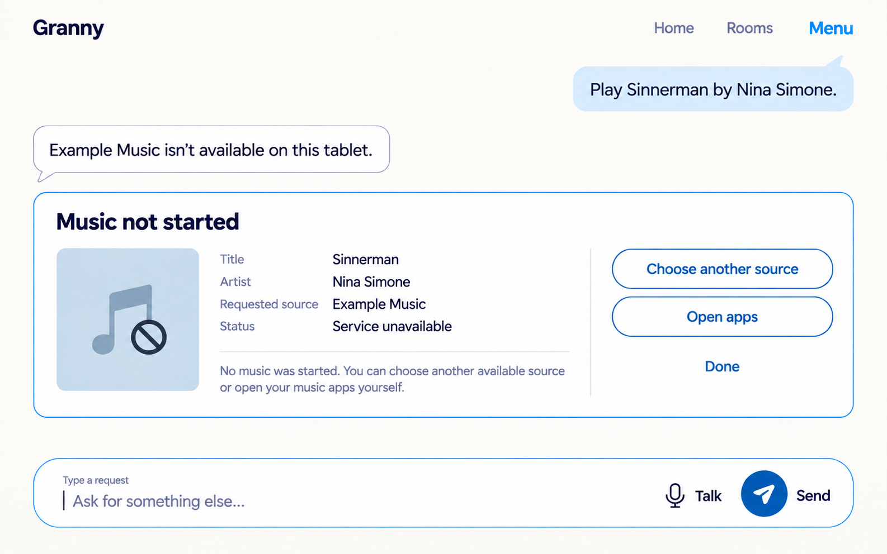

The failed source remains named and the module says that no music started.
Choose another source and Open apps are bounded alternatives; it does not show
a fake error code, retry loop or success state.

## Reading assistance

### 09 — Text-size preview

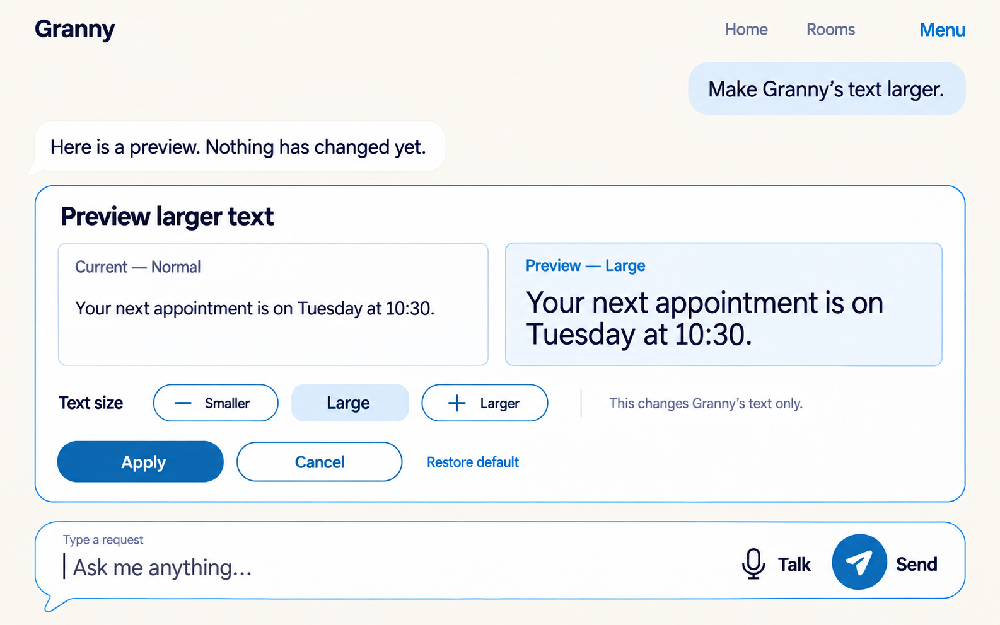

Current and preview use the same fictional sentence so the difference is
inspectable. Nothing changes before Apply. Smaller/Larger have written labels,
and scope text says this affects Granny only. At large text the two examples
stack rather than shrink.

### 10 — Applied with restore

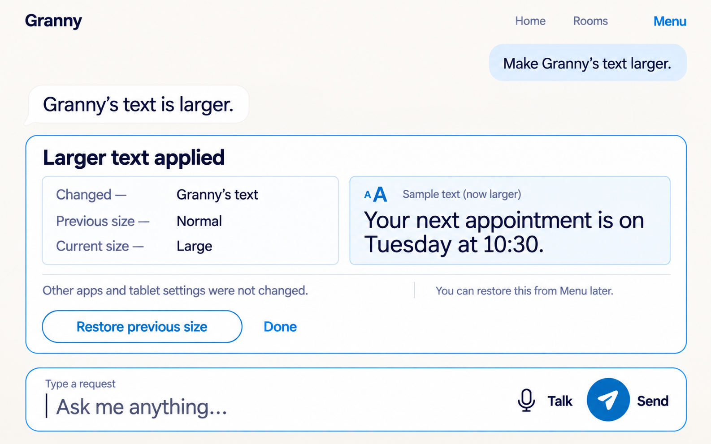

The result records changed scope, previous value and current value, then keeps
Restore previous size directly reachable. It explicitly excludes other apps
and tablet settings.

## Shared visual and interaction rules

- Use the selected Harbour Blue roles: Linen `#FBF6EE`, Surface `#FFFFFF`, Ink
  `#2E2D32`, Accent `#2C5981`, Outline `#597DA0`, Send `#165D9C`, separated
  focus ring `#4930A1`, danger/Stop `#962F43`, and On-colour `#FFFFFF`.
- The ordinary conversation and Round composer remain visible around one
  outcome module. The module is contextual content, not a route, home screen,
  card grid or app dashboard.
- Preserve the written Home, Rooms and Menu shell only as stable navigation;
  this checkpoint does not design new navigation or supporting surfaces.
- Use one primary action per decision region. Essential controls are written;
  images, symbols, color and progress bars never carry meaning alone.
- Implementation targets must support at least 56dp equivalents, and primary
  or Stop controls at least 64dp. Leave unclipped space for a separated focus
  ring.
- The intended type is Bricolage Grotesque 600 for display and DM Sans 400/600
  for body/controls. The generated raster only approximates these faces.
- At narrow widths or 200% text, preserve conversation → module heading →
  provenance/state → main content → actions → composer. Stack subregions and
  remove decorative imagery before hiding text or navigation.

## Deliberate omissions

There are no tabs inside modules, sidebars, recommendation rails, queues,
playlists, albums, contact dashboards, settings menus, notifications, prompt
chips, AI decoration or real external-service branding. Screen guidance does
not imitate an Android permission dialog. The reading preview changes no real
setting. The photo, message and media fixtures prove no retrieval or action.

## Generation and fidelity record

The built-in image-generation tool produced one raster per asset. Frames 03 and
04 were regenerated once because the first attempts introduced an unapproved
circular “G” avatar. Those attempts remain in `rejected/` and are excluded from
the selected manifest. [prompts.md](prompts.md) records the shared prompt and
frame-specific instructions; [manifest.json](manifest.json) records file facts.

All selected frames are opaque 1586 × 992 sRGB PNGs. The comparison is a
derived opaque 1624 × 2930 sheet with labels outside the product screenshots.
Full-size review found no private data, watermark, clipped canvas or material
text corruption.

These rasters do **not** prove exact color contrast, Android dp/sp geometry,
font fidelity, TalkBack wording/order, keyboard or switch traversal, live
regions, IME/inset behavior, 200% reflow, 300% combined scaling, service
availability, external action results or older-adult comprehension.

## Review table

| Module | First attention | Main value | Main review risk |
|---|---|---|---|
| Photos | Large image and provenance | Browsing stays direct and attributable | Partial next image may be mistaken for decoration |
| Screen explanation | Supplied screen and named target | Guidance stays read only with safe return | Dense screenshot detail needs device-size testing |
| Message drafting | Exact recipient/content/effect | Prepared is never confused with sent | Structured detail can feel formal at large text |
| Media | Title/source and current state | Play state and failure are explicit | Player can drift toward mini-app styling |
| Reading assistance | Before/after text | Apply and Restore make change reversible | Side-by-side preview must stack cleanly |

**Review question:** Which modules feel ready to carry into the prototype, and
which should be simplified while keeping their provenance, state and recovery
language intact?
