# Navigation and supporting surfaces — iteration 1

This proposed first round covers Menu, Today/minimal task history, Settings,
Privacy and data, Accessibility, Help, new-conversation behavior, return from
an external app, global search and initial setup.

Its structural thesis is: **conversation remains the home base; navigation is
a quiet written layer, supporting destinations use one readable sequence, and
setup asks only for reversible preferences or separately reviewed access.**

All depicted tasks, names, apps, times and content are fictional. These are
raster review references, not implementation, production geometry, permission
evidence or proof of external-app behavior.

Simon approved this direction for frontend implementation on 2026-09-20. The
[implementation metaprompt](NAVIGATION-SUPPORTING-SURFACES-IMPLEMENTATION-METAPROMPT.md)
translates every image into reusable route, overlay, state, responsive,
accessibility and test requirements while preserving canonical product and
safety contracts.

## Comparison

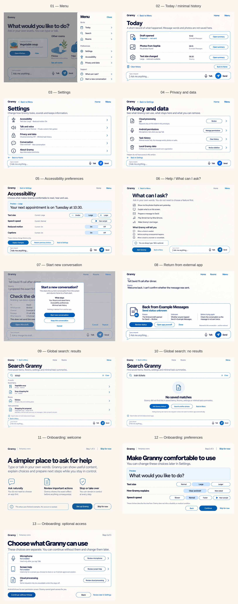

The comparison sheet is resampled and has labels outside the product views.
Use the individual images below for full-size review.

## Review gallery

### 01 — Menu

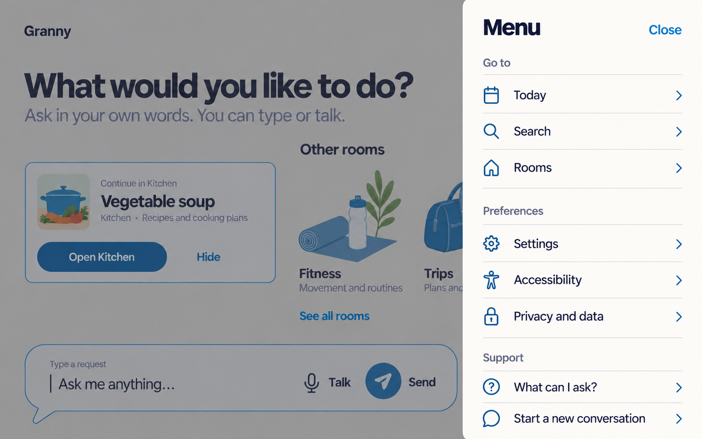

Menu is a focused layer over the current place, not a permanent rail. Written
groups separate destinations, preferences and support. The background composer
remains recognizable but inactive while Menu owns focus.

### 02 — Today / minimal task history

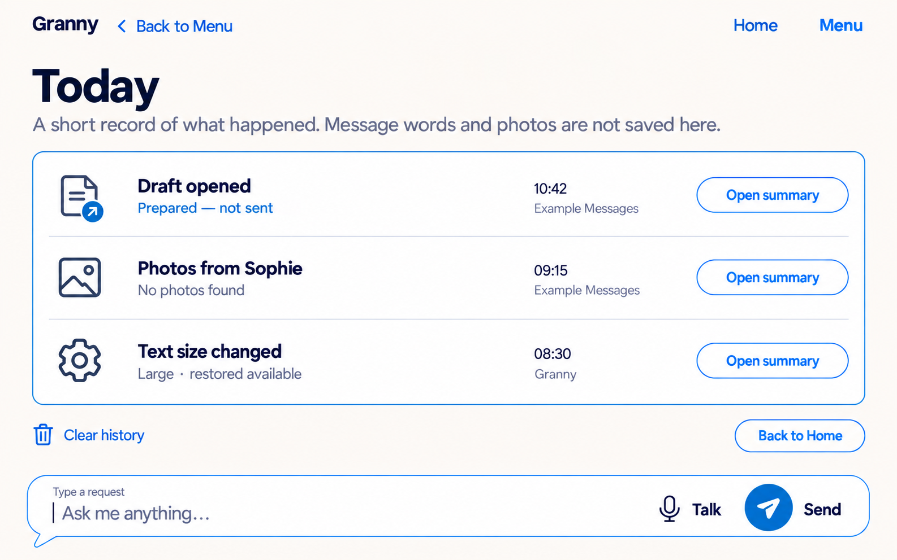

Today records outcomes, times and sources without saving message words, photos
or audio. Prepared, no-result and reversible setting states remain distinct.
Clear history routes to a later exact preview rather than deleting immediately.

### 03 — Settings

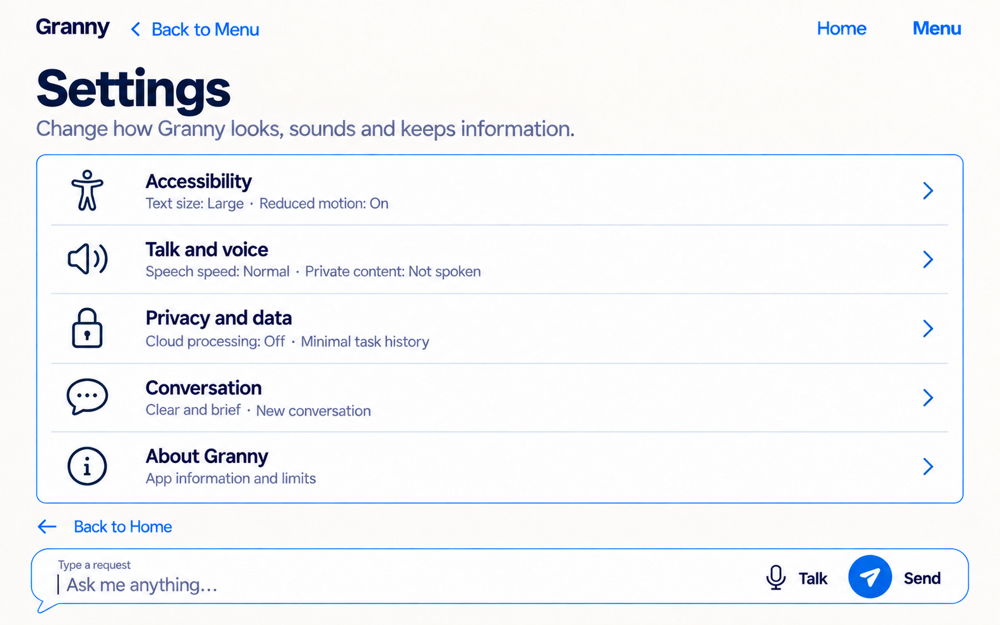

The overview is a calm route list, not a switch dashboard. It summarizes
current values before entry and keeps Accessibility, voice, privacy,
conversation and app limits directly touchable.

### 04 — Privacy and data

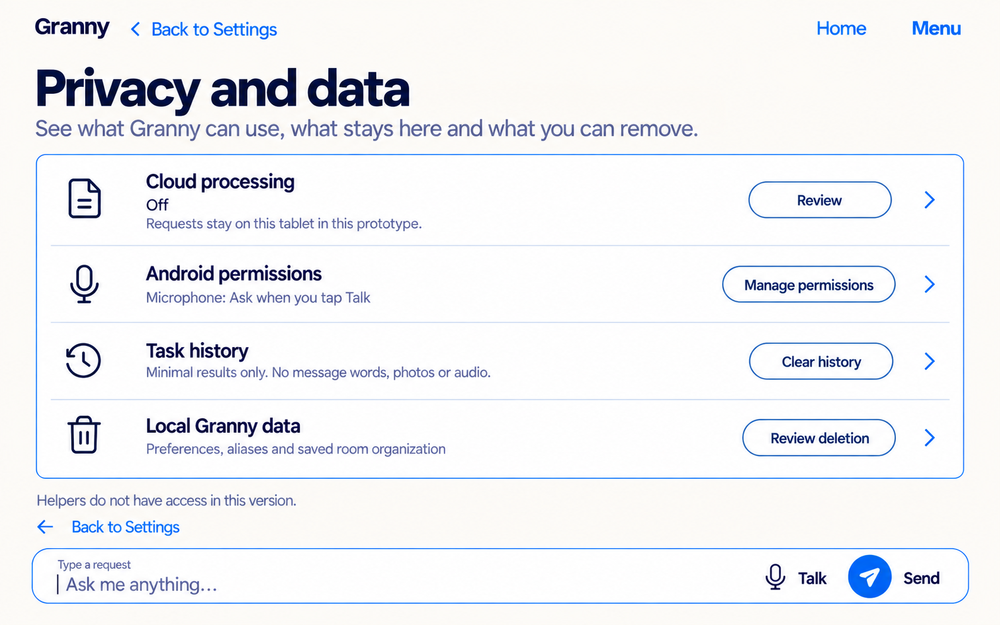

Each row states scope before its action. Permission management remains Android
owned; history and local-data deletion are separate; helper access is absent in
this version. Destructive effects require later exact previews.

### 05 — Accessibility preferences

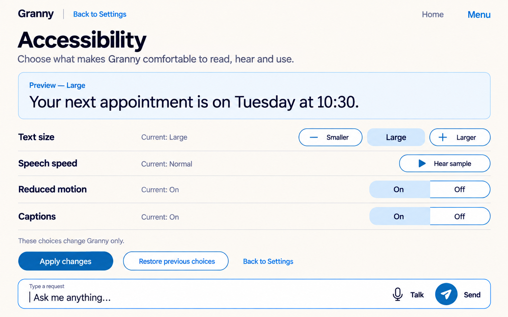

The preview precedes four written choices. Smaller/Larger and written On/Off
alternatives avoid slider-only or color-only operation. The screen explicitly
limits changes to Granny.

### 06 — Help / What can I ask?

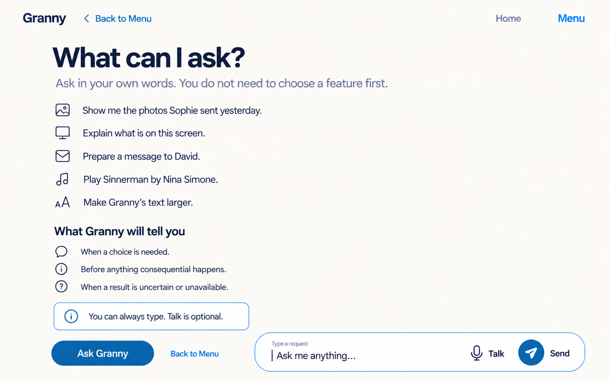

Examples teach natural requests without becoming prompt chips or a capability
dashboard. The lower section explains when Granny will clarify, preview a
consequence or report uncertainty; typed use remains complete without Talk.

### 07 — Start a new conversation

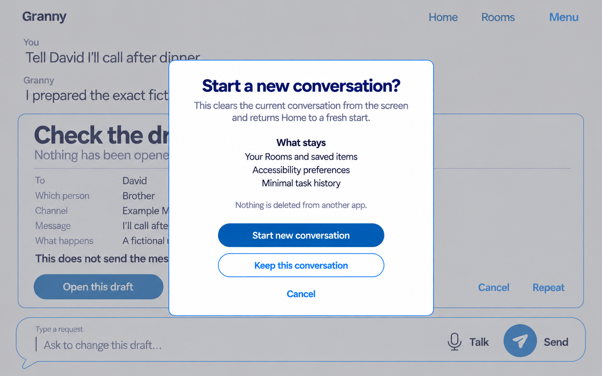

Starting fresh clears the visible conversation but is not deletion. The sheet
preserves Rooms, saved items, preferences and minimal history and states that
nothing is deleted from another app.

### 08 — Return from an external app

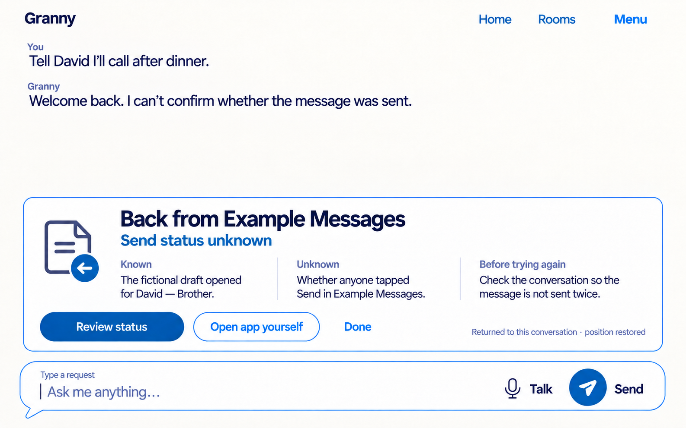

The original request and position return. Granny states what is known, what is
unknown and how to avoid a duplicate attempt. Returning to the app never turns
elapsed time or navigation into a sent claim.

### 09 — Global search results

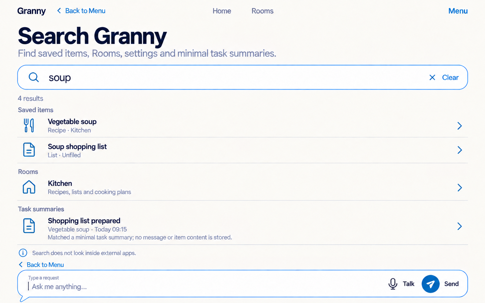

One field searches admitted local Granny content. Every result names its type
and source. Minimal task history reveals only its summary, and the scope line
states that search does not inspect external apps.

### 10 — Global search no results

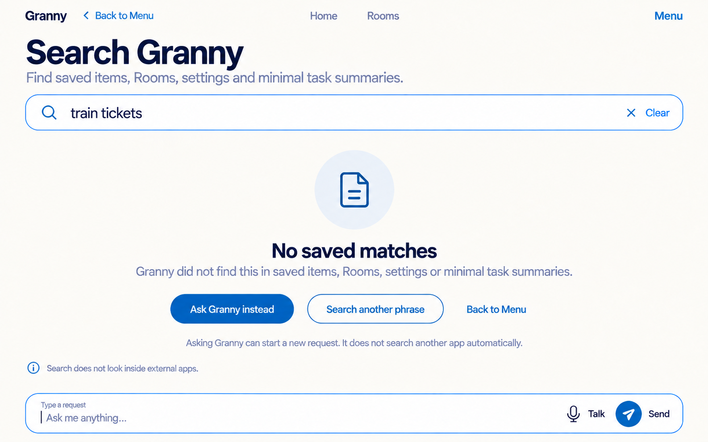

No result remains distinct from offline, loading or permission denial. Asking
Granny starts a request; it does not silently broaden search into another app.

### 11 — Onboarding welcome

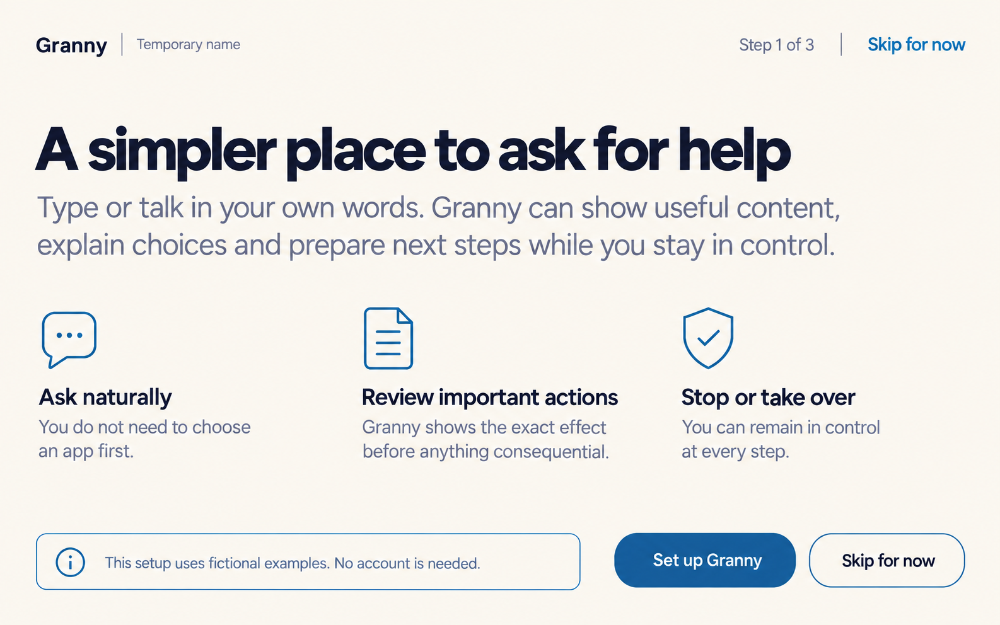

The first step explains the interaction and control posture without sign-in,
marketing claims, mascots or age framing. Setup is skippable and uses fictional
examples.

### 12 — Onboarding preferences

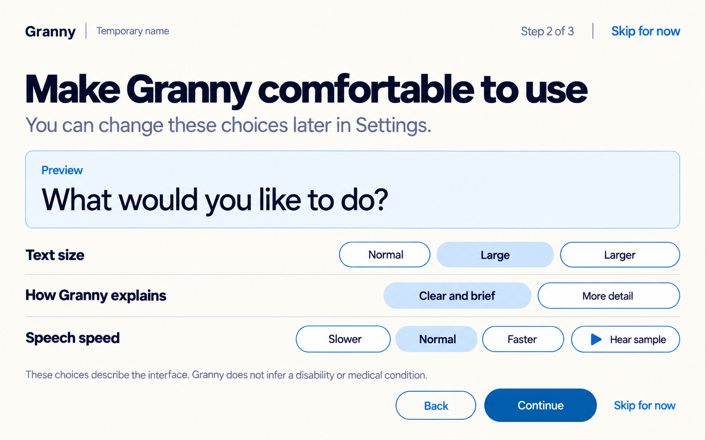

The second step previews a small set of reversible choices. Written values and
broad targets replace personality quizzes or inferred needs. The person can
skip and change everything later.

### 13 — Onboarding optional access

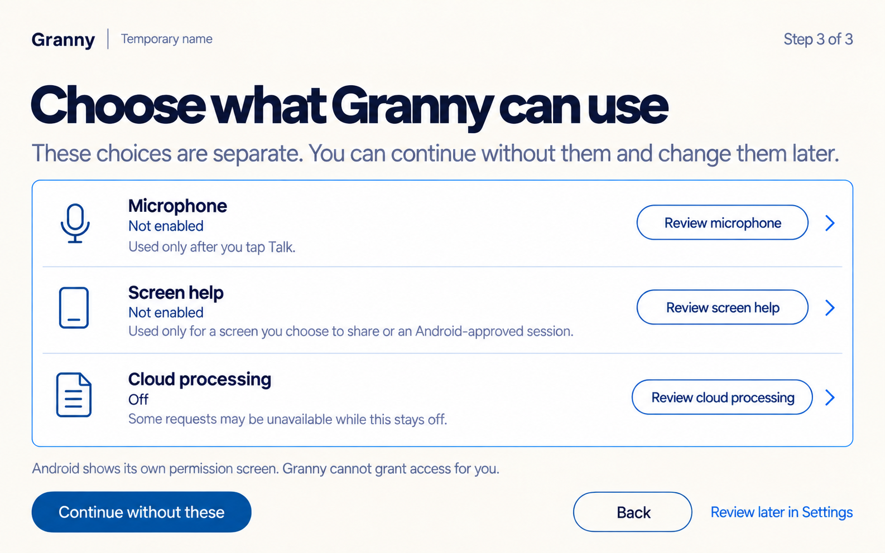

Access choices are separate and unselected. Continue without these is primary;
each Review action leads to its own disclosure and Android-owned permission
where applicable. There is no bundled consent.

## Shared visual and interaction rules

- Use selected Harbour Blue: Linen `#FBF6EE`, Surface `#FFFFFF`, Ink
  `#2E2D32`, Accent `#2C5981`, Outline `#597DA0`, Send `#165D9C`, separated
  focus `#4930A1`, danger/Stop `#962F43`, On-colour `#FFFFFF`.
- Preserve Bricolage Grotesque 600 display intent and DM Sans 400/600 body and
  control intent. Generated type is an approximation.
- Home, Rooms and Menu remain written and recognizable. Do not repeat them in
  rails, tabs and several competing navigation regions.
- Menu is a temporary focus-owning layer. Settings, Today, Privacy,
  Accessibility, Help and Search may be direct destinations with a written Back
  route and normal composer where useful.
- One whole row is one semantic target. Icons reinforce but never replace the
  written label, current value, source or outcome.
- At narrow width or 200% text, preserve heading → explanation → rows/content
  → actions → composer. Side-by-side controls stack before text shrinks.
- Controls must support at least 56dp equivalents; primary and Stop controls
  must support at least 64dp equivalents. Focus-ring space may not clip.
- Onboarding progress uses written `Step N of 3`; dots, color and motion are
  never the sole progress signal.

## Deliberate omissions

There is no bottom navigation, permanent sidebar, app grid, notification
center, capability tile wall, prompt-chip wall, full transcript archive,
privacy score, bundled consent, sign-in requirement, helper access, analytics,
external-app search, personality quiz or final logo. Destructive previews for
Clear history and Delete local data remain separate later states rather than
being compressed into these overview frames.

## Generation and fidelity record

The built-in image-generation tool created one raster per asset. Three assets
were regenerated once: Settings initially used a trash icon for Back to Home;
return-from-app introduced an inaccurate extra turn; and global search paired
the soup query with an unrelated photo summary. The rejected attempts remain
in `rejected/` and are excluded from [manifest.json](manifest.json).

[prompts.md](prompts.md) preserves the shared prompt foundation and exact
frame-specific content. All selected frames are opaque 1586 × 992 sRGB PNGs.
The derived comparison is an opaque 1624 × 4102 PNG.

Full-size review found no private data, watermark, cropped screen edge or
material text corruption in the selected files. The rasters do **not** prove
exact contrast, dp/sp geometry, fonts, TalkBack order, keyboard/switch access,
IME/inset behavior, 200% reflow, Android permission flow, persistence,
external-app outcome verification or older-adult comprehension.

## Review table

| Surface | First attention | Main design value | Main review risk |
|---|---|---|---|
| Menu | Current grouped destination | Direct touch without persistent chrome | Eight routes may feel long at 200% text |
| Today | Outcome and state | Useful history without transcript storage | “Today” may imply calendar content |
| Settings | Current-value summaries | Less drilling to understand state | Five rows still approach a conventional settings page |
| Privacy/data | Scope before action | Candid local/cloud/deletion separation | Detail may need progressive disclosure |
| Accessibility | Live preview | Reversible choices without diagnosis | Horizontal choices must stack cleanly |
| Help | Natural-language examples | Teaches capability without feature tiles | Examples must not look like tappable prompts |
| New conversation | What clears and stays | Fresh start is separated from deletion | Confirmation may be unnecessary when truly empty |
| External return | Unknown send status | Prevents false success and duplicate action | Dense known/unknown copy needs large-text testing |
| Global search | Source-labelled local results | One direct find route across Granny | Search scope must remain understandable |
| Onboarding | Control, preferences, separate access | Skippable setup without bundled consent | Three screens must not feel compulsory or long |

**Review question:** Does this feel like one quiet navigation system around the
conversation, and which surface—if any—still feels too much like a conventional
settings dashboard?
