# Profile and accessibility adaptations — iteration 1

This proposed final review batch adds one Profile support destination and nine
representative accessibility stress-state references. Its structural thesis is:
**accessibility changes scale, flow, feedback and available inputs without
changing the person's place, hiding essential controls or creating a second
version of Granny.**

The Profile is deliberately not an online account or social identity. It is a
plain local route for reviewing how Granny addresses the person, communicates,
interprets aliases and uses saved preferences. `Alex` and all other content are
fictional fixtures.

The nine state frames demonstrate patterns that must eventually be applied and
tested across every main surface. They are not nine new destinations, and one
representative screenshot does not prove full screen-by-screen coverage.

## Comparison

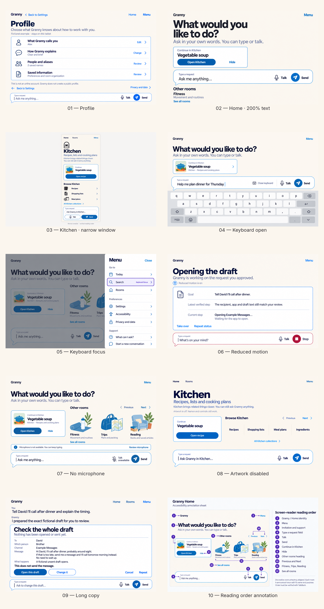

The comparison is a derived, resampled review sheet. Use the individual images
below for full-size inspection.

## Review gallery

### 01 — Profile

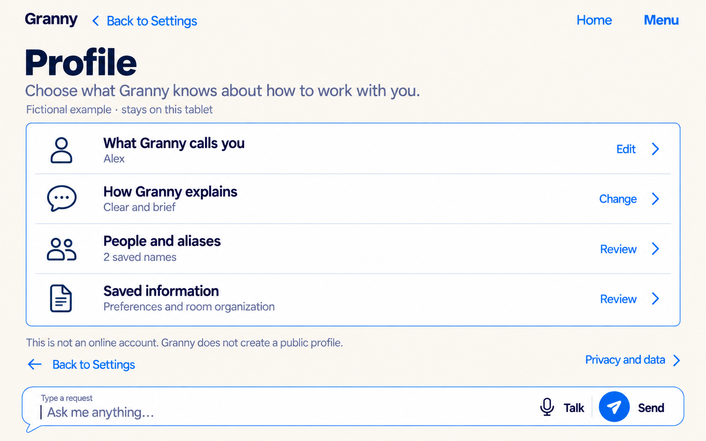

Profile is a readable route list for the fictional preferred name,
communication style, people/aliases and saved information. It explicitly says
that it is not an online account or public profile. No avatar, email, password,
social metric or cloud status is introduced.

### 02 — Home at 200% text

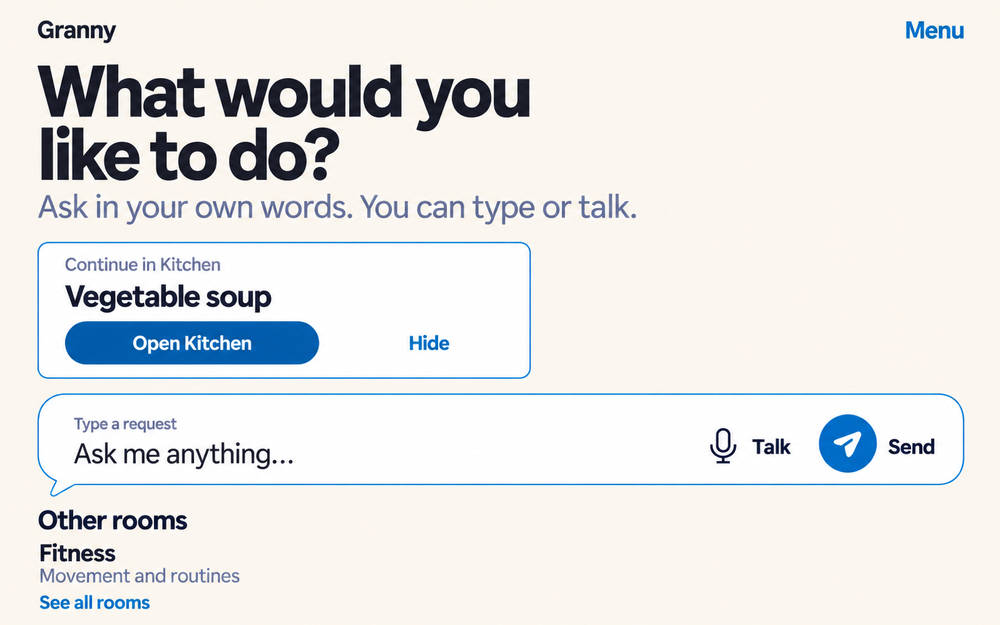

The selected Home retains invitation, continuation, composer and a written
Rooms route. The composer moves ahead of the room sequence, artwork disappears
before copy shrinks, and one room becomes a direct vertical entry. This is
reflow, not a zoomed crop of the normal screen.

### 03 — Kitchen in a narrow window

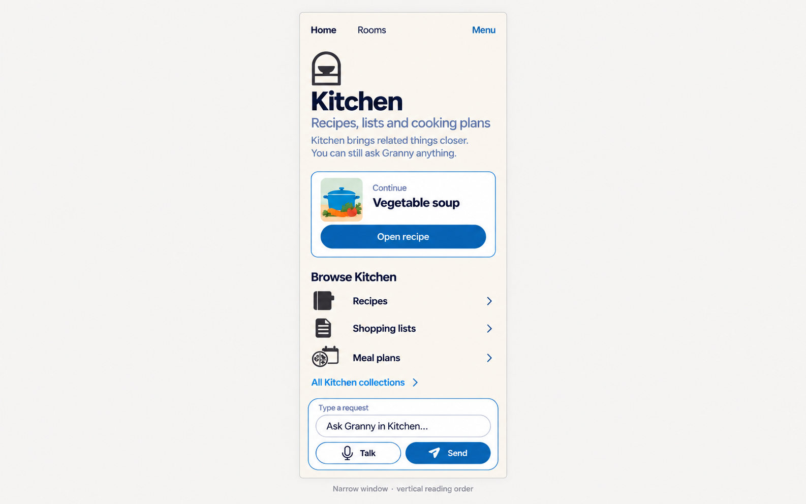

Kitchen identity, scope, continuation, direct browsing and the same composer
form one vertical sequence. The horizontal collection row becomes a labeled
list; room atmosphere is removed. The wide neutral margins belong to the
review sheet, not the app.

### 04 — Keyboard-open layout

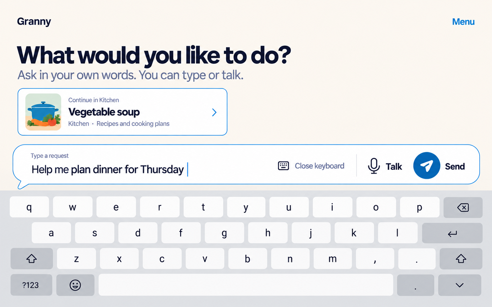

The IME consumes lower-screen space while the active composer remains directly
above it. Send, Talk, the draft and a written Close keyboard action stay
visible; optional Rooms content scrolls away before controls become cramped.

### 05 — Keyboard focus

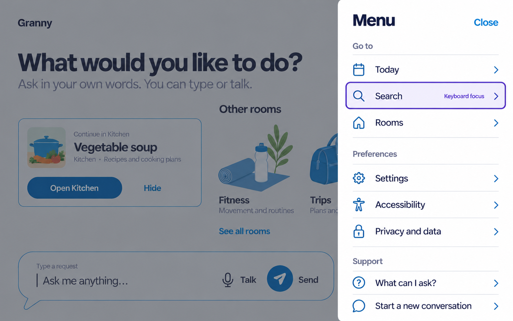

The Menu owns focus while the underlying Home is inert. Search receives one
offset purple focus ring with unclipped space and a written state note for this
review reference. Purple is not reused as an ordinary border.

### 06 — Reduced motion

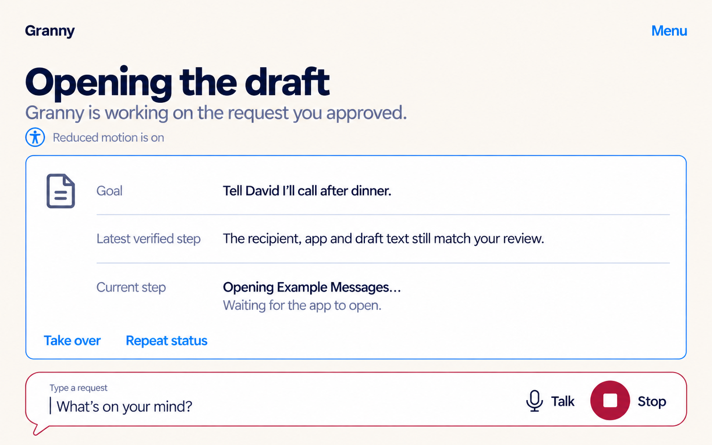

The active task uses persistent static text rather than a spinner, shimmer,
pulse or percentage. Stop remains stable and prominent. The written
`Reduced motion is on` line is a fixture explanation, not a required banner on
every production task.

### 07 — No microphone

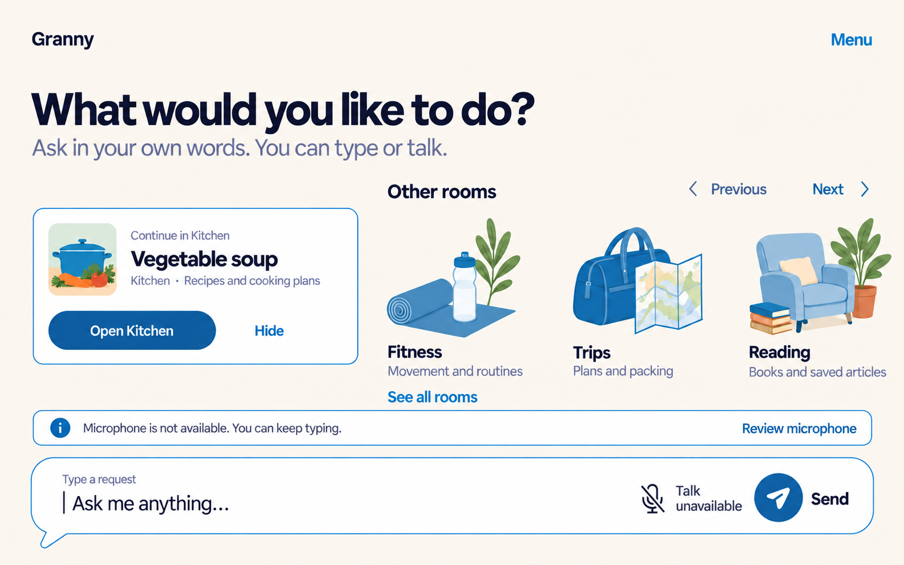

The stable Talk location becomes `Talk unavailable`, using an icon plus words
and a high-contrast reason. Typing and Send remain complete; Review microphone
is a separate route rather than a blocking permission prompt.

### 08 — Artwork disabled

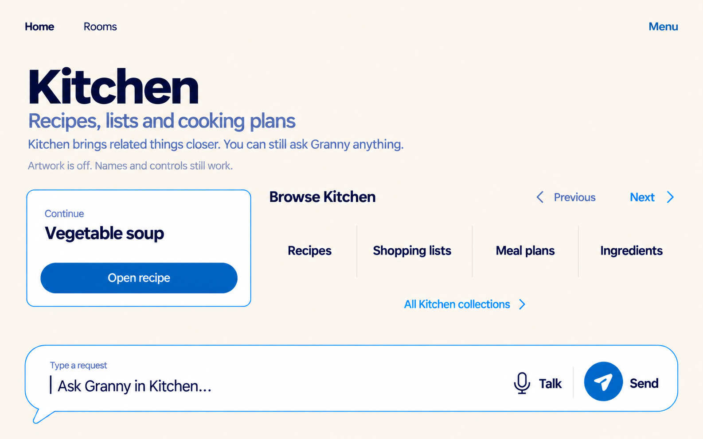

Written room identity, purpose, scope, continuation and collection labels carry
the experience. Decorative atmosphere and collection icons disappear without
leaving broken-image boxes or removing navigation.

### 09 — High-content / long copy

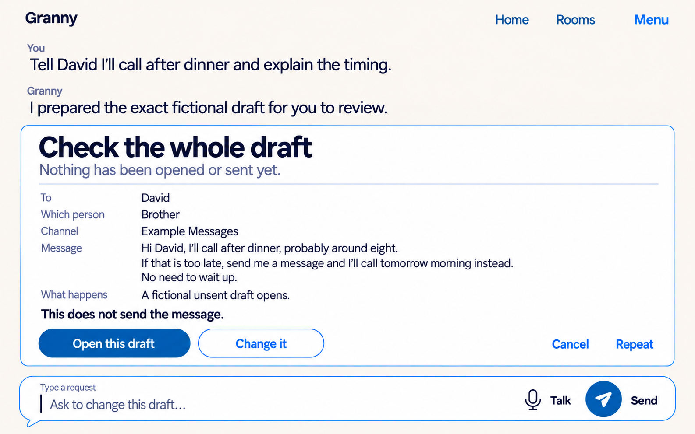

The exact recipient, differentiator, channel, complete body, effect and unsent
status remain inspectable before actions. Copy wraps in document flow and is
not ellipsized or hidden in a tiny internal scrolling region.

### 10 — Screen-reader reading-order annotation

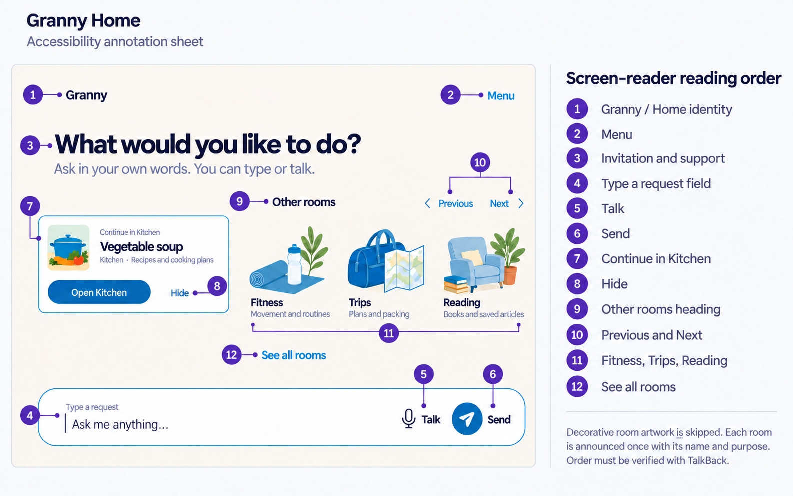

This documentation sheet proposes the idle Home order: identity, Menu,
invitation, composer field, Talk, Send, continuation, Hide, Rooms heading,
written row movement, room targets and See all rooms. Decorative portraits are
skipped and each room is announced once with its written name and purpose. The
order still requires implementation inspection and TalkBack verification.

## Shared adaptation rules

- Preserve the selected Harbour Blue roles and Round composer. Adaptation does
  not reopen palette, branding or input-shape exploration.
- Keep the current Home or Room as the underlying place. Accessibility states
  are presentation/input conditions, not new application destinations.
- Reflow and scroll before shrinking type. At 200% text, use one vertical
  sequence and remove decor before removing source, state or action copy.
- A narrow window replaces horizontal room/collection navigation with broad
  labeled rows; no essential horizontal scroll remains.
- The software keyboard may reduce visible context, but it cannot cover the
  active field, Send, Stop or the safe way to dismiss the keyboard.
- Focus is visually separated, programmatic and singular. A focused overlay
  makes its background inert and restores focus on close.
- Reduced motion removes nonessential transition, shimmer and pulse while
  preserving written state changes and stable Stop.
- A denied/unavailable microphone never blocks typed use or becomes a repeated
  permission nag.
- Artwork is removable. Written room identity, purpose and targets remain
  sufficient when images fail, are disabled or are not announced.
- Long content wraps and remains inspectable. Exact consequences are never
  shortened to protect a composition.
- Screen-reader order follows task meaning, skips duplicate decor and gives one
  accessible name/role/state per semantic target.

## Coverage boundary

These references define the adaptation vocabulary, not the completed coverage
matrix. Before implementation can claim accessibility readiness, each main
surface—Home, Menu, Rooms library, current Room, conversation state surfaces,
outcome modules, supporting destinations, confirmation/recovery and
onboarding—still needs implementation checks for all nine conditions and their
important combinations, especially 200% text + keyboard and TalkBack + external
control.

## Generation and fidelity record

The built-in image-generation tool created one raster per selected mockup. Two
assets were regenerated once: the first 200% Home added a physical-device bezel,
and the first reading-order sheet invented `October 2024`. Both rejected files
remain under `rejected/` and are excluded from the selected manifest entries.

All ten selected mockups are opaque 1586 × 992 sRGB PNGs. The comparison sheet
is a derived opaque 1632 × 3065 PNG assembled locally with labels outside the
mockups. [prompts.md](prompts.md) records the prompt set and targeted
corrections; [manifest.json](manifest.json) records dimensions and review state.

Full-size visual inspection found no private data, watermark, cropped screen
edge or material text corruption in the selected files. The rasters do **not**
prove contrast, Android dp/sp, real 200% scaling, IME insets, keyboard order,
reduced-motion runtime behavior, permission state, TalkBack semantics, switch
access, persistence, device behavior or older-adult comprehension.

## Review table

| Frame | Rule being tested | Main review concern |
|---|---|---|
| Profile | Local preferences without account framing | Whether Profile duplicates Settings/Memory too much |
| 200% Home | Reflow before shrink | Whether continuation should follow the composer at this scale |
| Narrow Kitchen | Direct vertical sequence | Whether the neutral review margins make the real width clear |
| Keyboard open | Active input stays visible | Exact Android IME height/insets remain unknown |
| Keyboard focus | One obvious focus owner | Written review note should not become permanent product chrome |
| Reduced motion | Static equivalent for progress | Runtime announcements and timing remain untested |
| No microphone | Complete typed path | Permission wording must follow actual native state |
| Artwork disabled | Identity without decor | Text-only collections may need stronger grouping at scale |
| Long copy | Full exact consequence | Maximum-scale version needs separate scrolling evidence |
| Reading order | One semantic sequence | TalkBack must verify the proposed order and grouping |

**Review question:** Does Profile feel useful without becoming an account
dashboard, and do these nine adaptations preserve the same calm Granny rather
than looking like separate accessibility versions of the product?
