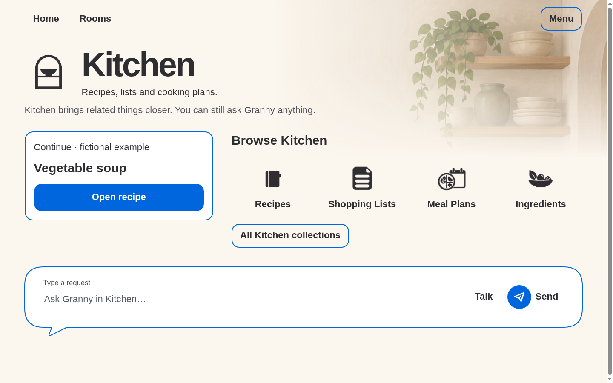
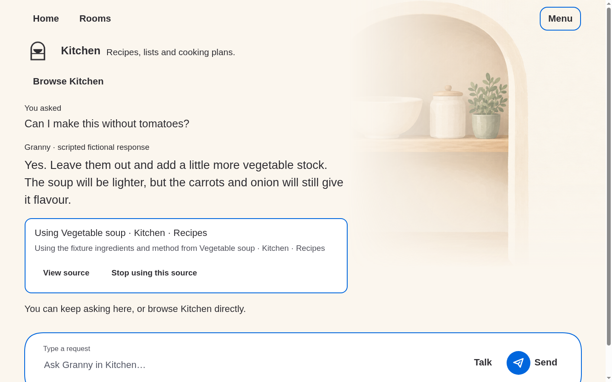

# Content/art separation

Base inspected: `a97de45e32310e0f69e7b868df824a5f431b38ea`. Captures include
this follow-up's working-tree changes. Reproduce with
`node prototypes/stage-1/room-layout-browser-check.mjs`; fictional fixtures only.

Artwork remains at the previous 115% overview / 60% chat scale. Overview's
horizontal fade holds detail farther right, and its vertical fade finishes at
the measured start of the collection symbols. Countertop and utensils no
longer compete with interactive categories. The image is not shrunk to fade it.

Chat uses a 3:2 grid with a responsive gutter: content occupies the left track,
and the art mask stays transparent through that track's measured right edge.
Source controls wrap below source text rather than crowding its narrower width.
Resize observation recalculates mask boundaries from actual layout; no fixed
viewport screenshot offsets are involved. At narrow/large-text sizes the grid
returns to one column and decorative artwork disappears.

143 layout assertions include explicit mask/content alignment and full-width
fallback checks. Existing workflows, room interactions and Home Hide remain
covered separately; exact checks are in the
[session](../../../10-execution/sessions/2026-09-20-room-content-separation.md).
Original assets and previous screenshots are untouched. Browser-only evidence:
Android dp/IME, assistive technology and comprehension remain unrun.
