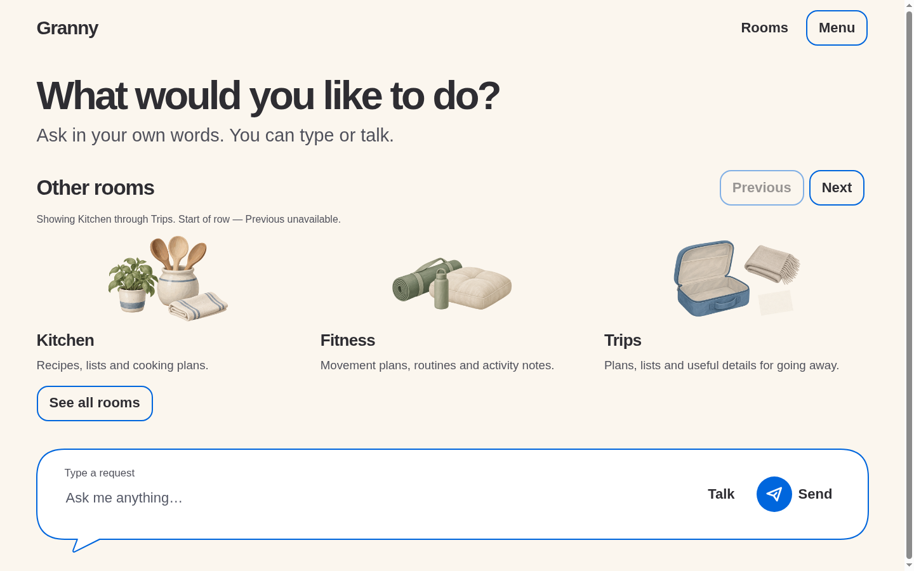
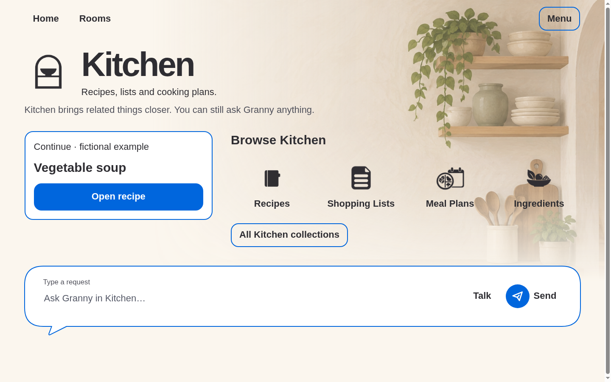
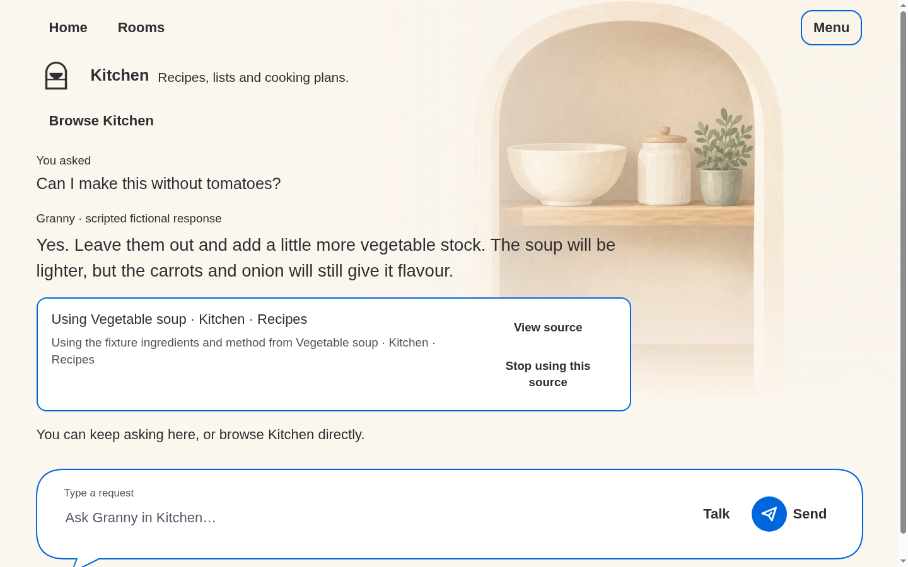

# Larger artwork, full-width room row

Base inspected: `e4804e3db7a16af0d0356228d0eafd65ee539334`.
These 1440 × 900 screenshots include this follow-up's working-tree changes,
captured by `node prototypes/stage-1/room-layout-browser-check.mjs`.
All content is fictional; original artwork and previous evidence are unchanged.

The earlier Hide fix retained a 64rem centered cap and the 36% card basis,
leaving unused margins and a clipped third entry. This revision removes that
cap and divides the available width, minus two gaps, into three complete
entries. The section aligns with the normal page margin; controls travel with
it. Real scrolling to the other three rooms remains, and Hide resets position
so stale pre-resize scrolling cannot clip the first entry. Narrow/large-text
views keep the direct vertical list; reviewer fit/overflow fixtures stay isolated.

The atmosphere's containing block is now the outer page shell, not the padded
room section. It starts at the top and reaches the right edge; its height
tracks viewport proportions. Overview artwork has a separate 115%-width
proportional cover layer, with independent left/bottom alpha masks. Chat
portraits use 60% shell width with natural aspect ratio rather than the former
27%-width sticker treatment. No fixed screenshot offsets or new art were added.

Intentional source difference: the selected backdrop has a left-side window,
while the Kitchen composition mockup depicts a right-side window. No asset
regeneration, mirroring or label/control changes are used to fake that match.
The shared readable shell, flow composer, violet focus and room-local content
remain. Images disappear at narrow/large-text sizes. Browser evidence does
not prove native Android dp/IME, TalkBack, switch access or comprehension.

The layout suite passes 132 assertions, now requiring full-margin Hide width,
three complete entries, contained controls, full-bleed hero bounds and a
substantial uncropped chat portrait. The [session](../../../10-execution/sessions/2026-09-20-room-footprint-refinement.md)
records other validation and publication.
