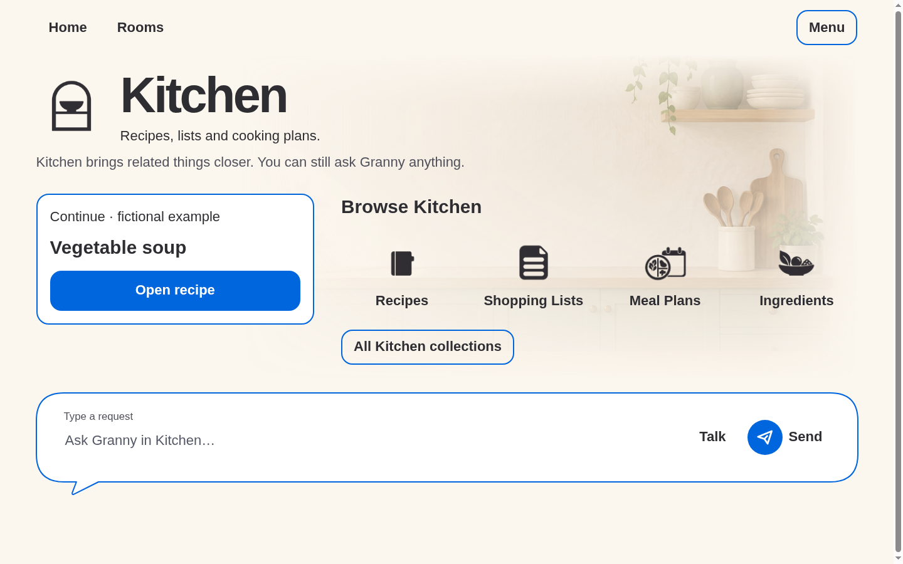
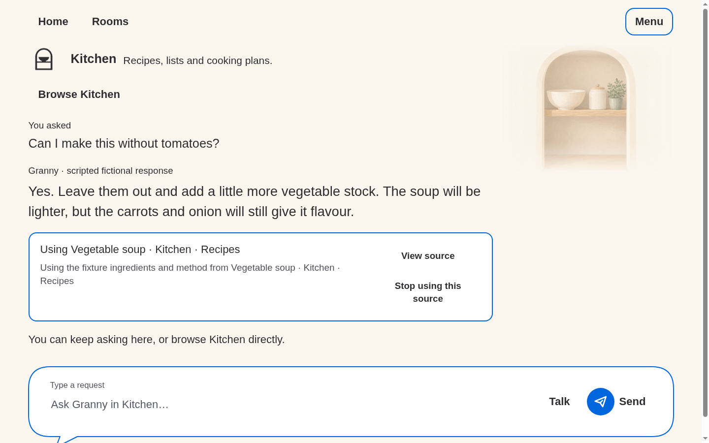
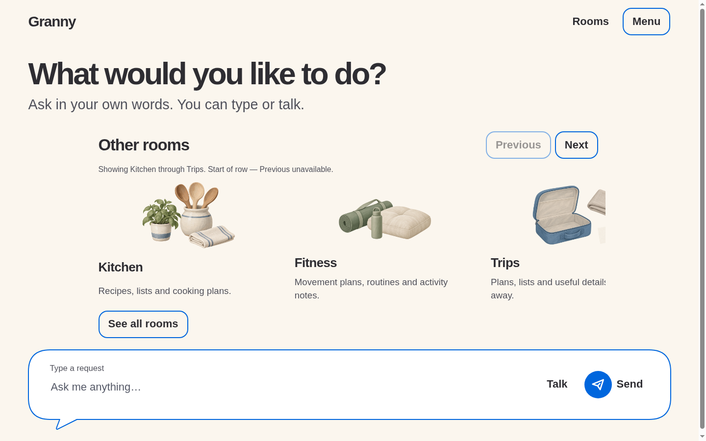
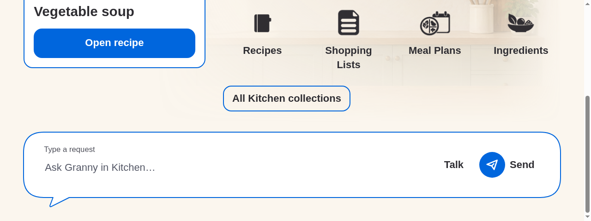
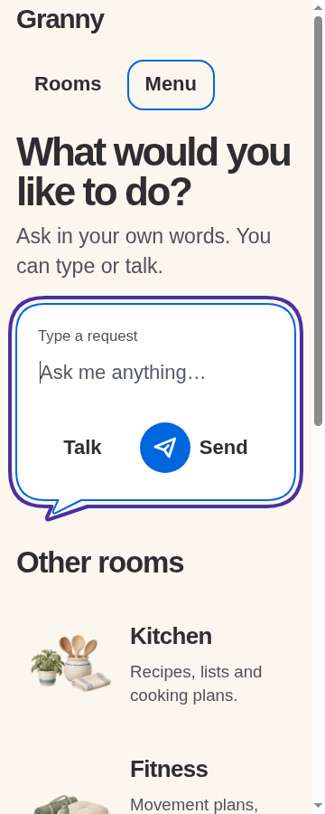

# Responsive layout repair

Inspected base: `1be55b9548a61785f14b95d9aa5c6cf319ab07d6`. These captures
include the working-tree repair following Simon's review of that version.
Generated by `node prototypes/stage-1/room-layout-browser-check.mjs` using
Chromium and fictional local fixtures. Earlier evidence remains untouched.

The fixed 350/360px art rectangles are removed. Overview atmosphere tracks
the complete content section and uses proportional alpha fades on its edges.
The background uses proportional cover sizing, so normal background cropping
can vary with aspect ratio, but no separate inset crop box exists. Chat art
instead preserves the full portrait aspect ratio with natural image height.
No original artwork is edited. At narrow/large-text sizes decoration still
disappears to preserve content and control space.

Room composer layout is normal flow, with a 1em gap and no auto spacer or
sticky overlap. The single SVG outline owns both bubble body and pointer;
the form itself remains semantic, interactive and intrinsically sized.
The focus contour is recomputed from the same geometry on resize. This
replaces the overlapping two-border construction, not an overlay patch.

130 new assertions cover 360/600/840/1280/1440 widths, 480/600/640/700/900/1200
heights, 200% text, overview/detail/chat geometry, actual control hit testing,
full-hero bounds, portrait aspect ratio, no border crossing the pointer mouth,
Home centering/focus after Hide, and room-local continuation isolation.
Existing suites additionally exercise combined 300% scaling and all six rooms.
Exact final checks are in the [session](../../../10-execution/sessions/2026-09-20-room-layout-repair.md).

This is browser evidence only: Android dp/IME, TalkBack, switch and human
comprehension remain unrun. Fonts remain system fallbacks. No new persistence,
model calls, recording, external assets or production room data were added.
