# Shared surfaces, retained place

Inspected baseline: `9224d38` (current main references merged into the existing
frontend branch). Captures show the scoped implementation recorded by this
README's delivery commit, not clean baseline renders. Run
`node prototypes/stage-1/shared-state-review.mjs` from repository root to
reproduce them. All data, David entries, app names and outcomes are fictional.
Chromium viewport is 1440 × 1000 CSS pixels unless named below. Reviewer tools
are below the captured app; participant mode does not create their DOM.

## Reference mapping

| Approved reference | Implemented component / behavior |
|---|---|
| 01 Listening | `speech-surface` inside the existing Round form; provisional read-only sample, Done/Cancel/Type instead |
| 02 Editable transcript | Same expanded form, editable Request; Use requests interpretation only; Listen again/Cancel |
| 03 Which David | `messageSurface` clarification, retained request, whole semantic person/destination rows and alternative answer composer |
| 04 Exact preview | One inline nonmodal rectangular private region, exact model slots and guarded approval; Change invalidates prior authority |
| 05 Active | Goal/latest verified/current step; existing scheduler; Stop replaces Send, with an offscreen fallback |
| 06 Prepared | Same result position; preparation explicitly distinguished from sending; fictional manual handoff and Done |
| 07 Unknown | Alternative model outcome, known/unknown/next, read-only review and explicit no retry |

The Room renderer is not re-entered or copied for any state. Its selected
collection/item/search and source state stay mounted. A UI origin record
restores focus and scroll on dismissal; Home/Room/library navigation resolves
unfinished work first. Leaving a Prepared/Unknown result asks for explicit
**Done and leave**. Opening secondary settings expires a visible preview's
authority without destroying its unfinished editor.

## Kitchen state family

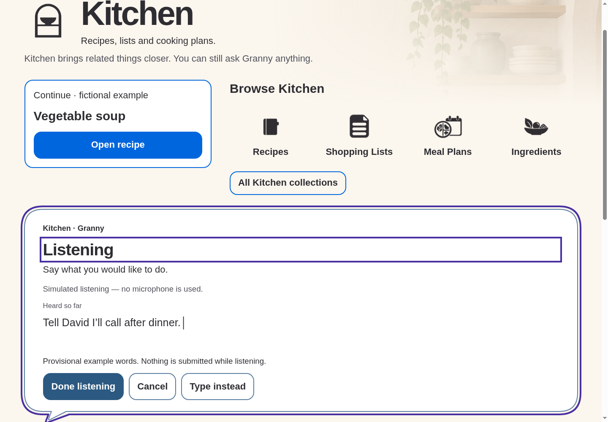
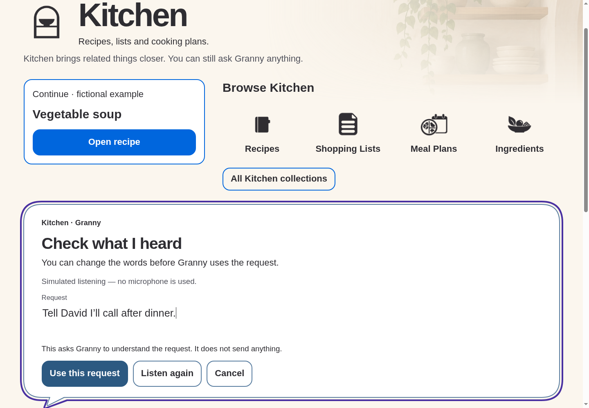
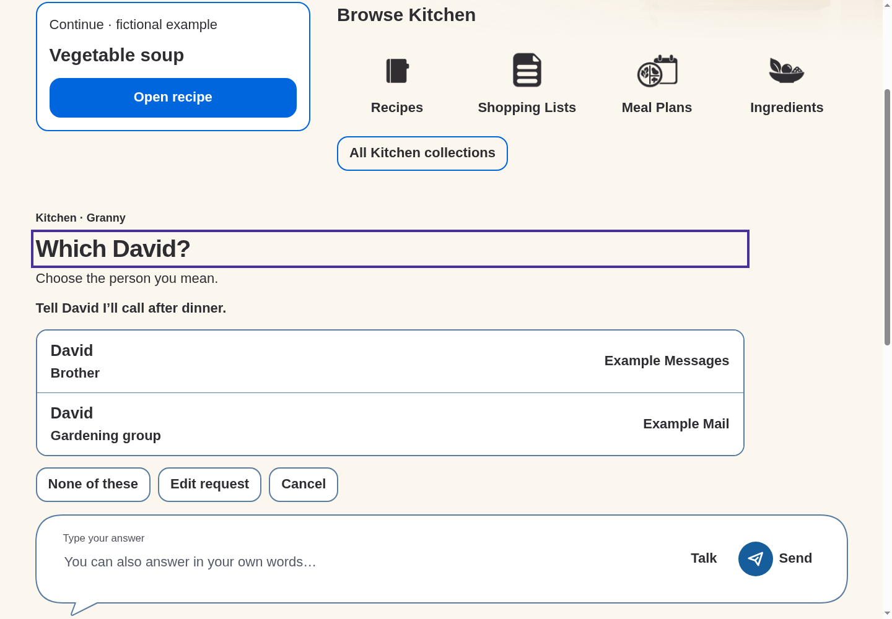
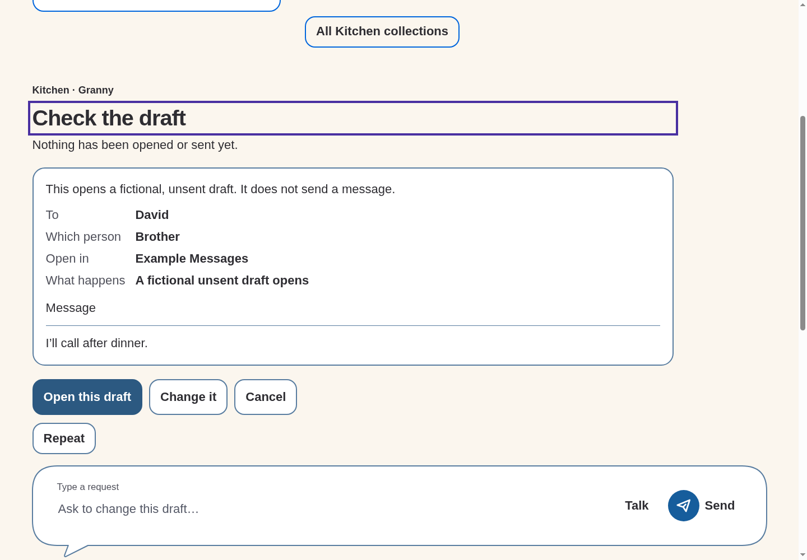
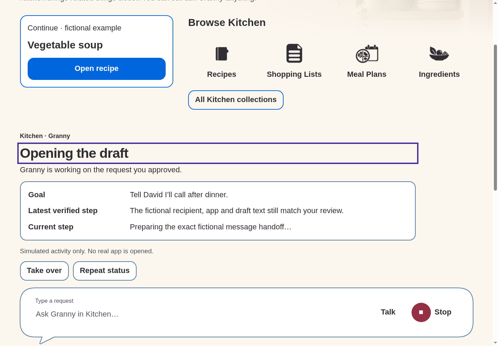
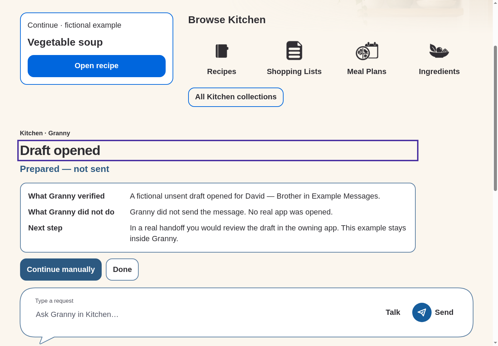
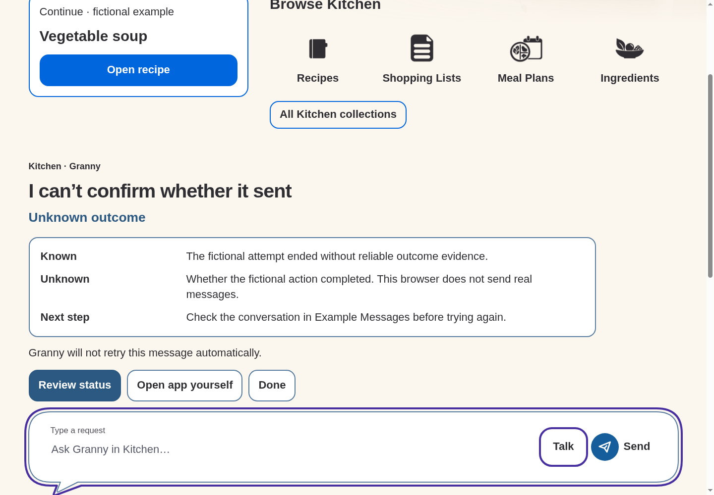

## Home proof

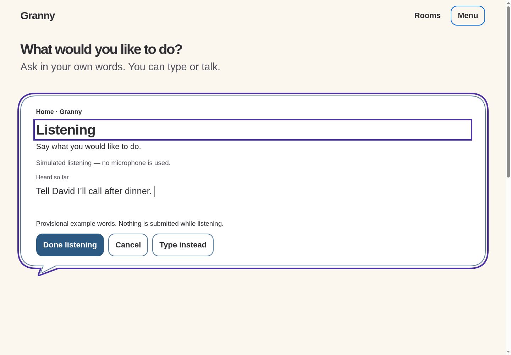
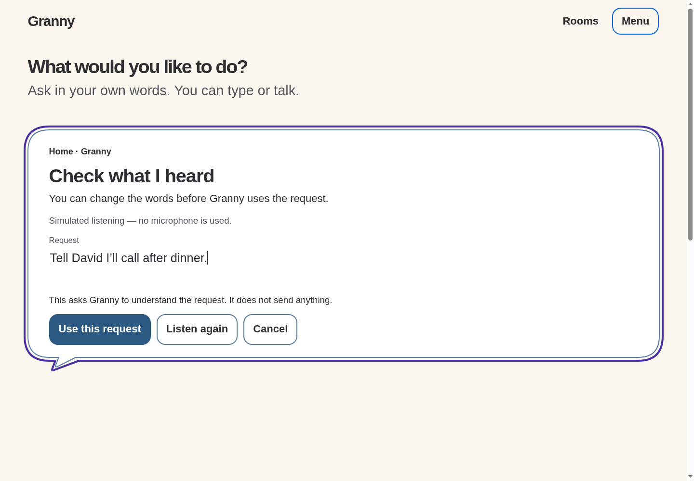
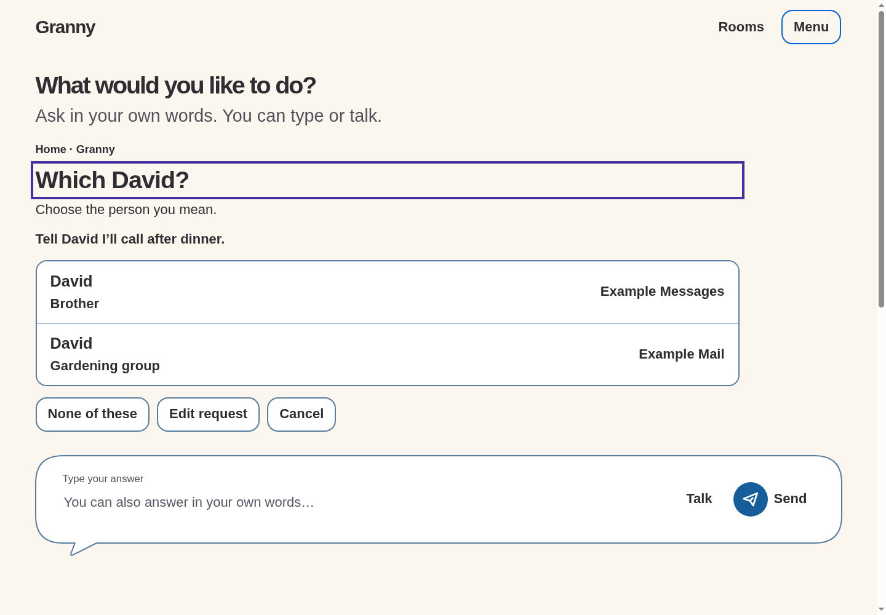
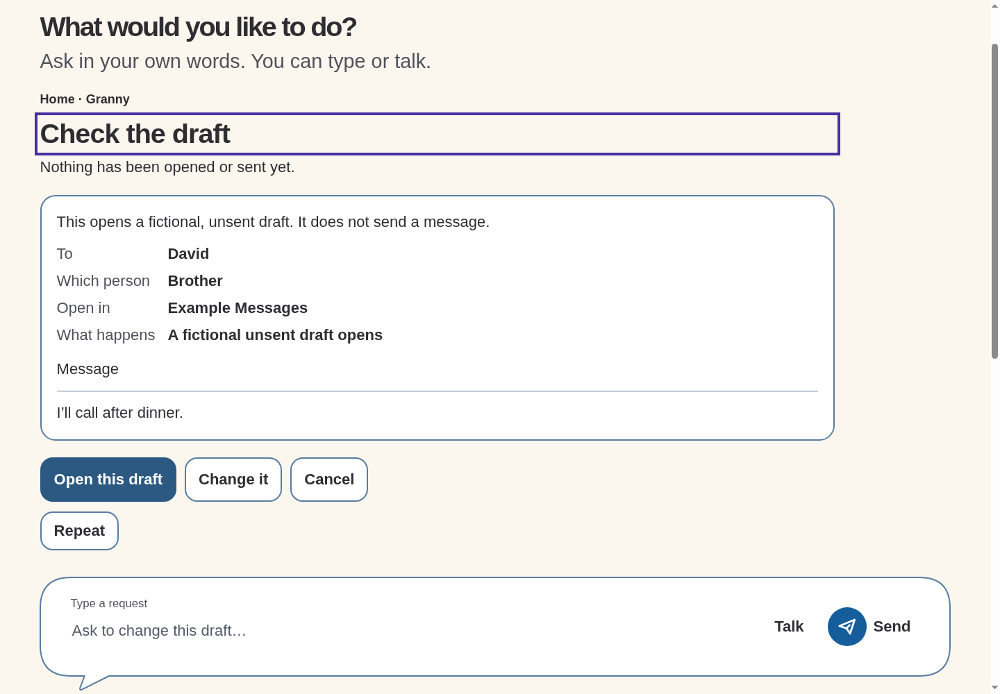
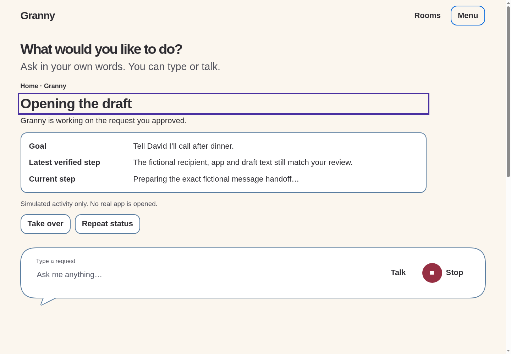
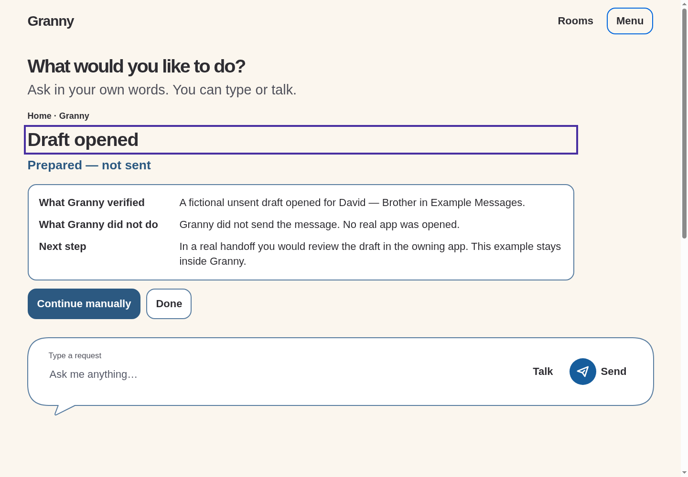
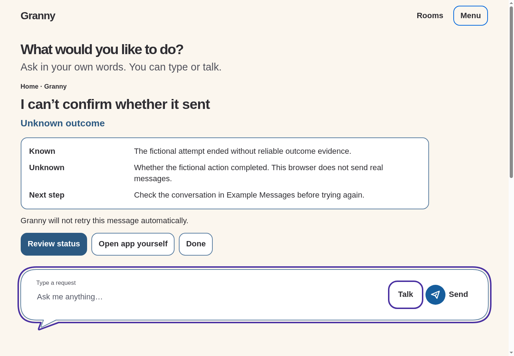

## Reflow

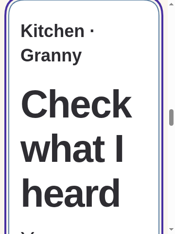
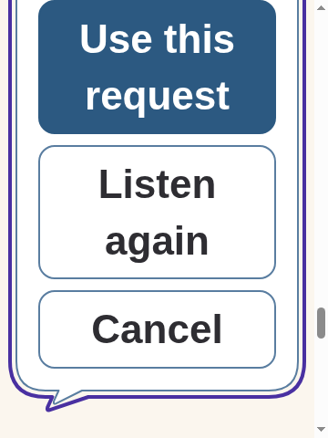
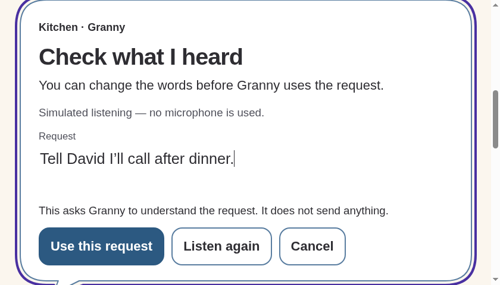

Narrow/large text uses intrinsic vertical flow. These cropped viewport images
are not evidence that all controls fit simultaneously: browser checks scroll
to and hit-test essential actions. Reduced viewport height approximates
keyboard pressure; a real Android IME remains unrun.

## Intentional visual adaptations and limits

- The rasters isolate states on an empty canvas. Implementation retains Home
  or Kitchen and adds a small written place cue; longer states scroll rather
  than hiding room identity behind a new route. No background scrim is used.
- The exact preview is inline/nonmodal. It has no artificial focus trap;
  actual interruption dialogs use native modal containment. Heading focus
  shows the separated violet ring in these keyboard-driven captures.
- New task surfaces/composer states use the requested canonical Harbour Blue
  outline/accent/Send roles. The already-approved idle Home/Room bright-blue
  outline treatment is untouched. No new global palette decision is claimed.
- Actions wrap together in reading order, rather than the raster's widely
  separated positions. No decorative document badges, microphone art or
  simulated streaming animation is necessary to understand state.
- Prepared/Unknown verification is only a deterministic fixture. Unknown
  does **not** claim a draft opened when the existing model has no such evidence;
  this intentionally differs from the raster's example Known statement.
- Repeat restates the visible review/status without auto-speaking private
  message text. No real audio, microphone, external app or provider is used.
- No local reviewed font files exist; system sans is retained, not exact
  Bricolage Grotesque/DM Sans fidelity. Existing selected room artwork and
  written Granny codename remain unchanged; no new artwork was generated.
- CSS targets and browser keyboard checks do not prove Android dp/sp,
  TalkBack, switch operation, actual keyboard/insets, real cancellation or
  outcome verification, or older-adult comprehension. All remain unrun.

Exact automated commands/results and changed paths are in the linked
[session handoff](../../../../10-execution/sessions/2026-09-20-shared-state-frontend.md).
Simon review question: does the expanded composer feel connected to the room
while keeping the request, exact consequence and escape controls easy to find?
