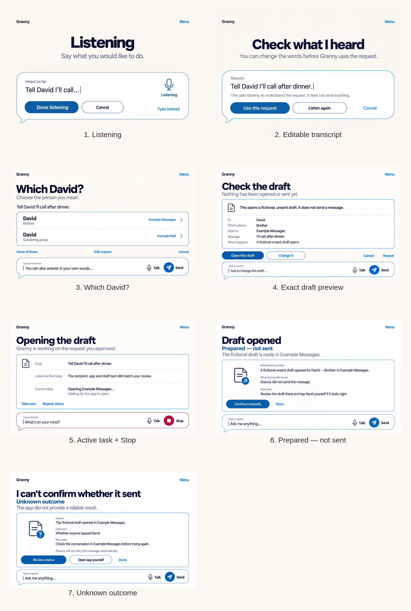
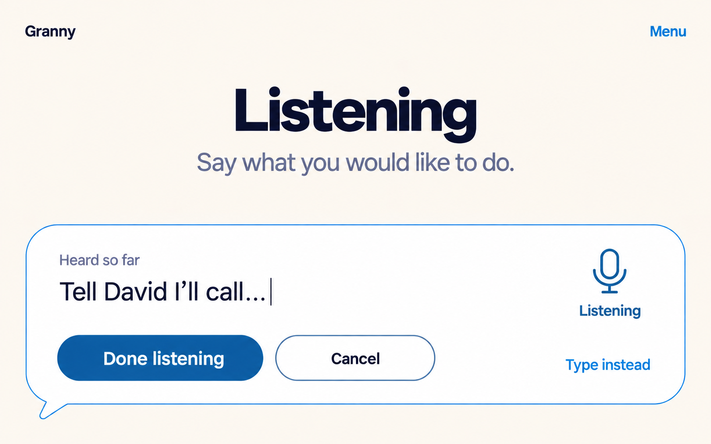
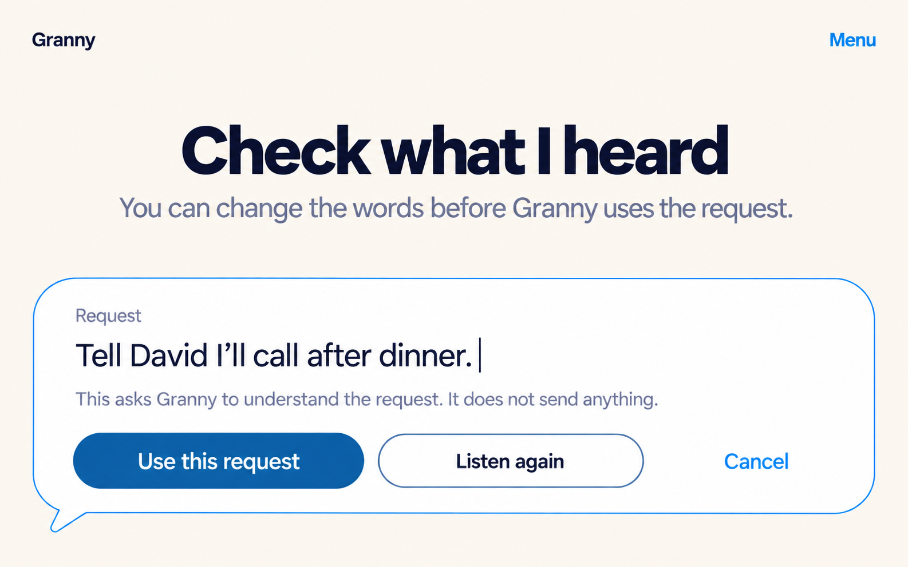
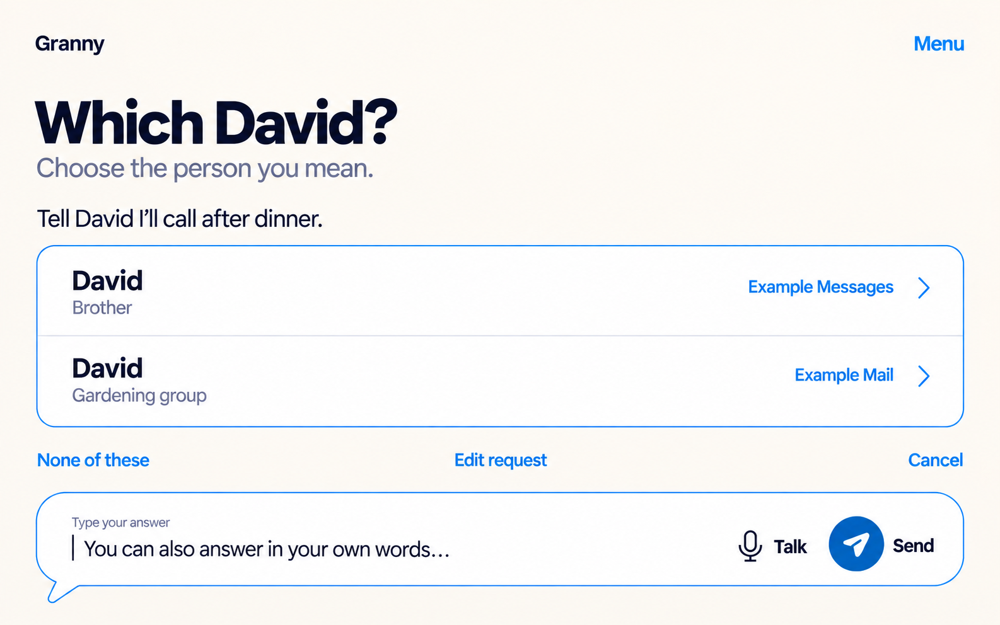
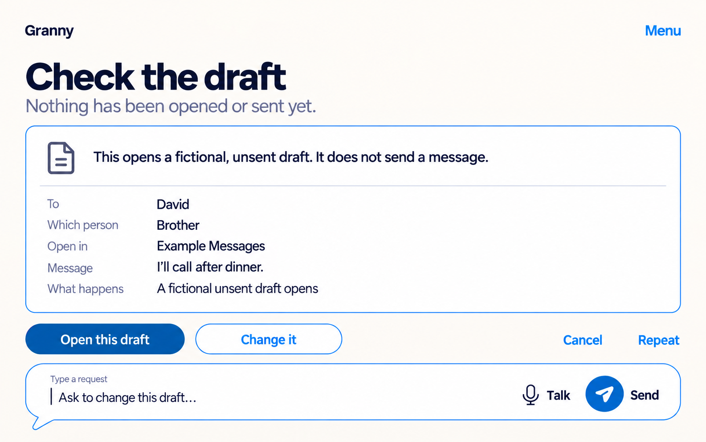
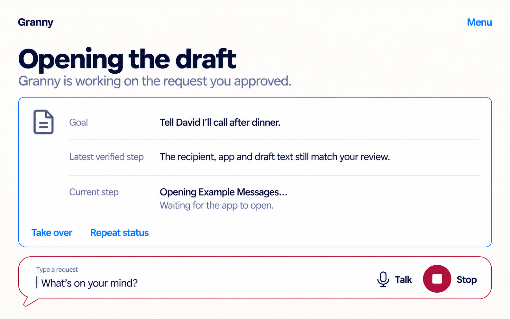
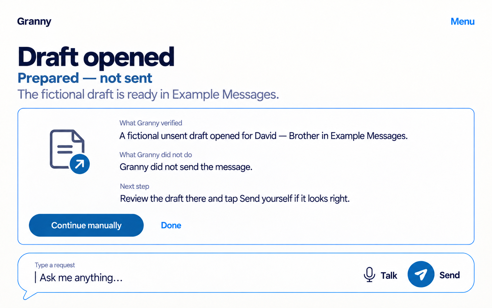
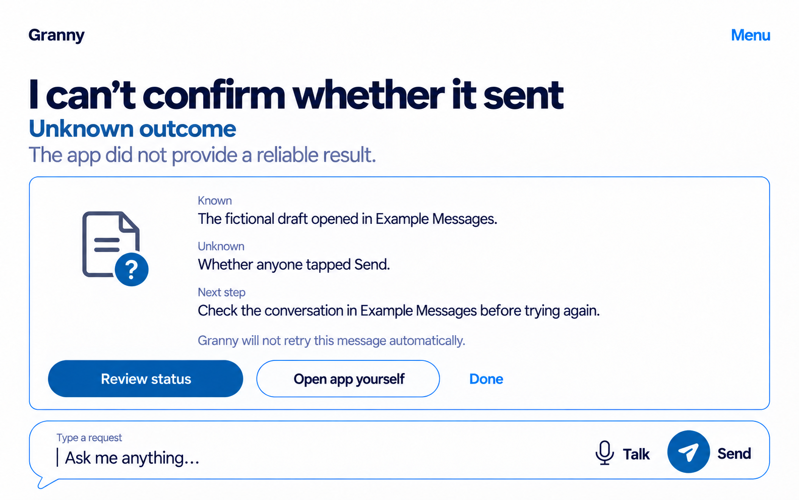

# Shared conversation state pack — iteration 1

This first shared-state pack extends the selected Harbour Blue Home into one
fictional message-draft example. Its thesis is: **conversation stays spacious;
structured surfaces appear only when safety or evidence earns them, while exact
consequences, visible Stop and unknown outcomes are never hidden.**

The pack is a state family, not a promise that every run follows all seven
screens. “Prepared — not sent” and “Unknown outcome” are alternative result
branches. Nothing here sends a real message, identifies a real contact or
proves a production workflow.

> [!important] These are state studies, not seven page templates
> The accepted [state-surface contract](../../../shared-conversation-state-surfaces.md)
> keeps Home or the current Room underneath. Listening normally expands the
> bottom composer; clarification, preview, activity and results appear as one
> temporary surface above it. The raster isolates each state for review and
> does not require an implementation to replace the whole screen.

## Comparison

The review sheet adds labels outside the product screenshots and resamples the
individual images. Use the full-size sources below for visual inspection.

## Frames

### 1. Listening

- **Purpose:** make active listening and the provisional transcript explicit.
- **Entry / exit:** explicit Talk enters; Done listening advances to transcript
  review, Type instead returns to typing, and Cancel returns without using the
  words.
- **Contract:** SCR-004 and CMP-002. “Listening” is written as well as shown by
  the microphone; the live region must announce material transcript changes
  without reading every partial token.

### 2. Editable transcript

- **Purpose:** let the person correct recognition before Granny interprets it.
- **Entry / exit:** Done listening enters; Use this request advances, Listen
  again replaces the provisional input, and Cancel leaves it unused.
- **Contract:** SCR-004, CMP-002 and CMP-007. The request is an editable field,
  not decorative transcript text; disclosure stays adjacent to the action.

### 3. Which David?

- **Purpose:** ask only for the missing recipient distinction while preserving
  the original request.
- **Entry / exit:** an ambiguous recipient enters; either broad row selects a
  fictional contact, None of these keeps clarification open, Edit request goes
  back, and Cancel abandons the request.
- **Contract:** SCR-006 and CMP-005. Each row exposes name, relationship and
  fictional source as one semantic target; the answer composer remains an
  alternative to touch selection.

### 4. Exact draft preview

- **Purpose:** show the exact object and consequence before opening anything.
- **Entry / exit:** resolved intent enters; Open this draft grants the bounded
  next step, Change it returns to editing, Cancel declines, and Repeat reads or
  restates the review.
- **Contract:** SCR-007 and CMP-003. Recipient, relationship, destination,
  message and “fictional unsent draft” consequence remain structured text, not
  an illustration. The private region should be treated as sensitive in real
  implementation.

### 5. Active task + Stop

- **Purpose:** keep goal, evidence and current activity inspectable while work
  is in progress.
- **Entry / exit:** approved Open this draft enters; Take over hands control
  back, Stop requests cancellation, and a verified result or honest uncertainty
  exits to a result branch.
- **Contract:** SCR-005, CMP-001 and CMP-004. Stop occupies the Send position and
  uses the reserved danger treatment; no percentage or unverified progress is
  invented. “Waiting for the app to open” is status, not success.

### 6. Prepared — not sent

- **Purpose:** distinguish a verified preparation result from sending.
- **Entry / exit:** independent evidence that the draft opened enters;
  Continue manually hands off to the fictional app and Done returns to Home.
- **Contract:** SCR-008 and CMP-006. The surface separates what Granny verified,
  what it did not do and the next human step.

### 7. Unknown outcome

- **Purpose:** make uncertainty actionable without converting it into success,
  failure or an unsafe retry.
- **Entry / exit:** missing or conflicting result evidence enters; Review status
  revisits available evidence, Open app yourself hands over, and Done returns
  without retrying.
- **Contract:** SCR-008 and CMP-006. Known, unknown and next step are written;
  the absence of a Retry action is deliberate.

## Shared visual and interaction rules

- The reference is the selected [Harbour Blue board](../../2026-09-19-style-boards/final-harbour-blue/README.md):
  Canvas `#FBF6EE`, Surface `#FFFFFF`, Ink `#2E2D32`, Accent `#2C5981`,
  Outline `#597DA0`, Send `#165D9C`, focus-only `#4930A1`, Stop/danger
  `#962F43`, and On-colour `#FFFFFF`.
- “Granny” and written Menu remain quiet top anchors. The Round conversation
  composer remains the bottom anchor; during active work, Stop deliberately
  replaces Send without moving Talk.
- Display intent is Bricolage Grotesque 600; body and controls are DM Sans
  400/600. The generator approximated these faces and does not prove exact font
  fidelity.
- Blue outlines organize ordinary information. Red appears only for active
  Stop. A separated purple focus ring needs unclipped space in implementation
  but is not painted permanently into idle screenshots.
- Every image has a simple top-to-bottom reading order. At narrow widths or
  200% text, headings, disclosure, structured rows, actions and composer must
  stack in that order instead of shrinking or horizontally clipping text.
- Actions need implementation targets of at least 56dp equivalents; Stop and
  primary actions must be capable of at least 64dp equivalents. Raster pixels
  are not dp evidence.

## Deliberate omissions

There are no Rooms, suggestions, prompt chips, bottom tabs, notifications,
progress percentages, automatic Retry, success confetti, fake memories or
extra app controls. The fixture uses fictional David entries and fictional
Example Messages / Example Mail labels. No external app is really opened and
no message is sent.

## Generation and fidelity record

The built-in image-generation tool created one raster per frame. No composite
generation call, API-key workflow or manual paint-over was used. All seven
first outputs were retained; there were no rejected retries. The complete
generation text is preserved in [prompts.md](prompts.md), and machine-readable
file facts are in [manifest.json](manifest.json).

The generation calls used the selected
[Explicit Scroll Row Home](../../2026-09-19-harbour-blue-home/selected-explicit-scroll-row/README.md)
and [Harbour Blue board](../../2026-09-19-style-boards/final-harbour-blue/README.md)
as stable references. They also used the locally inspected in-progress
`docs/02-design/mockups/context-rooms/kitchen-vertical-slice/iteration-1/05-ask-granny-about-soup.png`
only as a spacious-conversation style reference; that primary-checkout file is
not a canonical dependency or part of this task branch.

Full-size review found no watermark, private data, clipped screenshot edge or
obvious text corruption. Each frame is approximately 1586 × 992 pixels; the
comparison is 1680 × 2496. They are composition references, not accepted
Android geometry.

These images do **not** prove exact color contrast, font files, dp/sp sizes,
TalkBack output/order, keyboard or switch operation, live-region behavior,
IME/inset handling, 200% reflow, combined 300% scaling, action cancellation,
outcome verification or older-adult comprehension. Those checks remain unrun.

## Review table

| Frame | First attention | Safety value | Main review risk |
|---|---|---|---|
| Listening | State and heard words | Makes capture explicit and cancellable | Partial transcript announcements could become noisy |
| Editable transcript | Correctable request | No action is implied by speech alone | Large text may push actions below the fold |
| Which David? | Missing distinction | Prevents recipient guessing | Two rows plus composer are the densest layout |
| Exact draft preview | Exact consequence | Makes destination and unsent status reviewable | Structured detail must remain scannable, not bureaucratic |
| Active task + Stop | Current activity | Stop remains visible and stable | Red composer outline may feel stronger than necessary |
| Prepared — not sent | Verified boundary | Avoids implying a send | Manual handoff wording needs comprehension testing |
| Unknown outcome | Honest uncertainty | Prevents automatic duplicate attempts | Three actions plus dense explanation need large-text proof |

**Review question:** Does the exact safety information stay clear without
overwhelming the calm conversation surface?
