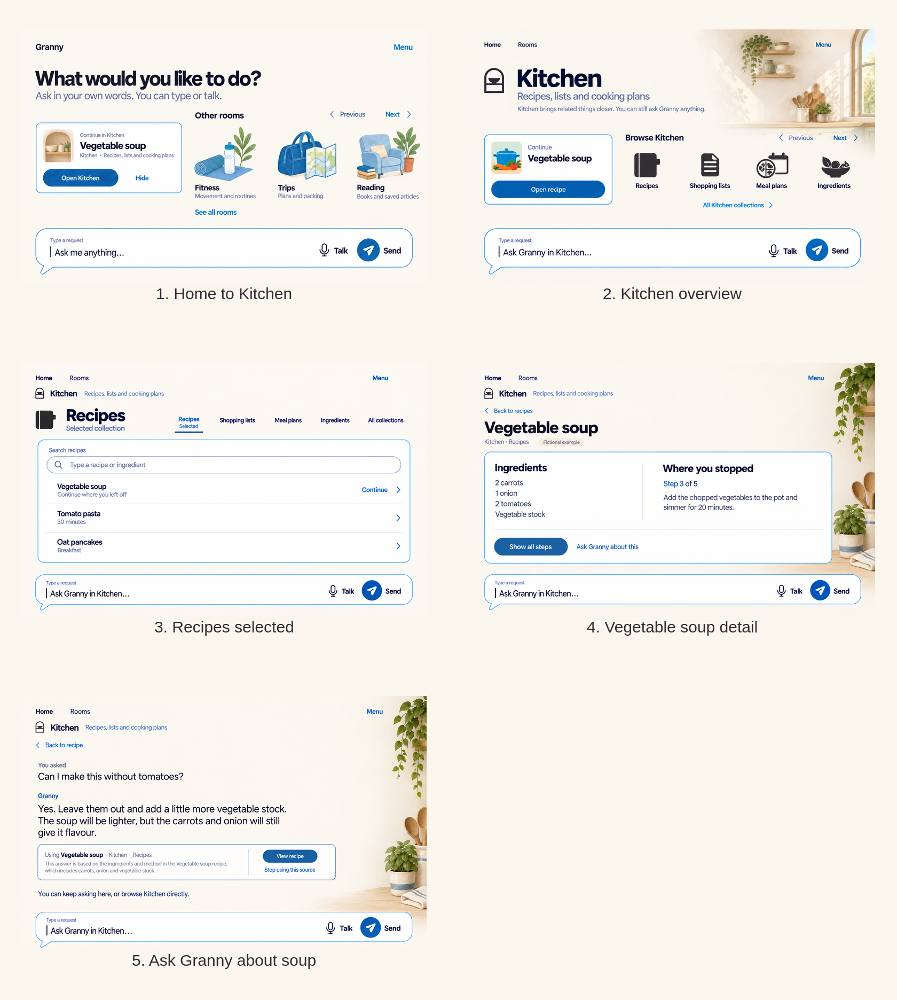
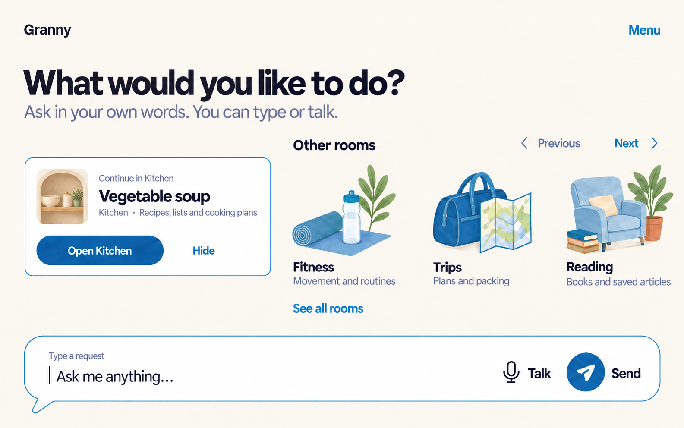
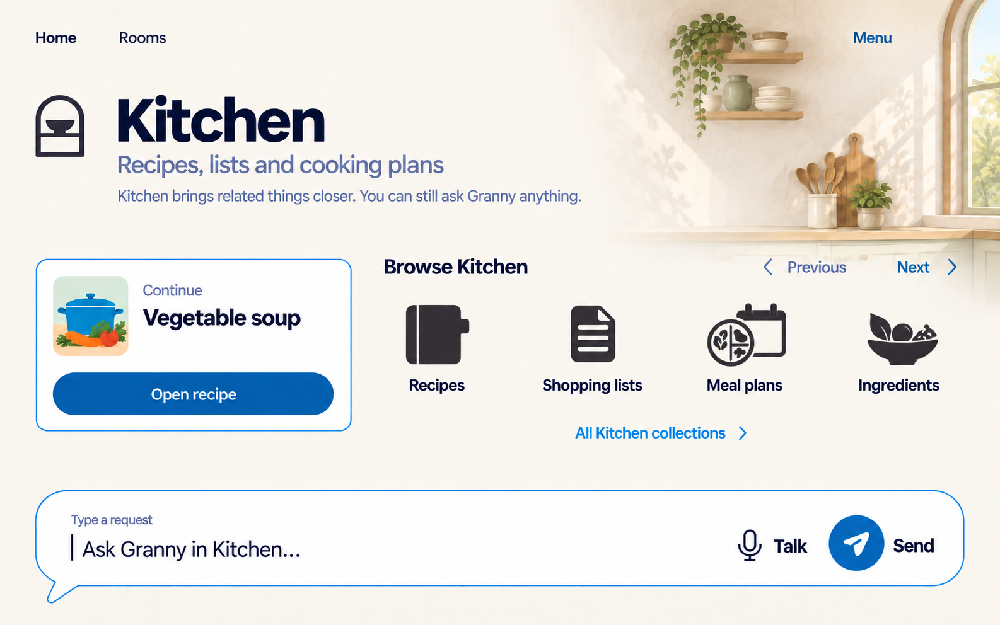
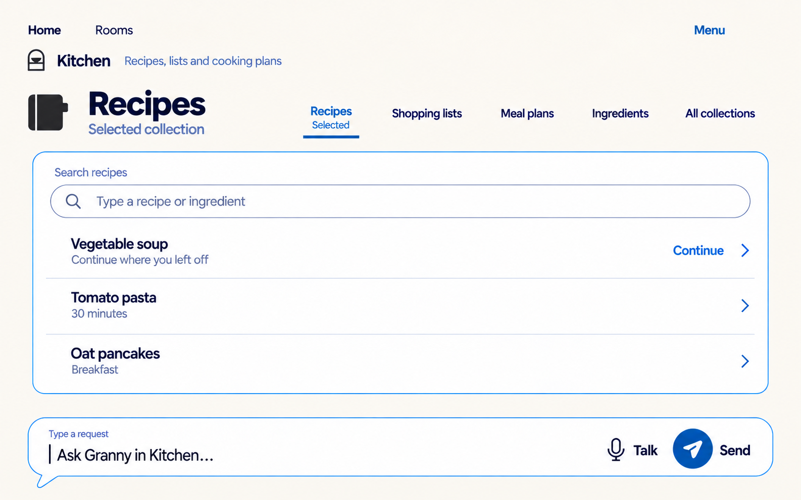
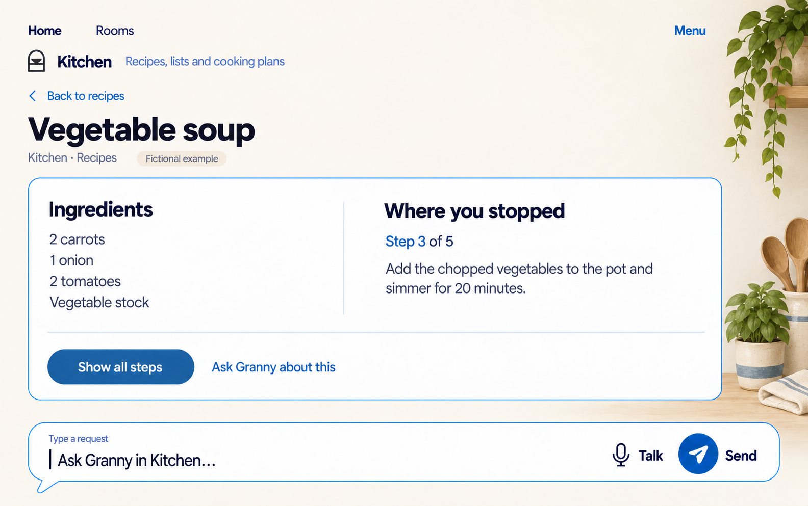
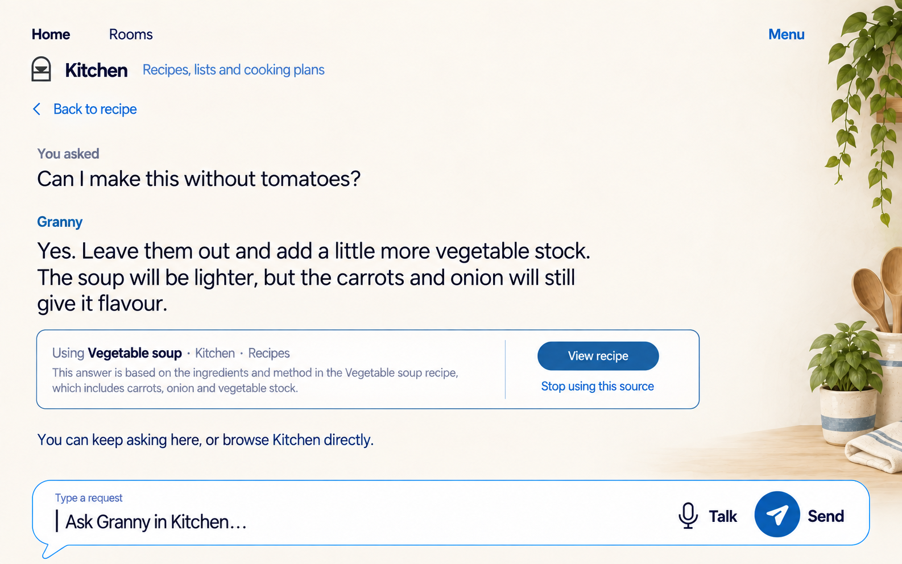

# Kitchen vertical slice — iteration 1

This proposed mockup round carries the selected explicit-scroll-row Home into
one complete fictional Kitchen path. It tests whether a room can feel
recognizable and useful without becoming a dashboard or a separate assistant:
Home continuation → Kitchen overview → Recipes → Vegetable soup → ask Granny
with the recipe disclosed as the active source.

## Structural thesis

Kitchen is an optional organization and atmosphere layer around the same
Granny conversation. Room art stays at the edge, direct browsing occupies one
calm reading surface, collection symbols are labelled navigation, and the
Round composer retains the same location and meaning throughout.

The first frame intentionally restates the selected Home handoff so the round
can be reviewed as a sequence. It does not reopen the selected Home direction.

## Frame sequence

### 1. Home to Kitchen

The compact rectangular continuation surface remains the one contextual panel.
Opening it is optional; Home still accepts any ordinary request.

### 2. Kitchen overview

The first room view makes identity, purpose and escape routes explicit. The
illustrated atmosphere is confined to an edge zone. Four high-value collection
targets appear directly on Linen rather than as separate tiles; the written
`All Kitchen collections` route covers the complete eight-symbol set.

### 3. Recipes selected

`Recipes` is identified as the selected collection in words and with a visual
indicator. Search and the three fictional recipe rows work as direct browse
controls without requiring conversation or a model result.

### 4. Vegetable soup detail

One broad reading surface holds ingredients and the point where the fictional
fixture stopped. The layout uses typography and whitespace rather than a stack
of cards. `Ask Granny about this` carries the current reference into the same
conversation shell.

### 5. Ask Granny about soup

The response stays conversational while a restrained source cue explains that
the fictional Vegetable soup recipe influenced the answer. `View recipe` and
`Stop using this source` make the relationship inspectable and reversible.

## Why the symbols exist

Collection symbols are direct-browse navigation, not decorative badges or
status indicators. In implementation, every symbol must remain paired with a
persistent written label, form one broad semantic target, expose a selected
state in words, support keyboard and assistive navigation, and open or filter
the matching local collection. Color or artwork alone never carries meaning.

This round shows four symbols on the overview to preserve space. The approved
Kitchen pack still contains all eight: Recipes, Shopping lists, Meal plans,
Favorites, Recently used, Appliance notes, Ingredients and Unfiled.

## Deliberate omissions

- No room personality, avatar or second assistant.
- No room grid, bottom navigation, sidebar or permanent dashboard widgets.
- No recipe photography, nutrition scores, timers, completion marks or real
  personal content.
- No archive/delete, cross-room retrieval, creation flow, errors or active Stop;
  those require their own state review.
- No Garden, Reading, Fitness, Trips or Projects interiors in this round.

## Review table

| Frame | Primary job | Entry | Exit / next | Main sacrifice or risk |
|---|---|---|---|---|
| Home to Kitchen | Resume one useful item | Home load | Open Kitchen, Hide, another room or composer | The continuation still competes with the room row for attention |
| Kitchen overview | Understand the room and choose browse or conversation | Open Kitchen | Continue recipe, collection, Home/Rooms or composer | Four visible collections require `All Kitchen collections` for the remainder |
| Recipes selected | Find a recipe without chat | Recipes symbol | Recipe row, another collection or composer | A wide reading surface uses substantial vertical space |
| Vegetable soup detail | Read the fictional recipe context | Vegetable soup row | Show steps, ask Granny or back to Recipes | Two-column content must stack at large text/narrow width |
| Ask Granny about soup | Understand room-aware assistance and its source | Ask Granny about this | View recipe, stop using source, continue asking or browse | Source explanation adds visible density to the conversation |

## Fidelity and accessibility limits

The five product frames were generated with the built-in image-generation tool
at approximately 1586 × 992 pixels; the comparison is a derived review sheet.
Exact Bricolage Grotesque and DM Sans font files were not supplied to the image
tool, so typography is an honest visual approximation. The generated first
Home frame is a close restatement, not a pixel-identical copy of the accepted
source. Frame 5 added one useful explanatory source sentence beyond the
requested verbatim set; implementation copy remains subject to review.

The raster shows intended hierarchy, written navigation, generous targets and
space for a separated focus ring. It does not prove Android dp/sp geometry,
contrast, TalkBack order, keyboard behavior, touch scrolling, 200% reflow,
reduced motion, model-disabled browsing or older-adult comprehension. At narrow
width or large text: art disappears first, collection controls become a simple
vertical sequence, the recipe columns stack, and the composer enters normal
document flow before controls shrink.

Two rejected generations are preserved in `rejected/`: a Kitchen overview with
generic symbols and a denser Recipes view with food thumbnails. They are not
selected references.

See [exact prompts and corrections](prompts.md) and the machine-readable
[manifest](manifest.json).

## Review question

Does this feel like stepping into a useful Kitchen while clearly remaining the
same Granny interface, or should iteration 2 reduce either the room atmosphere
or the direct-browse surface before the structure is extended to other rooms?
