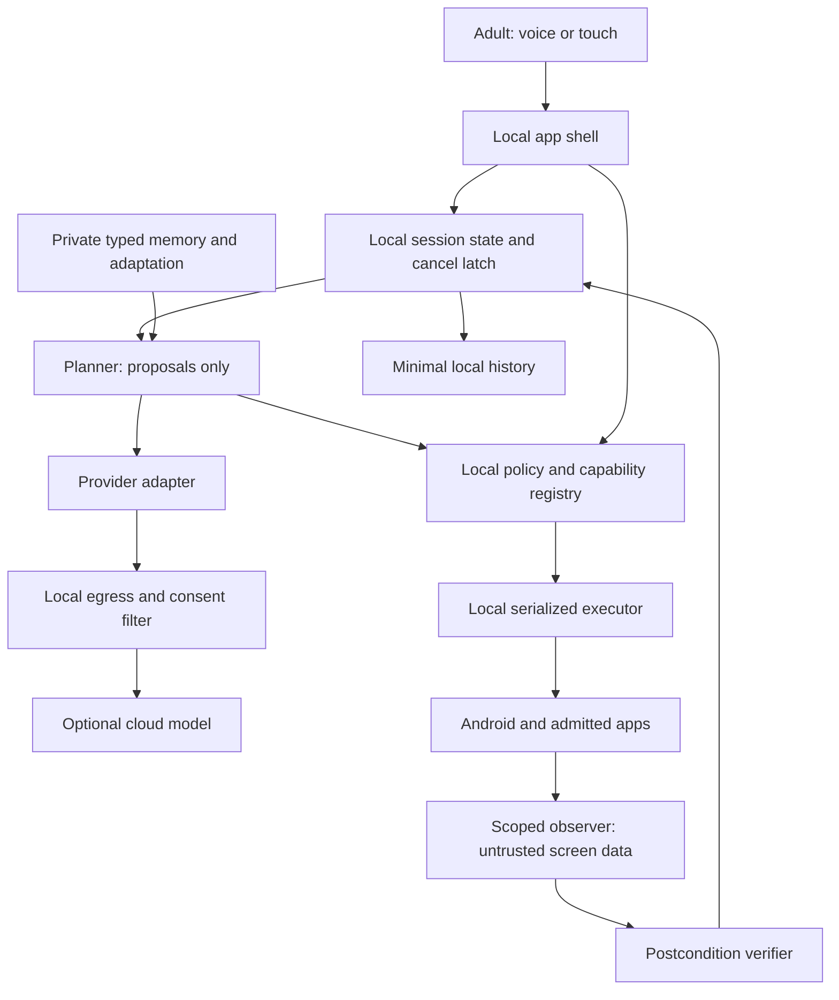

# Stage 1 architecture

Proposed component contracts for the stock-Android app. [ADR-0001/0005/0007](../09-decisions/README.md) constrain platform/control; [ADR-0009](../09-decisions/ADR-0009-mvp-and-control-posture.md) accepts experiment/control scope. [ADR-0010](../09-decisions/ADR-0010-local-authority-and-data.md) and [ADR-0011](../09-decisions/ADR-0011-explicit-activation-and-access.md) still propose local authority/data and explicit voice/access. No framework, database, model vendor, backend topology or public distribution is selected. [Execution protocol](../03-agent/execution-protocol.md) owns transaction/event ordering; [capability admission](capability-admission.md) owns registry/build/support lifecycle.

## Trust and process map

Diagram arrows show logical request/data relationships; actual outbound payloads pass privacy filter before provider transport. No provider directly reaches OS/executor. Helper is V1 optional remote principal restricted to proposals; it cannot reach private memory, history or observer.

## Component contracts

Each anchor is a stable architecture owner referenced from [traceability](../01-product/traceability.md). Same-package MVP processes may share code/storage, but planner cannot hold executor/permit keys or bypass privacy interfaces. A separate Android process may isolate service failure after measurement; process count is replaceable implementation choice, not authorization.

### Android shell/UI

**Responsibility / state / APIs:** Screen stack, focus, preferences rendering; validate/version typed ComponentPlan against the semantic registry; UserIntent/LocalControl events.
**Placement/trust:** Local app activity; trusted renderer of local state.
**Permissions/data:** Own UI, no special grant; private preview only.
**Offline/failure isolation:** Offline Home/settings/help; crash loses rendering, executor must stop on visibility loss.
**Dependencies:** session, voice, audit.

### Voice input/output

**Responsibility / state / APIs:** Capture session state, transcript events, stop/output controls.
**Placement/trust:** Local capture/TTS wrapper; provider optional, output untrusted.
**Permissions/data:** Runtime microphone; audio focus; ephemeral audio/text.
**Offline/failure isolation:** No provider/permission → typed path; no ambient background promise.
**Dependencies:** shell, privacy, provider.

### Session coordinator

**Responsibility / state / APIs:** Single task state machine, intent/plan versions, user epoch, cancellation priority.
**Placement/trust:** Local authoritative state; serialized events.
**Permissions/data:** No new Android privilege; private task refs.
**Offline/failure isolation:** Offline local controls; restart terminal/unknown, never resume commit.
**Dependencies:** all local components.

### Screen observer

**Responsibility / state / APIs:** Scoped Observation/ElementRef; completeness/provenance.
**Placement/trust:** Local service/API wrapper; third-party data untrusted.
**Permissions/data:** User accessibility/capture/URI grant by route; protected views denied.
**Offline/failure isolation:** No grant/tree → unavailable; revoke drops snapshots.
**Dependencies:** permissions, privacy, executor.

### Action executor/device-control boundary

**Responsibility / state / APIs:** Serialized dispatch, action journal, cancel latch, admitted adapters.
**Placement/trust:** Local least-authority boundary; service system-bound where needed.
**Permissions/data:** Only declared route grants; no device-owner/root.
**Offline/failure isolation:** Fails closed on lost service/visibility/epoch; reconciles in-flight.
**Dependencies:** policy, registry, observer, verifier.

### Intent/entity/planner

**Responsibility / state / APIs:** Intent and TaskPlan proposals; no authority.
**Placement/trust:** Local orchestration + replaceable local/cloud model.
**Permissions/data:** Redacted scoped context only.
**Offline/failure isolation:** Provider fail → guidance/local surface; no direct tool access.
**Dependencies:** provider, memory, session.

### Policy/authorization

**Responsibility / state / APIs:** Action classification, permit issuance/consumption, consent rules.
**Placement/trust:** Local independent trusted code; no model override.
**Permissions/data:** Private scope/consent refs and transient permits.
**Offline/failure isolation:** Available offline; failure denies execution.
**Dependencies:** permissions, registry, executor, shell.

### Permission/visibility monitor

**Responsibility / state / APIs:** Actual OS grants, screen lock/visibility and service health events.
**Placement/trust:** Local OS-facing trusted adapter.
**Permissions/data:** Read own permission/state; no self-enablement.
**Offline/failure isolation:** Revocation increments epoch before action; no cached-grant trust.
**Dependencies:** observer, executor, policy.

### Capability registry

**Responsibility / state / APIs:** Build mode, package/recipe/API versions, predicates and side-effect declarations.
**Placement/trust:** Local bundled versioned manifest; no remote arbitrary code.
**Permissions/data:** Package queries minimum-scope; no installed-app scrape.
**Offline/failure isolation:** Unknown version disables affected route; safe local kill switch.
**Dependencies:** policy, executor, provider.

### Outcome verifier

**Responsibility / state / APIs:** Fresh postcondition predicates → Evidence grade.
**Placement/trust:** Local deterministic checks + trusted integration receipts; model interpretation qualified.
**Permissions/data:** Same observation scopes; no extra hidden capture.
**Offline/failure isolation:** Unknown when receipt/state absent; never assumes action callback proves outcome.
**Dependencies:** observer, executor, audit.

### Memory repository

**Responsibility / state / APIs:** Versioned item revisions, automatic-candidate admission, adaptive-communication baseline/state, provenance, private retrieval and deletion.
**Placement/trust:** Local protected app storage MVP; no cloud sync.
**Permissions/data:** MVP user-entered aliases/preferences; V1 allowed direct-user important facts and bounded interaction preferences under ADR-0012.
**Offline/failure isolation:** Offline local rights; tombstone blocks use immediately.
**Dependencies:** privacy, planner, shell.

### Privacy/egress boundary

**Responsibility / state / APIs:** Sensitivity classification, redaction, scopes, retention/erase jobs.
**Placement/trust:** Local trusted filter before all provider/export paths.
**Permissions/data:** Audio/tree/screenshot/transcript sensitivity; no credentials.
**Offline/failure isolation:** No consent → no cloud; deletion local even offline.
**Dependencies:** observer, voice, provider, memory, audit.

### Provider adapter/router

**Responsibility / state / APIs:** Normalized proposal/transcription responses; transport timeouts/costs.
**Placement/trust:** Local facade; optional remote service untrusted for authority.
**Permissions/data:** No permits/nodes/secrets in input; credentials infrastructure-owned.
**Offline/failure isolation:** Recorded/fake adapter for tests; real outage cannot stop local cancellation.
**Dependencies:** privacy, planner, voice.

### Audit/diagnostics/evals

**Responsibility / state / APIs:** Content-free journal/event schema, result history, export preview.
**Placement/trust:** Local bounded store; optional explicit support export.
**Permissions/data:** Codes/times/versions, not private text or device identifiers.
**Offline/failure isolation:** Offline summary/export; corrupt journal cannot imply success.
**Dependencies:** executor, verifier, shell, privacy.

### Backend/identity/sync/update

**Responsibility / state / APIs:** Only required selected provider transport/integration; V1 helper identity/grants.
**Placement/trust:** Remote boundary; MVP no general family/backend platform.
**Permissions/data:** Service tokens outside model; no default transcript storage.
**Offline/failure isolation:** Offline no queued consequence; account recovery owning provider.
**Dependencies:** provider, privacy; V1 helper.

### Optional helper proposals

**Responsibility / state / APIs:** V1 invite/scope/proposal diff/revoke; no remote screen/control.
**Placement/trust:** Separate authenticated principal; adult local grant authority.
**Permissions/data:** Only chosen contacts/accessibility configuration.
**Offline/failure isolation:** Offline new grants blocked; local revocation immediate; pending proposals rejected.
**Dependencies:** backend, policy, shell, memory.

## Local browser runtime experiment — 2026-09-15

Simon authorized one actual local backend/MCP slice with synthetic contacts and an isolated unsent draft store. [Conversation runtime contract](conversation-runtime-contract.md) owns the browser API, backend authority and event boundaries; [source and startup](../../prototypes/conversation-runtime/README.md) implement them. It is separate from production Android and T-103. MCP is a protocol boundary, not permission; only fixed contact resolution, draft creation and readback tools exist. Model/provider choice is replaceable. No helper/sync/account platform is introduced.

## Major sequences

**Voice → result:** local user activation/grant → ephemeral audio → consent/redaction → speech adapter → editable transcript → Intent revision → admitted planner/API/fixed recipe → policy → local executor → fresh postcondition → state/result. Speech/microphone failure stops capture and offers touch; no broad background service prerequisite.

**Screen → navigation:** explicit scope → semantic snapshot with source/version/window/epoch → reject protected/unknown surface → fixed predicate target resolution → admitted operation → reobserve → result. Returning from external app may lose observed screen; preserve scoped reference only while valid or ask for selected screenshot. Source content never becomes instructions. General dynamic accessibility planning remains isolated lab-only.

**Consequence:** local PreparedAction contains exact recipient/body/channel/effect → trusted preview → fresh local permit → synchronized pre-dispatch check/journal/consume → one admitted effect → receipt/semantic postcondition → sent/opened/unknown language. Model cannot issue permits; backend success cannot silently override local cancellation.

**Stop / takeover:** UI/OS interruption event advances cancel/user epoch and invalidates queued work/permits; executor refuses new dispatch; voice/observer stop collection; current external effect is reconciled if allowed; user sees stopped/partial/unknown. Service death/watchdog/restart does not continue work. This requires physical route tests before claiming universal takeover.

**Recovery:** classify failure → bounded re-observe/clarify/manual path using remaining budget → verified target or terminal failure. No substitute provider/control path may bypass policy or reset budget. Unknown external effect quarantines retries.

**Memory:** explicit user save → local repository with provenance/revision → selected scoped read; correction/delete → retrieval blocked immediately, derivatives removed, referencing plans invalidated → read-back receipt. Sync is excluded MVP; V1 tombstone/backup behavior from privacy policy precedes any synchronization.

**Helper:** no MVP remote endpoint. V1 invitation → authenticated helper identity + adult local scope → helper submits proposal → user reviews diff → local policy applies explicit change → minimal audit. Revoke denies locally first, syncs revocation status later; no screen/audio/task stream.

**Outage:** provider/network lost → no new cloud request, no send queue; local Home/settings/privacy/history/Stop remain. Read-only cached data names source/time. Explicit Resume after dependency repair requires new observation and permits. If an earlier effect is unknown, reconcile before another attempt.

## Local/cloud options and recommendation

| Option | Benefit | Cost/risk | Proposed posture |
|---|---|---|---|
| Fully local model/speech | Less egress, offline potential | Reference compute, language quality and latency unmeasured | Benchmark; no claim it works on supplied tablet |
| Cloud planner/speech with local authority/data | Replaceable stronger models, small client | Network/retention/cost and sensitive screen exposure | Conditional prototype option with synthetic data; real data requires reviewed provider consent/terms |
| Cloud-centric executor/history/memory | Central operation and sync | Stop/authority depends on network; broad personal archive | Reject for MVP safety boundary |
| No model / recorded planner | Deterministic contracts and replay, no provider/privacy dependency | Does not test natural-language intelligence | First implementation slice recommended |

Local authority, privacy filter and minimum local data are consequential recommendations, not selected infrastructure. Backend is introduced only for a specific approved provider/integration need; no generic identity/sync platform in first slice. Model adapter version and provider costs are recorded without private request bodies.

## Deployment/update and test boundary

Modes: ContractReplay (no external effects/network), SyntheticDeviceLab (explicit allowlisted synthetic accounts, dynamic path isolated), CandidateRelease (API/manual plus only approved fixed recipes). Registry admission is compile/build and runtime enforced; model text cannot change modes. No downloaded arbitrary scripts or unrestricted remote feature activation.

Before pilot: signed build provenance, private key handling outside Git, supported app/version matrix, controlled capability disable, regression/rollback and user-visible version/support. Update must invalidate permits and restart no task. OS/root/device-owner/custom dock remain excluded. Actual min/target SDK and service/permission manifest are outputs of T-101 feasibility; current API 34 test floor is proposed only.
