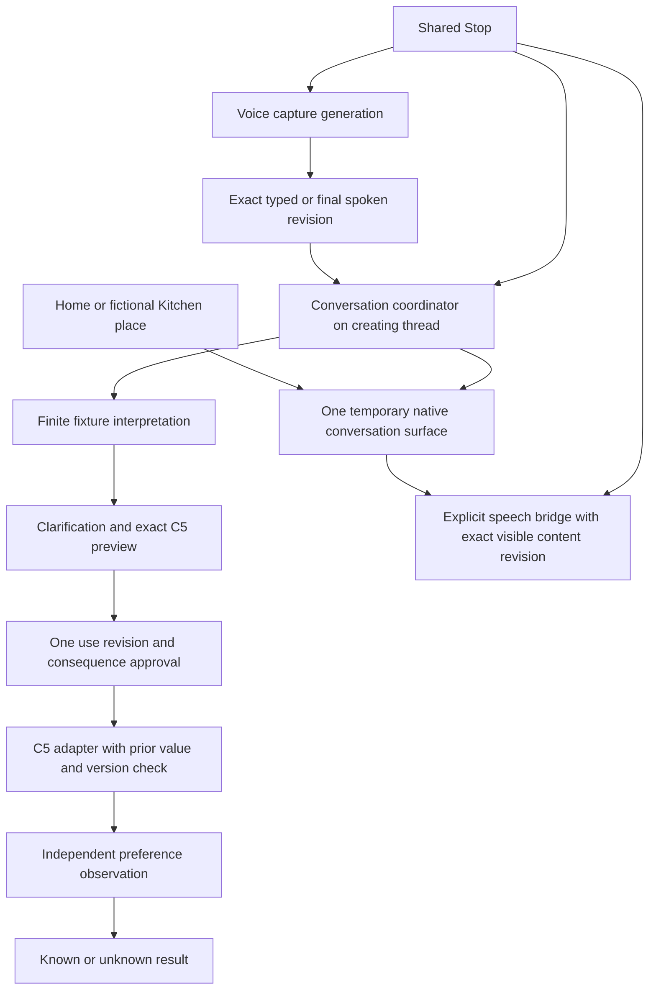

# Native typed, voice and speech integration

## Scope and authority

Simon explicitly invoked the native tablet integration metaprompt from peer
`feature/t120-native-voice` commit `9340e786ea209be3e4ca26fbc60cce7f1cc15078`
and requested voice, typed requests and the ongoing text-to-speech work to
converge in `android/stage1`. All physical tablet testing is explicitly on hold.
No new shell, framework, dependency, provider, network, personal data or
external-app actuation is authorized. C2 remains isolated and unavailable.

Baseline is current `origin/main` at
`5214d351bf5950781181f0f0ef5955679e352c2d`, containing the selected voice source
commit and C5 text-size controls. The primary checkout's local notes/assets
remain untouched. The voice peer branch is inspected read-only; its unrelated
browser changes are not Android dependencies.

## File ownership and source map

- Root, `feature/native-conversation-integration`: Activity, rendering/resources,
  voice-to-conversation and speech integration, scoped documentation and final
  integration/builds. Existing `android/stage1` is the single product shell.
- Terra, separate `feature/native-conversation-core`: only new `conversation/`
  types, coordinator, closed capability/interpretation contracts and host tests.
- Sol: read-only independent readiness, lifecycle, privacy and evidence review.
- Peer `feature/t121-spoken-readback`: owns `speech/` adapter, controller,
  rate preferences and tests in its own worktree. Its in-progress Activity,
  resources, manifest and documentation will be reviewed at a committed
  checkpoint and reconciled by root only in this integration worktree.
  No peer worktree/branch is mutated or uncommitted file copied as delivery.

The coordinator owns place, temporary surface, request revision/provenance,
operation generation, local authority and verified/unknown outcome. The voice
controller owns recognizer generation and capture state; the Activity bridges
accepted callbacks into the coordinator. TTS owns an independent output
lifecycle but participates in global Stop, input/output exclusion and revision
invalidation. The Activity owns actual View focus/scroll and restores only
valid origin anchors. C5 owns the private saved preference and independent
readback. The C2 observer remains a separate lab; no projection permission or
service enters the native shell.

## Readiness and evidence boundaries

T-120, PRD-FR-001/002, UC-013/J-007, shared conversation surfaces,
PRD-FR-011/PRD-PRV-002, UC-007/J-006 and CAP-11 own the bounded slice.
Only exact deterministic fixture interpretation is allowed; a proposal cannot
mint its approval or declare success. Partial speech never submits. Use this
request freezes exact visible words, not capability authority. Approval binds
revision/consequence once. Stop invalidates before cleanup; late callbacks
cannot revive authority. Unknown outcome never automatically retries.

No tablet testing, microphone/TTS engine use or gate admission occurs here.
Host tests, native build/lint/manifest/dependency inspection and documentation
checks will be recorded separately from unrun physical evidence.

## Handoff

The source slice is complete for review. No main merge or primary-vault sync
is claimed for this new mixed integration slice. Simon's integration metaprompt
requires separate mixed-code main/PR authority; physical testing remains on hold.

### Git and isolation

- Root worktree: `/home/lgtw/Work/granny-worktrees/native-conversation-integration`.
- Published target: `feature/native-conversation-integration` on verified
  `https://github.com/Pueblo98/Granny.git`; final SHA is the commit containing
  this handoff, verified against its remote branch at publication.
- Initial base: `5214d351bf5950781181f0f0ef5955679e352c2d`. Current main
  `497c4d1a5ca6981c5c7dceee7204d46505bf426f` integrated via `4c314d6`.
- T-120 voice source already existed in the base. Peer voice branch's unrelated
  browser work was not imported. T-121 remote checkpoint
  `c39ce9bfd422a47d92affbf2c32089c9fcc74715` was verified and cherry-picked
  as `d5786c9`; root reconciled the Activity rather than replacing the shared UI.
- Terra worked exclusively in the separate native-conversation-core worktree:
  core commits were reviewed/repaired by root, then test-only branches supplied
  `8bd0436` and `a241c36`. Root's independent store-oracle cases supplement them.
- Sol's final read-only source review passed `215e95e54ac794a920d51ea8fafa6e6c774b0a31`.
  Subsequent source change only removes obsolete resource labels/renames the
  debug launcher. Final executable validation includes that change.
- Exact tested Android source commit: `481b00141b96f152c76e147aaa0c60fb1f418048`.
- Primary vault remains on `497c4d1` with its pre-existing untracked `.claude/`,
  Context Rooms assets, three design session notes and two personal note files.
  This session did not read personal notes, copy into, back up, stash, reset,
  synchronize or otherwise mutate the primary checkout or either peer worktree.

### State and interface ownership



The closed registry exposes only `TEXT_SCALE` in synthetic/debug mode, with a
closed enum/Restore schema, no additional permission and a private preference
oracle. `CANDIDATE` has no enabled C5 dispatch. `SCREEN_EXPLANATION` is always
disabled in this app. There is no arbitrary intent, shell, accessibility,
projection, network or external-app execution port. Interpretation accepts only
three named fixture requests; it cannot mint a permit. Unknown outcomes never
retry automatically. C5 writes are synchronous main-thread operations: host
reentrant Stop tests prove ordering, not real device interruption latency.

Voice/TTS are explicit foreground platform adapters. Read aloud includes the
visible request and written task status/consequence; it never approves that
consequence. Repeat requires the exact visible text and its private monotonically
increasing content revision. Touch exploration suppresses app TTS; audio focus
is acquired immediately before speech and released on terminal paths. Loss
stops without resuming. [Android audio-focus guidance](https://developer.android.com/media/optimize/audio-focus)
informs this source choice; actual engine/focus/TalkBack behavior is unrun.

Only app-owned text scale and speech settings persist (private versioned
preferences, synchronous write plus readback, no backup/transfer). Transcript,
raw hypotheses, TTS text, approvals and previews stay in memory and are cleared
on background/recreation. Saved Activity state holds place, scroll and an
uncertain-operation flag only. IME no-learning/autofill hints are present;
they do not prove a third-party keyboard's behavior. No model, runtime library,
audio file, app network permission or logging sink was added. An installed
TTS engine's independent process/egress cannot be proved by this manifest.

### Reproducible checks and exact results

All commands used the existing toolchain; no installation or physical device
command occurred. Environment:

```text
JAVA_HOME=/tmp/granny-c2-toolchain/jdk
ANDROID_HOME=/tmp/granny-c2-toolchain/android-sdk
GRADLE_USER_HOME=/tmp/granny-c2-gradle-home
```

| Check | Result and boundary |
| --- | --- |
| `android/stage1/gradlew -p android/stage1 --offline --no-daemon :app:testDebugUnitTest :app:assembleDebug :app:lintDebug` | Pass: 110 tests, 13 suites, zero failures/errors/skips; debug APK assembled; lint zero errors, 14 warnings. |
| Lint warnings | 11 English fixture string/concatenation warnings; API 36 target and newer compile SDK notices; API-33 Back attribute with minSdk 31. No lint suppression/baseline added. |
| `:app:dependencies --configuration debugRuntimeClasspath` with the same wrapper/env | Pass: no runtime dependencies. |
| `experiments/c2-screen-explanation/gradlew -p experiments/c2-screen-explanation --offline --no-daemon :observer:testDebugUnitTest` | Pass: 49 tests, 10 suites, zero failures/errors/skips. No C2 code changed or device observation admitted. |
| API-36 `aapt2 dump permissions` | Only `android.permission.RECORD_AUDIO`; package `org.pueblo98.stage1`. |
| API-36 `apksigner verify --verbose` with JDK on PATH | Pass: one signer, APK v2 signature verifies; local debug artifact, not a release. |
| Manifest and source audit | Backup/transfer disabled, cleartext disabled; recognition/TTS service queries only; launcher Activity is sole exported component; no Internet/projection/accessibility service or app egress/log/file sink. |
| `python3 scripts/validate-docs.py` | Pass: zero errors; structural local evidence only. |
| `python3 -m unittest discover -s scripts -p 'test_*.py'` | Pass: 47 tooling cases. The fixture deliberately prints `fatal: Needed a single revision`; suite exit is zero. |
| `python3 scripts/cockpit.py --write` and `--check` | Pass: generated snapshot fresh. |
| `python3 scripts/check_handoff.py --base origin/main --head HEAD` | Pass at committed publication checkpoint. |
| `git diff --check` | Pass. |
| Sol read-only source review | Pass after audio-focus, availability, exact Repeat and callback-ownership fixes. |

Debug APK: `android/stage1/app/build/outputs/apk/debug/app-debug.apk`.
SHA-256: `ec0b389a45e202f4243f0257de7c660cebaa974cff1a51a6dc272b7bbf4132ae`.
APK is a local ignored build output, not an uploaded binary or authorized install.
Earlier checks exposed an obsolete known-result wording assertion and legacy
Back lint failure; both were repaired before the final full pass. No unresolved
executable failure is hidden by the result above.

### Deferred synthetic tablet script — do not run yet

Physical actions, instrumentation, microphone/engine runtime, disk/restart,
layout, TalkBack, focus latency, permission dialogs, selected-package identity,
and retention/egress evidence are **unrun**. Simon explicitly postponed them.
The following is preparation only; any later run needs a new exact artifact,
setup/teardown and authorization request before installation or permission changes.
Use only fictional text in this app; no personal app, account, message or photo.
Stop the run if the app/tablet becomes unresponsive, unexpected capture/output
continues after Stop, or any unintended external action/data access appears.

1. Open the authorized artifact on Home. Tap Type, enter `make text larger`,
   then Use this request. Expect clarification, no changed setting yet.
2. Choose Larger. Read the exact prior/target preview. Tap Cancel: expect no
   setting change and return to the same Home/fictional Kitchen origin.
3. Repeat and tap Apply this text size once. Expect independently verified
   local preference status; inspect actual text separately. Tap Restore previous
   size, inspect its preview, then Apply. Expect the original size.
4. Type an unsupported fictional request. Expect editable clarification and no
   dispatched capability; screen explanation remains unavailable.
5. Use Talk under a separately granted microphone case. Partial words must not
   submit. Tap Done listening, edit the final words, and use the same path as
   case 1. Denial/unavailability/timeout must retain Type.
6. On a written preview, tap Read aloud; then Stop speaking. Expect written text
   to remain. Tap Repeat only before editing. Edit the request and verify old
   readback is unavailable. No automatic speech on a result or permission grant.
7. Tap Speech speed, Preview Slower, wait for completion, then Apply previewed
   speed. Repeat each closed rate; test Restore. Interrupt a preview with Stop:
   Apply must remain disabled until a fresh completed preview.
8. While speaking, tap Talk or Type. While capturing, output controls must be
   unavailable. Shared Stop ends the active operation without approving/retrying.
9. Under separately authorized setup, enable TalkBack/touch exploration. App
   Read/Preview must be unavailable with written explanation; inspect screen
   reader/keyboard focus, 200%/300% text and pinned Stop reachability.
10. Under separately authorized audio setup, interrupt focus during start and
    speech. Expect Stop and no automatic resume; verify actual sound separately.
11. Exercise rotation, background, lock and task removal only as authorized.
    Expect no transcript/permit restoration, no resumed capture/speech and an
    honest unknown state after a possibly entered operation.
12. Report only case ID, pass/fail/unknown, exact APK/device/OS/engine metadata,
    observed control/outcome and content-free timing. No audio, screen share or
    personal transcript. Use the separately approved teardown, not ad hoc settings.

Rollback: revert the scoped integration commits through a reviewed branch,
retaining written input if an audio route fails evidence. Do not wholesale
revert merged concurrent design commits. Local text/speech Restore remains an
explicit app control; cancelling speech never changes a preference automatically.

### Post-review closure — 2026-09-20

The combined source and continuity repair reached `main` through the native PR
sequence ending in PR #42. Simon later completed a bounded follow-up walkthrough;
the [recorded smoke feedback](../../08-research/2026-09-20-native-tablet-followup-feedback.md)
is positive for the repaired interaction and requested access paths, while
spoken naturalness remains unsatisfactory. Missing case-level configuration,
repetitions and timings prevent a complete device-matrix claim. T-101 remains in
progress, C2 remains unadmitted, GATE-03/04/06 remain open and T-104 remains
blocked by route evidence.
