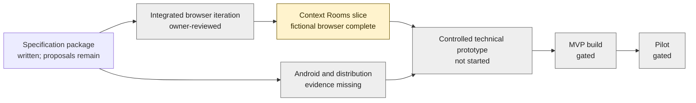

# Development cockpit

> [!important] Iteration-1 owner review — 2026-09-20
> The integrated browser frontend is on `main` through PR #44. Simon completed a walkthrough and reported the iteration cohesive and good for now, including the Home/Rooms scrolling refinement; no frontend revision is queued. His follow-up tablet report is positive for the repaired interaction and requested access checks, while spoken readback remains only slightly improved and below the desired naturalness. These are owner-review/smoke observations, not representative-user evidence or a gate pass.

> [!important] Context Rooms direction — 2026-09-19
> Simon accepted [Context Rooms](02-design/context-rooms.md) as optional recognizable spaces around one global assistant and selected [Explicit Scroll Row](02-design/mockups/2026-09-19-harbour-blue-home/selected-explicit-scroll-row/README.md) as the Home composition. Home stays universal and conversation-first; the selected row adds open portraits, written Previous/Next and direct See all rooms under [ADR-0016](09-decisions/ADR-0016-explicit-home-room-row.md). [T-119](10-execution/backlog.md#t-119)'s fictional browser iteration is integrated and owner-reviewed; proposed App V1 production placement, persistence and evidence remain gated.

> [!important] Latest review — 2026-09-17
> Simon selected the [Round conversation bubble](02-design/brand-and-visual-identity.md#accepted-shape-direction--round-conversation) for future composers, including compact/normal/expanded use and favicon exploration. The old browser composition remains rejected. Home/interface choices are now recorded in ADR-0013/0016; runtime checks remain synthetic evidence, not Android readiness.

> [!important] Stage 1 · Android tablet app
> This is **Simon's development workspace**, not Granny's customer interface. Stage 2 OS and Stage 3 hardware are dormant.
> **Start here:** [current priority](10-execution/current-milestone.md) → [decisions needed](10-execution/open-questions.md) → [review queue](10-execution/agent-board.md).

[Visual cockpit](Development.canvas) · [Sessions](10-execution/cockpit.base) · [Agent board](10-execution/agent-board.md) · [How this stays current](10-execution/cockpit-guide.md)

## Where are we?

No percentage-of-product score: written documentation, mock test passes and real-device readiness are different measures.

## Decide and review

> [!todo] Current product/evidence discussion
> Select one bounded native product-app slice and one T-101 feasibility target. Leading app candidates are setup/capability status, a local fictional draft/clarification/preview flow, or recent activity after its storage/backup/retention packet. Persistent Rooms data and external app routes remain gated.

- [Conversation-first experience](02-design/browser-prototype.md): browser review and coverage; [build handoff](10-execution/sessions/2026-09-14-conversation-build.md) records evidence and publication.
- [Context Rooms plan](02-design/context-rooms.md): active experience direction; [T-119 packet](10-execution/task-packets.md#t-119-packet) bounds the integrated fictional artifact and remaining production/evidence gaps.
- [Latest handoffs and issues](10-execution/agent-board.md): who needs what, evidence, acknowledgement and resolution.
- [Scope and release gates](10-execution/development-readiness.md#named-gates-evidence-approver-blockers-and-unlocks): canonical approval criteria.
- [Backlog and dependencies](10-execution/backlog.md): canonical work status; not a second checklist in this dashboard.
- [Naming and visual choices](10-execution/open-questions.md): separate from interaction acceptance.

## Session deliveries

These are saved records, **not online-presence indicators**. Bases reflects the notes in this checkout; work on unmerged branches is not automatically synchronized.

![[10-execution/cockpit.base#Session deliveries]]

## Open agent messages

![[10-execution/cockpit.base#Open messages]]

## Build and gate snapshot

The following is a generated read-only view of canonical notes, with source fingerprint and refresh checks. Open the source links to change status.

![[10-execution/cockpit-snapshot]]

If embeds are unavailable, open [the plain Markdown snapshot](10-execution/cockpit-snapshot.md). No community plugin, JavaScript query, GitHub token or network dashboard is needed.
