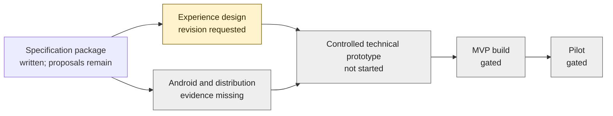

# Development cockpit

> [!important] Stage 1 · Android tablet app
> This is **Simon's development workspace**, not Granny's customer interface. Stage 2 OS and Stage 3 hardware are dormant.
> **Start here:** [current priority](10-execution/current-milestone.md) → [decisions needed](10-execution/open-questions.md) → [review queue](10-execution/agent-board.md).

[Visual cockpit](Development.canvas) · [Sessions](10-execution/cockpit.base) · [Agent board](10-execution/agent-board.md) · [How this stays current](10-execution/cockpit-guide.md)

## Where are we?

No percentage-of-product score: written documentation, mock test passes and real-device readiness are different measures.

## Decide and review

> [!todo] Current design feedback
> The feature-button Home was not accepted by Simon. He wants a minimal, conversation-led experience. The existing browser code remains a reference; do not polish its tile layout. A redesign **plan**, not another implementation, is the next design deliverable.

- [Conversation-first redesign plan](02-design/conversation-first-plan.md): proposed next interaction direction; no new UI code.
- [Latest handoffs and issues](10-execution/agent-board.md): who needs what, evidence, acknowledgement and resolution.
- [Scope and release gates](10-execution/development-readiness.md#named-gates-evidence-approver-blockers-and-unlocks): canonical approval criteria.
- [Backlog and dependencies](10-execution/backlog.md): canonical work status; not a second checklist in this dashboard.
- [Naming and visual choices](10-execution/open-questions.md): separate from interaction acceptance.

## Session deliveries

These are saved records, **not online-presence indicators**. Bases reflects the notes in this checkout; work on unmerged branches is not automatically synchronized.

![[10-execution/cockpit.base#Session deliveries]]

## Open agent messages

![[10-execution/cockpit.base#Open messages]]

## Build and gate snapshot

The following is a generated read-only view of canonical notes, with source fingerprint and refresh checks. Open the source links to change status.

![[10-execution/cockpit-snapshot]]

If embeds are unavailable, open [the plain Markdown snapshot](10-execution/cockpit-snapshot.md). No community plugin, JavaScript query, GitHub token or network dashboard is needed.
